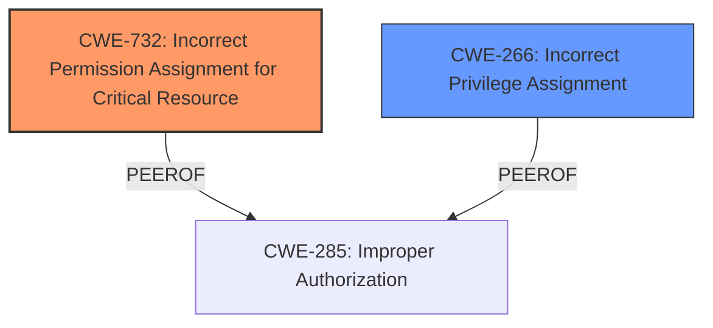

# Analysis Report for CVE-2024-21302

# Vulnerability Analysis Report: CVE-2024-21302

## Description

Summary Microsoft was notified that an elevation of privilege vulnerability exists in Windows based systems supporting Virtualization Based Security (VBS), including a subset of Azure Virtual Machine SKUS. This vulnerability enables an attacker with administrator privileges to replace current versions of Windows system files with outdated versions. By exploiting this vulnerability, an attacker could reintroduce previously mitigated vulnerabilities, circumvent some features of VBS, and exfiltrate data protected by VBS. Microsoft is developing a security update to mitigate this threat, but it is not yet available. Guidance to help customers reduce the risks associated with this vulnerability and to protect their systems until the mitigation is available in a Windows security update is provided in the Recommended Actions section of this CVE. This CVE will be updated when the mitigation is available in a Windows security update. We highly encourage customers to subscribe to Security Update Guide notifications to receive an alert when this update occurs. Update August 13, 2024 Microsoft has released the August 2024 security updates that include an opt-in revocation policy mitigation to address this vulnerability. Customers running affected versions of Windows are encouraged to review KB5042562 Guidance for blocking rollback of virtualization-based security related updates to assess if this opt-in policy meets the needs of their environment before implementing this mitigation. T

## Vulnerability Description Key Phrases

- **Impact:** ['circumvent some features of VBS', 'elevation of privilege', 'exfiltrate data protected by VBS', 'reintroduce previously mitigated vulnerabilities']
- **Vector:** replace current versions of Windows system files with outdated versions
- **Attacker:** attacker with administrator privileges
- **Product:** Windows based systems supporting Virtualization Based Security (VBS)

## Analysis (with Relationship Data)

# Summary
| CWE ID | CWE Name | Confidence | CWE Abstraction Level | CWE Vulnerability Mapping Label | CWE-Vulnerability Mapping Notes |
|---|---|---|---|---|---|
| CWE-732 | Incorrect Permission Assignment for Critical Resource | 0.75 | Class | Allowed-with-Review | Primary CWE |
| CWE-266 | Incorrect Privilege Assignment | 0.5 | Base | Allowed | Secondary Candidate |

## Evidence and Confidence

*   **Confidence Score:** 0.7
*   **Evidence Strength:** LOW

## Relationship Analysis
The primary relationship to consider is the hierarchical relationship between CWEs related to authorization and privilege management. CWE-732 is a Class-level CWE, while CWE-266 is a Base-level CWE. The guidance notes that while CWE-732 might seem applicable due to its name, it is often misused for vulnerabilities related to authorization weaknesses, which align better with CWE-285 or its descendants. However, without more detailed information about the **incorrect permission assignment** for the critical resource, it's difficult to determine the exact nature of the weakness. The "Privileges vs Permissions Guidance" suggests considering the distinction between privileges (user roles) and permissions (access rules applied to resources).



## Vulnerability Chain
The vulnerability chain starts with an attacker having administrator privileges, then replacing system files with outdated versions, which leads to the **reintroduction of previously mitigated vulnerabilities**, circumvention of VBS features, and **exfiltration of protected data**.

Root Cause: Incorrect permission assignment for critical resources (potentially CWE-732), or incorrect privilege assignment to the attacker (potentially CWE-266).
Weakness: Reintroduction of vulnerabilities, circumvention of VBS.
Impact: Elevation of privilege and data exfiltration.

## Summary of Analysis
The initial assessment pointed towards CWE-732 (Incorrect Permission Assignment for Critical Resource) based on the vulnerability description mentioning the ability to replace system files. However, the lack of specific root cause information makes it challenging to definitively classify the vulnerability.

The classification guidance emphasizes the distinction between privileges and permissions, suggesting that if the issue is related to user roles, CWE-266 (Incorrect Privilege Assignment) might be more appropriate. The vulnerability description states the attacker needs administrator privileges, but it's not clear if the vulnerability lies in the *assignment* of those privileges or the *permissions* granted to the administrator role.

Given the limited evidence, I'm sticking with CWE-732 as the primary CWE because the vulnerability description explicitly refers to replacing system files. However, the confidence level is reduced due to the lack of root cause details.

The selection is at the optimal level of specificity given the available information. While more specific CWEs might exist, there's insufficient evidence to support them.

Relevant CWE Information:

# Enhanced Context (25 CWEs)
The following CWEs were identified as potentially relevant to this vulnerability:

## CWE-59: Improper Link Resolution Before File Access ('Link Following')
**Abstraction Level**: Base
**Similarity Score**: 0.78
**Source**: dense

**Description**:
The product attempts to access a file based on the filename, but it does not properly prevent that filename from identifying a link or shortcut that resolves to an unintended resource.

**Mapping Guidance**:
- Usage: Allowed
- Rationale: This CWE entry is at the Base level of abstraction, which is a preferred level of abstraction for mapping to the root causes of vulnerabilities.


## CWE-266: Incorrect Privilege Assignment
**Abstraction Level**: Base
**Similarity Score**: 0.78
**Source**: dense

**Description**:
A product incorrectly assigns a privilege to a particular actor, creating an unintended sphere of control for that actor.

**Mapping Guidance**:
- Usage: Allowed
- Rationale: This CWE entry is at the Base level of abstraction, which is a preferred level of abstraction for mapping to the root causes of vulnerabilities.


## CWE-41: Improper Resolution of Path Equivalence
**Abstraction Level**: Base
**Similarity Score**: 0.77
**Source**: dense

**Description**:
The product is vulnerable to file system contents disclosure through path equivalence. Path equivalence involves the use of special characters in file and directory names. The associated manipulations are intended to generate multiple names for the same object.

**Mapping Guidance**:
- Usage: Allowed
- Rationale: This CWE entry is at the Base level of abstraction, which is a preferred level of abstraction for mapping to the root causes of vulnerabilities.


## CWE-267: Privilege Defined With Unsafe Actions
**Abstraction Level**: Base
**Similarity Score**: 0.77
**Source**: dense

**Description**:
A particular privilege, role, capability, or right can be used to perform unsafe actions that were not intended, even when it is assigned to the correct entity.

**Mapping Guidance**:
- Usage: Allowed
- Rationale: This CWE entry is at the Base level of abstraction, which is a preferred level of abstraction for mapping to the root causes of vulnerabilities.


## CWE-23: Relative Path Traversal
**Abstraction Level**: Base
**Similarity Score**: 0.76
**Source**: dense

**Description**:
The product uses external input to construct a pathname that should be within a restricted directory, but it does not properly neutralize sequences such as ".." that can resolve to a location that is outside of that directory.

**Mapping Guidance**:
- Usage: Allowed
- Rationale: This CWE entry is at the Base level of abstraction, which is a preferred level of abstraction for mapping to the root causes of vulnerabilities.


## CWE-668: Exposure of Resource to Wrong Sphere
**Abstraction Level**: Class
**Similarity Score**: 0.76
**Source**: dense

**Description**:
The product exposes a resource to the wrong control sphere, providing unintended actors with inappropriate access to the resource.

**Mapping Guidance**:
- Usage: Discouraged
- Rationale: CWE-668 is high-level and is often misused as a catch-all when lower-level CWE IDs might be applicable. It is sometimes used for low-information vulnerability reports [REF-1287]. It is a level-1 Class (i.e., a child of a Pillar). It is not useful for trend analysis.


## CWE-73: External Control of File Name or Path
**Abstraction Level**: Base
**Similarity Score**: 0.76
**Source**: dense

**Description**:
The product allows user input to control or influence paths or file names that are used in filesystem operations.

**Mapping Guidance**:
- Usage: Allowed
- Rationale: This CWE entry is at the Base level of abstraction, which is a preferred level of abstraction for mapping to the root causes of vulnerabilities.


## CWE-274: Improper Handling of Insufficient Privileges
**Abstraction Level**: Base
**Similarity Score**: 0.76
**Source**: dense

**Description**:
The product does not handle or incorrectly handles when it has insufficient privileges to perform an operation, leading to resultant weaknesses.

**Mapping Guidance**:
- Usage: Discouraged
- Rationale: This CWE entry could be deprecated in a future version of CWE.


## CWE-280: Improper Handling of Insufficient Permissions or Privileges 
**Abstraction Level**: Base
**Similarity Score**: 0.75
**Source**: dense

**Description**:
The product does not handle or incorrectly handles when it has insufficient privileges to access resources or functionality as specified by their permissions. This may cause it to follow unexpected code paths that may leave the product in an invalid state.

**Mapping Guidance**:
- Usage: Allowed
- Rationale: This CWE entry is at the Base level of abstraction, which is a preferred level of abstraction for mapping to the root causes of vulnerabilities.


## CWE-497: Exposure of Sensitive System Information to an Unauthorized Control Sphere
**Abstraction Level**: Base
**Similarity Score**: 0.75
**Source**: dense

**Description**:
The product does not properly prevent sensitive system-level information from being accessed by unauthorized actors who do not have the same level of access to the underlying system as the product does.

**Mapping Guidance**:
- Usage: Allowed
- Rationale: This CWE entry is at the Base level of abstraction, which is a preferred level of abstraction for mapping to the root causes of vulnerabilities.


## CWE-863: Incorrect Authorization
**Abstraction Level**: Class
**Similarity Score**: 1633.98
**Source**: sparse

**Description**:
The product performs an authorization check when an actor attempts to access a resource or perform an action, but it does not correctly perform the check.

**Mapping Guidance**:
- Usage: Allowed-with-Review
- Rationale: This CWE entry is a Class


## CWE Relationship Analysis

Current CWEs represent these abstraction levels: .


### Vulnerability Chain Analysis

**Chain starting from CWE-274:**
- 274 (Improper Handling of Insufficient Privileges) - ROOT


**Chain starting from CWE-863:**
- 863 (Incorrect Authorization) - ROOT


### CWE Relationship Diagram

```mermaid
graph TD
    classDef primary fill:#f96,stroke:#333,stroke-width:2px
    classDef secondary fill:#69f,stroke:#333
    classDef tertiary fill:#9e9,stroke:#333
```


*Report generated on 2025-07-13 05:28:15*
