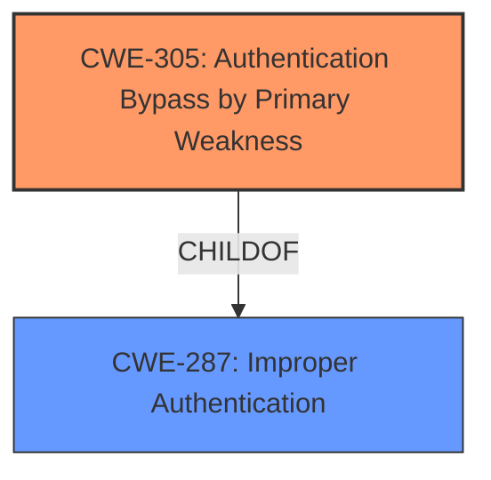

# Raw Analyzer Response for CVE-2024-21543

# Summary
| CWE ID    | CWE Name                                                                              | Confidence | CWE Abstraction Level | CWE Vulnerability Mapping Label | CWE-Vulnerability Mapping Notes |
| :---------- | :------------------------------------------------------------------------------------ | :--------- | :---------------------- | :------------------------------ | :------------------------------ |
| CWE-305     | Authentication Bypass by Primary Weakness                                           | 0.9        | Base                    | Primary CWE                   | Allowed                       |
| CWE-287     | Improper Authentication                                                               | 0.7        | Class                   | Secondary Candidate           | Discouraged                    |

## Evidence and Confidence

*   **Confidence Score:** 0.9
*   **Evidence Strength:** HIGH

## Relationship Analysis
The primary relationship that influenced my decision was the hierarchical relationship between CWE-287 (Improper Authentication) and CWE-305 (Authentication Bypass by Primary Weakness), where CWE-305 is a child of CWE-287. The vulnerability description clearly indicates an authentication bypass due to a fallback mechanism, making CWE-305 the more specific and appropriate choice. CWE-287 remains a relevant, but higher-level, classification.

## Vulnerability Chain
The vulnerability chain starts with a failure in the primary `authenticate()` function, which then leads to an authentication bypass due to the system falling back to a direct database query.

1.  **Root Cause:** Failure in primary `authenticate()` function.
2.  **Weakness:** Authentication Bypass due to **fallback to database query**.
3.  **Impact:** Unauthorized access to user accounts, circumvention of security policies.

## Summary of Analysis
The initial analysis considered both CWE-287 and CWE-305 due to the authentication-related keywords in the vulnerability description. However, after a careful review of the "CVE Reference Links Content Summary," the evidence strongly supports CWE-305 as the primary weakness. The description explicitly states that the `authenticate()` function failure leads to a **fallback to database query**, effectively bypassing the intended authentication mechanisms.

The selection of CWE-305 is based on the following evidence:

*   **Vulnerability Description Key Phrases:** "**rootcause:** **fallback to database query**", "**weakness:** **authentication bypass**"
*   **CVE Reference Links Content Summary:** "When the `authenticate()` function...fails, the system **falls back to directly querying the database**. This **bypasses custom authentication checks** implemented in `AUTHENTICATION_BACKENDS`..."

CWE-287 was considered but deemed less specific because it represents a broader class of authentication failures. The key differentiator is the explicit bypass mechanism, which is accurately captured by CWE-305.

The selected CWEs are at the optimal level of specificity because they directly address the root cause and the resulting weakness.
*   CWE-305 precisely describes the authentication bypass mechanism.
*   CWE-287 provides a broader context but is not as specific to the bypass.

Relevant CWE Information:

# Enhanced Context (25 CWEs)
The following CWEs were identified as potentially relevant to this vulnerability:

## CWE-303: Incorrect Implementation of Authentication Algorithm
**Abstraction Level**: Base
**Similarity Score**: 0.76
**Source**: dense

**Description**:
The requirements for the product dictate the use of an established authentication algorithm, but the implementation of the algorithm is incorrect.

**Mapping Guidance**:
- Usage: Allowed
- Rationale: This CWE entry is at the Base level of abstraction, which is a preferred level of abstraction for mapping to the root causes of vulnerabilities.

CWE-303 was not selected because the issue isn't an incorrect implementation of the primary authentication algorithm itself, but rather a bypass mechanism that gets triggered when the initial authentication fails.

## CWE-1390: Weak Authentication
**Abstraction Level**: Class
**Similarity Score**: 0.76
**Source**: dense

**Description**:
The product uses an authentication mechanism to restrict access to specific users or identities, but the mechanism does not sufficiently prove that the claimed identity is correct.

**Mapping Guidance**:
- Usage: Allowed-with-Review
- Rationale: This CWE entry is a Class and might have Base-level children that would be more appropriate

CWE-1390 was not selected because it's too general. The vulnerability is more specific: a **bypass** of authentication, not just a weak authentication mechanism.

## CWE-305: Authentication Bypass by Primary Weakness
**Abstraction Level**: Base
**Similarity Score**: 0.75
**Source**: dense

**Description**:
The authentication algorithm is sound, but the implemented mechanism can be bypassed as the result of a separate weakness that is primary to the authentication error.

**Mapping Guidance**:
- Usage: Allowed
- Rationale: This CWE entry is at the Base level of abstraction, which is a preferred level of abstraction for mapping to the root causes of vulnerabilities.

CWE-305 is the selected Primary CWE.

## CWE-287: Improper Authentication
**Abstraction Level**: class
**Similarity Score**: 2.55
**Source**: graph

**Description**:
CWE-287: Improper Authentication

**Mapping Guidance**:
- Usage: Discouraged
- Rationale: This CWE entry might be misused when lower-level CWE entries are likely to be applicable. It is a level-1 Class (i.e., a child of a Pillar).

CWE-287 is the selected Secondary CWE.