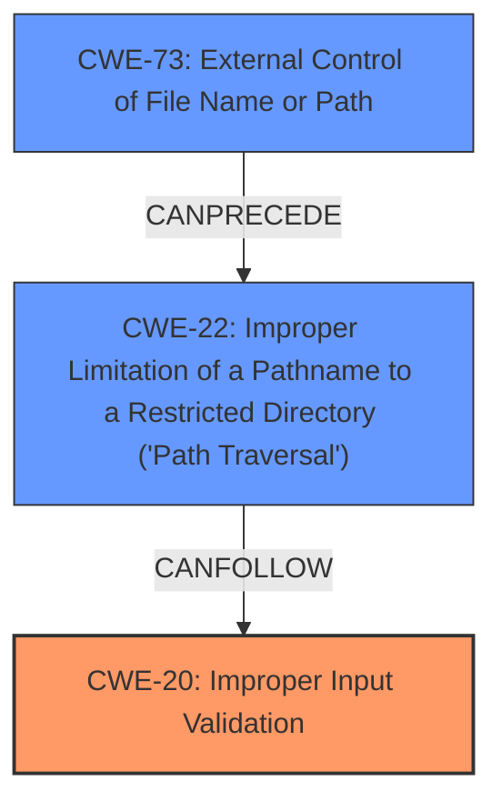

# Analysis Report for CVE-2024-21544

# Vulnerability Analysis Report: CVE-2024-21544

## Description

Versions of the package spatie/browsershot before 5.0.1 are vulnerable to Improper Input Validation due to **improper URL validation** through the setUrl method. An attacker can exploit this vulnerability by using leading whitespace (%20) before the file// protocol, resulting in **Local File Inclusion**, which allows the attacker to read sensitive files on the server.

## Vulnerability Description Key Phrases

- **Rootcause:** improper URL validation
- **Weakness:** Local File Inclusion
- **Impact:** read sensitive files
- **Vector:** leading whitespace before the file// protocol
- **Attacker:** attacker
- **Product:** spatie/browsershot
- **Version:** before 5.0.1
- **Component:** setUrl method

## Analysis (with Relationship Data)

# Summary
| CWE ID | CWE Name | Confidence | CWE Abstraction Level | CWE Vulnerability Mapping Label | CWE-Vulnerability Mapping Notes |
|---|---|---|---|---|---|
| CWE-20 | Improper Input Validation | 0.9 | Class | Primary | Allowed-with-Review |
| CWE-22 | Improper Limitation of a Pathname to a Restricted Directory ('Path Traversal') | 0.8 | Base | Secondary | Allowed |
| CWE-73 | External Control of File Name or Path | 0.7 | Base | Secondary | Allowed |

## Evidence and Confidence

*   **Confidence Score:** 0.8
*   **Evidence Strength:** HIGH

## Relationship Analysis
The primary weakness is **Improper Input Validation** (CWE-20) because the `setUrl` method **does not properly** validate URLs, allowing leading whitespace characters before the `file://` protocol. This leads to **Local File Inclusion**, which falls under **Improper Limitation of a Pathname to a Restricted Directory ('Path Traversal')** (CWE-22). **External Control of File Name or Path** (CWE-73) can also be present because the file path is derived from external input.



## Vulnerability Chain
The vulnerability chain begins with **improper input validation** (CWE-20) of the URL. This allows an attacker to inject a URL with leading whitespace followed by `file://` and a file path. This leads to **Path Traversal** (CWE-22) as the application **does not properly** limit the pathname to a restricted directory, enabling **Local File Inclusion**.

## Summary of Analysis
The primary root cause is **improper input validation** (CWE-20) in the `setUrl` method, as the method **fails to properly** sanitize or validate URLs, allowing leading whitespace characters. The key phrase "improper URL validation" supports this selection. This **improper validation** leads directly to the ability to read sensitive files, which is a classic **Local File Inclusion** vulnerability. This can be represented by **Improper Limitation of a Pathname to a Restricted Directory ('Path Traversal')** (CWE-22). Also, **External Control of File Name or Path** (CWE-73) is considered because the file path is influenced by external input.

**CWE-20** is chosen as the primary CWE because the vulnerability stems from the **lack of proper input validation**. The **improper validation** of the URL allows the injection of the `file://` protocol, which is the core of the vulnerability.

**CWE-22** is chosen as a secondary CWE to describe the **Local File Inclusion** which allows the attacker to read sensitive files on the server.

**CWE-73** is chosen as a secondary CWE because the file path is influenced by external input.

**CWEs Considered but Not Used:**

*   CWE-98: Improper Control of Filename for Include/Require Statement in PHP Program ('PHP Remote File Inclusion'): While this CWE is related to file inclusion, it's more specific to PHP programs. The vulnerability isn't exclusive to PHP, so it is not the best fit.
*   CWE-79: Improper Neutralization of Input During Web Page Generation ('Cross-site Scripting'): This CWE is related to Cross-Site Scripting (XSS) vulnerabilities, which is not the case in this vulnerability.
*   CWE-120: Buffer Copy without Checking Size of Input ('Classic Buffer Overflow'): This CWE relates to buffer overflows, which is not the type of vulnerability described.
*   CWE-347: Improper Verification of Cryptographic Signature: This CWE relates to cryptographic signature issues, which is not the case in this vulnerability.
*   CWE-94: Improper Control of Generation of Code ('Code Injection'): This CWE relates to code injection, which is not the case in this vulnerability.


## CWE Relationship Analysis

Current CWEs represent these abstraction levels: .


### Vulnerability Chain Analysis

**Chain starting from CWE-94:**
- 94 (Improper Control of Generation of Code ('Code Injection')) - ROOT


**Chain starting from CWE-22:**
- 22 (Improper Limitation of a Pathname to a Restricted Directory ('Path Traversal')) - ROOT


### CWE Relationship Diagram

```mermaid
graph TD
    classDef primary fill:#f96,stroke:#333,stroke-width:2px
    classDef secondary fill:#69f,stroke:#333
    classDef tertiary fill:#9e9,stroke:#333
```


*Report generated on 2025-07-13 05:32:46*
