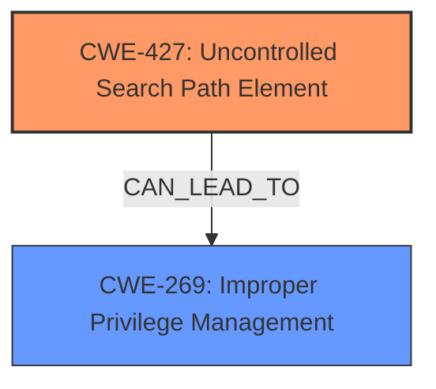

# Analysis for CVE-2024-21784

# Summary

| CWE ID  | CWE Name                                                                           | Confidence | CWE Abstraction Level | CWE Vulnerability Mapping Label | CWE-Vulnerability Mapping Notes |
| :-------- | :--------------------------------------------------------------------------------- | :--------- | :---------------------- | :------------------------------ | :------------------------------ |
| CWE-427 | Uncontrolled Search Path Element                                                 | 1.0        | Base                    | Primary                         | Allowed                       |
| CWE-269 | Improper Privilege Management                                                 | 0.4        | Class                    | Secondary                         | Discouraged                       |

## Evidence and Confidence

*   **Confidence Score:** 0.8
*   **Evidence Strength:** HIGH

## Relationship Analysis

The primary relationship influencing the CWE selection is the direct match of the vulnerability description to CWE-427. The vulnerability describes an "Uncontrolled search path" which directly aligns with the definition of CWE-427: "The product uses a fixed or controlled search path to find resources, but one or more locations in that path can be under the control of unintended actors."

The chain of root cause and weaknesses is relatively short: the uncontrolled search path leads to the potential for privilege escalation. This could be seen as a potential exploitation of **CWE-269** Improper Privilege Management, although this is an impact rather than a root cause.

## Vulnerability Chain

The vulnerability chain starts with the **uncontrolled search path** (**CWE-427**). This allows an attacker to place malicious files in the search path, which the application may then load and execute. The execution of malicious code can then lead to privilege escalation.
  - **Root Cause:** CWE-427 (Uncontrolled Search Path Element)
  - **Impact:** Privilege escalation (potential exploitation of **CWE-269** Improper Privilege Management, but it is just an impact)

## Summary of Analysis

The initial analysis correctly identified **CWE-427** as the primary weakness. The vulnerability description explicitly mentions "uncontrolled search path", which aligns directly with the definition of CWE-427. The provided evidence strongly supports this classification. The CVSS score and description also indicate privilege escalation, but that is an impact of the **uncontrolled search path** and not the root cause.

The graph relationships also highlight the connection between the uncontrolled search path and potential privilege escalation. The mapping guidance for CWE-427 explicitly states that it is a Base level of abstraction, which is preferred.

The other CWEs considered were mostly related to privilege management and access control, but they are less specific to the root cause. For example, CWE-285 (Improper Authorization) and CWE-863 (Incorrect Authorization) are related to authorization issues, but the primary problem is the uncontrolled search path, not the authorization mechanism itself.

**CWE-269** (Improper Privilege Management) was considered, but the problem is not necessarily that privileges are being managed incorrectly, but that the **uncontrolled search path** allows an attacker to gain privileges. Therefore, CWE-427 is the most appropriate CWE.

Relevant CWE Information:

# Enhanced Context (25 CWEs)
The following CWEs were identified as potentially relevant to this vulnerability:

## Vulnerability Description
**Uncontrolled search path** for some Intel(R) IPP Cryptography software before version 2021.11 may allow an authenticated user to potentially enable escalation of privilege via local access.

### Vulnerability Description Key Phrases
- **weakness:** **Uncontrolled search path**
- **impact:** escalation of privilege
- **vector:** local access
- **attacker:** authenticated user
- **product:** Intel(R) IPP Cryptography software
- **version:** before version 2021.11

### CWE for similar CVE Descriptions
### Primary CWE Match
CWE-427

#### Top CWEs
- CWE-427 (Count: 104)
- CWE-400 (Count: 10)
- CWE-428 (Count: 9)

## CVE Reference Links Content Summary
Based on the provided document, here's a breakdown of the vulnerability:

**CVE ID:** CVE-2024-21784

**Root Cause of Vulnerability:**
The vulnerability stems from an **uncontrolled search path** in Intel® IPP Cryptography software before version 2021.11.

**Weaknesses/Vulnerabilities Present:**
- **Uncontrolled search path**: The software searches for resources or libraries in a way that is not properly restricted or validated, potentially leading it to load malicious files.

**Impact of Exploitation:**
- Escalation of Privilege: An attacker could potentially gain higher privileges on the system by exploiting the **uncontrolled search path**. This could allow them to execute malicious code with elevated permissions.

**Attack Vectors:**
- Local Access: The attacker needs local access to the system to exploit the vulnerability.
- Authenticated User: The attacker needs to be an authenticated user on the system.
- User Interaction: The CVSS v4.0 vector indicates the attack requires a user to perform an action for exploitation, while v3.1 indicates that user interaction is required.

**Required Attacker Capabilities/Position:**
- The attacker must have legitimate, though possibly low-level, user credentials to the system.
- The attacker must be able to place a malicious file in a location where it will be found by the vulnerable software.
- The attacker may need to induce a user interaction for the attack to succeed, as indicated by the CVSS v4.0 vector.

**Affected Products:**
- Intel® IPP Cryptography software before version 2021.11.
- Intel® oneAPI Base Toolkit before version 2024.1.

**Mitigation:**
- Update Intel® IPP Cryptography software to version 2021.11 or later.
- Update Intel® oneAPI Base Toolkit to version 2024.1 or later.

## Retriever Results

### Top Combined Results

| Rank | CWE ID | Name | Abstraction | Usage  | Retrievers | Individual Scores |
|------|--------|------|-------------|-------|------------|-------------------|
| 1 | 693 | Protection Mechanism Failure | Pillar | Discouraged | sparse | 0.189 |
| 2 | 691 | Insufficient Control Flow Management | Pillar | Discouraged | sparse | 0.178 |
| 3 | 427 | Uncontrolled Search Path Element | Base | Allowed | sparse | 0.173 |
| 4 | 277 | Insecure Inherited Permissions | Variant | Allowed | sparse | 0.165 |
| 5 | 400 | Uncontrolled Resource Consumption | Class | Discouraged | sparse | 0.163 |
| 6 | 284 | Improper Access Control | Pillar | Discouraged | sparse | 0.154 |
| 7 | 248 | Uncaught Exception | Base | Allowed | sparse | 0.152 |
| 8 | 453 | Insecure Default Variable Initialization | Variant | Allowed | sparse | 0.150 |
| 9 | 426 | Untrusted Search Path | Base | Allowed | dense | 0.642 |
| 10 | 98 | Improper Control of Filename for Include/Require Statement in PHP Program ('PHP Remote File Inclusion') | Variant | Allowed | graph | 0.003 |