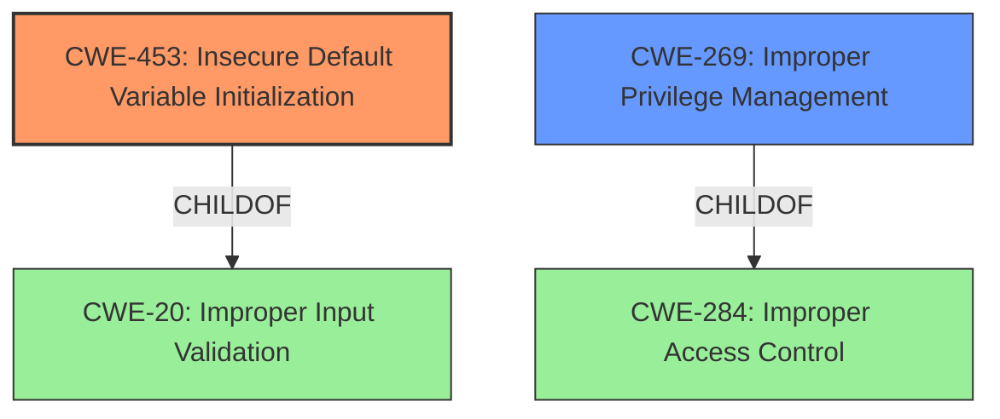

# Raw Analyzer Response for CVE-2024-21807

# Summary
| CWE ID | CWE Name | Confidence | CWE Abstraction Level | CWE Vulnerability Mapping Label | CWE-Vulnerability Mapping Notes |
|---|---|---|---|---|---|
| CWE-453 | Insecure Default Variable Initialization | 0.75 | Variant | Allowed | Primary CWE |
| CWE-269 | Improper Privilege Management | 0.5 | Class | Discouraged | Secondary Candidate |

## Evidence and Confidence

*   **Confidence Score:** 0.7
*   **Evidence Strength:** MEDIUM

## Relationship Analysis
The primary relationship that influenced my decision was the parent-child relationship between CWE-20 (Improper Input Validation) and other more specific CWEs. However, the root cause "Improper Initialization" suggests a more specific weakness related to insecure default variable initialization (CWE-453). Although CWE-269 (Improper Privilege Management) is in the retriever results, it is discouraged.

## Vulnerability Chain
The vulnerability chain starts with **improper initialization** (CWE-453), potentially leading to an exploitable state, and ultimately resulting in privilege escalation.

CWE-453 (Insecure Default Variable Initialization) -> Privilege Escalation

## Summary of Analysis
The initial analysis focused on the **improper initialization** root cause. The primary CWE match from similar CVE descriptions suggested CWE-20 (Improper Input Validation). However, the detailed description and the retriever results pointed towards CWE-453 (Insecure Default Variable Initialization) as a more precise match, which aligns with the provided root cause of the vulnerability. The retriever results included CWE-269 (Improper Privilege Management), but this is discouraged, and the privilege escalation is an impact rather than a root cause.

The selection of CWE-453 is based on the vulnerability description's explicit mention of "**improper initialization**" and the resulting privilege escalation. The evidence from "CVE Reference Links Content Summary" also supports "**Improper initialization** in the Linux kernel mode driver for the Intel® 800 Series Ethernet Driver" as the root cause.

# Relevant CWE Information:

## CWE-453: Insecure Default Variable Initialization
**Abstraction Level**: Variant

**Description**:
The software initializes a variable with a default value that is known to be insecure in the intended operational environment. This can lead to vulnerabilities if the variable is not properly updated or validated before being used.

**Mapping Guidance**:
- Usage: Allowed
- Rationale: This CWE entry is at the Variant level of abstraction, which is a preferred level of abstraction for mapping to the root causes of vulnerabilities.

**Why Selected:**

The vulnerability description explicitly states "**Improper initialization**" as the root cause. CWE-453 directly addresses this issue, where a variable is initialized with an insecure default value, leading to potential exploitation. This aligns perfectly with the provided evidence.

**Security Implications and Potential Impact:**
An insecure default variable initialization can lead to various security issues, including privilege escalation, information disclosure, or denial of service. In this case, it leads to privilege escalation.

**Parent-Child Relationships:**
CWE-453 is a variant of CWE-20 (Improper Input Validation) and CWE-661 (Incorrect Behavior Order).

## CWE-269: Improper Privilege Management
**Abstraction Level**: Class

**Description**:
The product does not properly assign, modify, track, or check privileges for an actor, creating an unintended sphere of control for that actor.

**Mapping Guidance**:
- Usage: Discouraged
- Rationale: CWE-269 is commonly misused. It can be conflated with "privilege escalation," which is a technical impact that is listed in many low-information vulnerability reports [REF-1287]. It is not useful for trend analysis.

**Why Not Fully Selected:**
While privilege escalation is the ultimate impact of the vulnerability, CWE-269 is a more general class of weakness. The root cause is the **improper initialization** of a variable (CWE-453). CWE-269 is also discouraged. Therefore, while relevant, it is not the primary weakness.

**Other CWEs Considered But Not Used:**

*   **CWE-20 (Improper Input Validation):** Although listed as the primary CWE match for similar CVE descriptions, it is too generic. The root cause is more specifically related to variable initialization than general input validation.
*   **CWE-284 (Improper Access Control):** This is a very high-level CWE (Pillar) and not specific enough to describe the root cause.
*   **CWE-754 (Improper Check for Unusual or Exceptional Conditions):** While it appears in the top CWEs, it doesn't directly address the **improper initialization** aspect of the vulnerability.