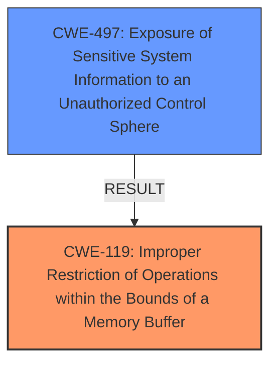

# Analysis for CVE-2024-21859

# Summary
| CWE ID | CWE Name | Confidence | CWE Abstraction Level | CWE Vulnerability Mapping Label | CWE-Vulnerability Mapping Notes |
|---|---|---|---|---|---|
| CWE-119 | Improper Restriction of Operations within the Bounds of a Memory Buffer | 0.8 | Class |  | Discouraged |
| CWE-497 | Exposure of Sensitive System Information to an Unauthorized Control Sphere | 0.6 | Base |  | Allowed |

## Evidence and Confidence

*   **Confidence Score:** 0.7
*   **Evidence Strength:** MEDIUM

## Relationship Analysis
The primary relationship impacting the decision is that CWE-119 is a high-level Class, while the more specific out-of-bounds read/write CWEs (e.g., CWE-787) are base level. The evidence indicates an "Improper buffer restrictions", suggesting potential out-of-bounds access. CWE-497 describes the impact of the vulnerability, which is information exposure. The selection of CWE-119 accounts for the potential for out-of-bounds access due to the buffer restriction issue.

## Vulnerability Chain
The vulnerability chain starts with the **improper buffer restrictions** (likely leading to out-of-bounds read/write) in the UEFI firmware, potentially leading to information disclosure.
  - Root Cause: **Improper buffer restrictions**
  - Impact: Information disclosure

## Summary of Analysis
Based on the provided evidence, the primary weakness is **improper buffer restrictions** in the UEFI firmware. This could potentially lead to out-of-bounds memory access, and ultimately information disclosure.

The retriever results suggest CWE-119 (Improper Restriction of Operations within the Bounds of a Memory Buffer) as the closest match. While CWE-119 is a Class and is discouraged, the description states that the vulnerability involves **improper buffer restrictions**. Since the information provided isn't sufficient to determine the specific type of out-of-bounds access (read or write), CWE-119 is chosen.

CWE-497 (Exposure of Sensitive System Information to an Unauthorized Control Sphere) is included because the vulnerability leads to information disclosure.

Relevant CWE Information:

# Enhanced Context (25 CWEs)
The following CWEs were identified as potentially relevant to this vulnerability:

## CWE-1285: Improper Validation of Specified Index, Position, or Offset in Input
**Abstraction Level**: Base
**Similarity Score**: 0.77
**Source**: dense

**Description**:
The product receives input that is expected to specify an index, position, or offset into an indexable resource such as a buffer or file, but it does not validate or incorrectly validates that the specified index/position/offset has the required properties.

**Mapping Guidance**:
- Usage: Allowed
- Rationale: This CWE entry is at the Base level of abstraction, which is a preferred level of abstraction for mapping to the root causes of vulnerabilities.

## CWE-119: Improper Restriction of Operations within the Bounds of a Memory Buffer
**Abstraction Level**: Class
**Similarity Score**: 0.76
**Source**: dense

**Description**:
The product performs operations on a memory buffer, but it reads from or writes to a memory location outside the buffer's intended boundary. This may result in read or write operations on unexpected memory locations that could be linked to other variables, data structures, or internal program data.

**Mapping Guidance**:
- Usage: Discouraged
- Rationale: CWE-119 is commonly misused in low-information vulnerability reports when lower-level CWEs could be used instead, or when more details about the vulnerability are available.

## CWE-497: Exposure of Sensitive System Information to an Unauthorized Control Sphere
**Abstraction Level**: Base
**Similarity Score**: 0.76
**Source**: dense

**Description**:
The product does not properly prevent sensitive system-level information from being accessed by unauthorized actors who do not have the same level of access to the underlying system as the product does.

**Mapping Guidance**:
- Usage: Allowed
- Rationale: This CWE entry is at the Base level of abstraction, which is a preferred level of abstraction for mapping to the root causes of vulnerabilities.

## CWE-131: Incorrect Calculation of Buffer Size
**Abstraction Level**: Base
**Similarity Score**: 0.76
**Source**: dense

**Description**:
The product does not correctly calculate the size to be used when allocating a buffer, which could lead to a buffer overflow.

**Mapping Guidance**:
- Usage: Allowed
- Rationale: This CWE entry is at the Base level of abstraction, which is a preferred level of abstraction for mapping to the root causes of vulnerabilities.

## CWE-787: Out-of-bounds Write
**Abstraction Level**: base
**Similarity Score**: 2.87
**Source**: graph

**Description**:
CWE-787: Out-of-bounds Write

**Mapping Guidance**:
- Usage: Allowed
- Rationale: This CWE entry is at the Base level of abstraction, which is a preferred level of abstraction for mapping to the root causes of vulnerabilities.

## Detailed Analysis of Selected CWEs

*   **CWE-119 Improper Restriction of Operations within the Bounds of a Memory Buffer:** The vulnerability description mentions **improper buffer restrictions**, which aligns with the general concept of CWE-119. This is considered the primary weakness because it is the root cause. The impact is information disclosure.
*   **CWE-497 Exposure of Sensitive System Information to an Unauthorized Control Sphere:** This CWE describes the impact of the vulnerability, which is the exposure of sensitive information.

## CWEs Considered But Not Used

*   **CWE-787 Out-of-bounds Write:** While out-of-bounds write could be a possibility, the information is insufficient to confirm it. Therefore, the more general CWE-119 is preferred.
*   **CWE-129 Improper Validation of Array Index**: Considered but the vulnerability description doesn't have enough information to support this.
*   **CWE-20 Improper Input Validation**: Considered but the vulnerability description doesn't have enough information to support this.