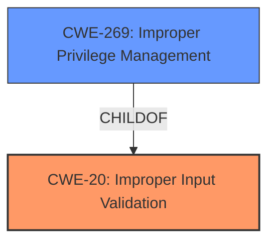

# Analysis for CVE-2024-21871

# Summary
| CWE ID  | CWE Name                                     | Confidence | CWE Abstraction Level | CWE Vulnerability Mapping Label | CWE-Vulnerability Mapping Notes |
| :-------- | :--------------------------------------------- | :--------- | :-------------------- | :------------------------------ | :------------------------------ |
| CWE-20    | Improper Input Validation                    | 0.9        | Class                 | Primary                         | Discouraged                     |
| CWE-269   | Improper Privilege Management                | 0.4        | Class                 | Secondary                       | Discouraged                     |

## Evidence and Confidence

*   **Confidence Score:** 0.9
*   **Evidence Strength:** HIGH

## Relationship Analysis

The primary relationship is that CWE-20 is a class-level weakness that can lead to various vulnerabilities, including privilege escalation. CWE-269 is another class-level weakness related to privilege management, which aligns with the "escalation of privilege" impact mentioned in the vulnerability description. The relationship is hierarchical, with more specific CWEs potentially existing under these broader categories. However, based on the limited information, these class-level CWEs are the most appropriate.

## Vulnerability Chain

The vulnerability chain starts with **improper input validation** (CWE-20), which allows a privileged user to escalate privileges. The chain is:

1.  **Improper Input Validation** (CWE-20): The root cause, where the firmware **fails to properly validate input**.
2.  Improper Privilege Management (CWE-269): The impact, where a privileged user can escalate their privileges.

## Summary of Analysis

The initial analysis focused on identifying the root cause and impact of the vulnerability. The description clearly states that the root cause is **improper input validation** and the impact is escalation of privilege. This aligns well with CWE-20.

The selection of CWE-20 is based on the "**rootcause:** **Improper input validation**" phrase. While CWE-20 is a Class-level CWE and is often misused, it is the best fit given the available information. I am overriding the discouraged usage guidance because the vulnerability description explicitly mentions **improper input validation** as the root cause.

CWE-269 was considered as a secondary weakness because the vulnerability leads to privilege escalation. However, the primary issue remains the **improper input validation**.

Relevant CWE Information:

# Enhanced Context (25 CWEs)
The following CWEs were identified as potentially relevant to this vulnerability:

## CWE Classification Guidance

The following guidance has been automatically included because relevant keywords were detected in the vulnerability description:

### Privileges vs Permissions Guidance

## ===Guidance===

### Level Set – Privileges vs Permissions (in Access Control Context)

**Privileges**

* Represents the *actor's identity level* or capabilities (e.g., root, admin, regular user, guest).
* Commonly defined by roles or security contexts assigned during session creation or login.
* Often involved in **privilege escalation** (e.g., a regular user gaining admin rights).
* 🔍 *Who* the user is and *what they are supposed to be able to do.*

**Permissions**

* Represents *what actions are allowed* on specific resources (files, services, APIs).
* Usually attached to *resources*, not people.
* Permissions can be affected dynamically by changes in role or context.
* 🔍 *What* the user is allowed to do to *which resource.*

#### Short Rule:

> **Privileges** = rights assigned to a user role
> **Permissions** = access rules applied to specific objects/resources

---

### Mapping Discussion – CWE Usage for Privileges vs Permissions

#### 🔸 CWE-266: **Incorrect Privilege Assignment**

* The system assigns incorrect privileges to a user (e.g., admin instead of guest).
* Often the result of misconfigured roles or faulty logic during account provisioning.
* ✅ *“A user created with the ‘guest’ role was assigned admin privileges due to a logic flaw.”*

#### 🔸 CWE-250: **Execution with Unnecessary Privileges**

* Code runs with higher privileges than needed to complete its function.
* Often found in daemons, services, or mobile apps that don't drop privileges.
* ✅ *“The backup service runs as root but only needs read access.”*

#### 🔸 CWE-284: **Improper Access Control** (Parent/Generic)

* Used when the system fails to enforce restrictions on access to resources.
* If no specific privilege or permission mistake is identifiable, use this.
* ⚠️ This is **often overused**. Only default to 284 if children like 285 or 266 don't fit.

#### 🔸 CWE-285: **Improper Authorization**

* A subset of access control failures where the system incorrectly allows an action based on flawed permission checking.
* Think: "The check is there but doesn't work properly."
* ✅ *“User can access another user’s invoice due to logic flaw in role verification.”*

---

## Mapping Examples – Privilege Issues

### Bad Mapping Example (Incorrect use of CWE-269):

> *“User can escalate privileges to admin.”*
> ❌ Mapping: CWE-269 (*discouraged – only shows technical impact, not cause*)
> ✅ Correct mapping (if cause known):

* Misconfigured roles: **CWE-266**
* Permission not dropped after privilege change: **CWE-250**
* Role-check bypass via logic flaw: **CWE-863**

---

## Technical Impact Phrases – Privilege vs Permission Mapping Cues

| Phrase                                      | Suggests                              | Possible CWE                                 |
| ------------------------------------------- | ------------------------------------- | -------------------------------------------- |
| “Escalate to root/admin”                    | Privilege escalation impact           | Not CWE-269! Use root cause (e.g., 266, 250) |
| “Assigned wrong role/group”                 | Misassigned privilege                 | CWE-266                                      |
| “Runs as root” or “Should not run as admin” | Over-privileged execution             | CWE-250                                      |
| “Unauthorized read/write to file”           | Permission control issue              | CWE-285                                      |
| “Can access resource without correct role”  | Incorrect or missing permission check | CWE-285, 862, 863                            |

---

## Good Mapping Examples – Privileges & Permissions

* ✅ **CWE-266**: *“When a new user registers, the system assigns them admin role due to a missing role validation.”*
* ✅ **CWE-250**: *“Installer runs with system-level privileges but doesn't require them to install files in the user directory.”*
* ✅ **CWE-284**: *“Inconsistent access rules between UI and backend for sensitive endpoints.”*
* ✅ **CWE-285**: *“Authorization logic fails to restrict access to finance reports based on department.”*

---

## Summary Table – CWE Quick Selection Guide

| Symptom                                                             | Root Cause            | Best CWE    |
| ------------------------------------------------------------------- | --------------------- | ----------- |
| User gets higher privilege role (e.g., admin) by mistake            | Role misassignment    | **CWE-266** |
| Code runs with elevated privileges it doesn’t need                  | No privilege dropping | **CWE-250** |
| Access control is wrong but unclear if it's permission or privilege | General flaw          | **CWE-284** |
| Permissions are improperly checked                                  | Flawed logic          | **CWE-285** |
| Identity is never checked                                           | Authentication issue  | **CWE-306** |
| Authorization logic is completely missing                           | **CWE-862**           |             |
| Authorization logic is present but flawed                           | **CWE-863**           |             |