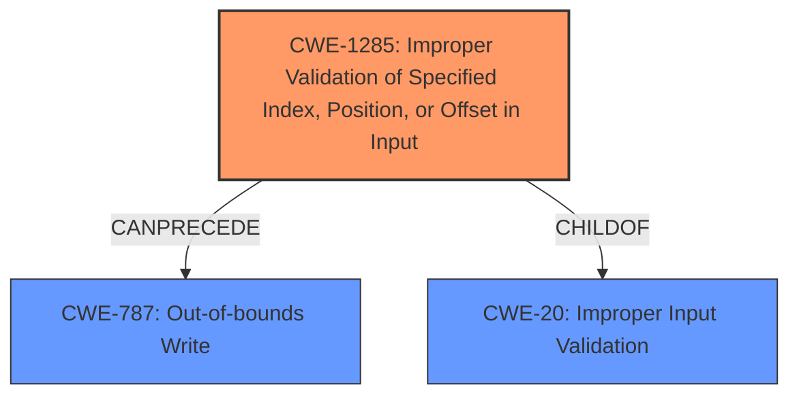

# Raw Analyzer Response for CVE-2024-21925

# Summary
| CWE ID | CWE Name | Confidence | CWE Abstraction Level | CWE Vulnerability Mapping Label | CWE-Vulnerability Mapping Notes |
|---|---|---|---|---|---|
| CWE-1285 | Improper Validation of Specified Index, Position, or Offset in Input | 0.9 | Base | Allowed | Primary CWE: Root cause is **improper input validation** related to index/position/offset. |
| CWE-787 | Out-of-bounds Write | 0.7 | Base | Allowed | Secondary: Result of **improper input validation** leads to overwriting SMRAM which is an out-of-bounds write. |
| CWE-20 | Improper Input Validation | 0.6 | Class | Discouraged | Secondary: A more general description of the root cause. CWE-1285 is a more specific instance of this. |

## Evidence and Confidence

*   **Confidence Score:** 0.8
*   **Evidence Strength:** HIGH

## Relationship Analysis
The primary weakness identified is CWE-1285, which describes **improper validation** of index, position, or offset. This can lead to further issues like CWE-787 (Out-of-bounds Write) as a consequence. CWE-20 is a parent class of CWE-1285, but is too general.

## Vulnerability Chain
The vulnerability chain starts with **improper input validation** (CWE-1285) which leads to an out-of-bounds write (CWE-787) resulting in arbitrary code execution by overwriting SMRAM.
- Root Cause: CWE-1285 (**Improper Validation** of index/position/offset)
- Consequence: CWE-787 (Out-of-bounds Write)
- Impact: Arbitrary code execution

## Summary of Analysis
The analysis is based on the provided vulnerability description and the summary of CVE-2024-21925. The key phrases "Improper input validation" and "overwrite SMRAM, leading to arbitrary code execution" directly map to the identified CWEs. The description states "**Improper input validation** within the AmdPspP2CmboxV2 driver may allow a privileged attacker to overwrite SMRAM, leading to arbitrary code execution."

The graph relationships confirm that CWE-1285 can precede CWE-787. CWE-20 is a general class, and since the input is specifically related to index, position, or offset, CWE-1285 is more appropriate. The **rootcause** appears to be due to the **improper input validation** and not something like a missing patch.

Relevant CWE Information:

# Enhanced Context (25 CWEs)
The following CWEs were identified as potentially relevant to this vulnerability:

## CWE-1285: Improper Validation of Specified Index, Position, or Offset in Input
**Abstraction Level**: Base
**Similarity Score**: 0.80
**Source**: dense

**Description**:
The product receives input that is expected to specify an index, position, or offset into an indexable resource such as a buffer or file, but it does not validate or incorrectly validates that the specified index/position/offset has the required properties.

**Mapping Guidance**:
- Usage: Allowed
- Rationale: This CWE entry is at the Base level of abstraction, which is a preferred level of abstraction for mapping to the root causes of vulnerabilities.

**Technical Explanation**: The vulnerability involves **improper validation** of input that is intended to be an index, position, or offset. This aligns directly with the description of CWE-1285.
**Security Implications**: An attacker can provide a malicious index/position/offset, potentially leading to out-of-bounds access.
**Relationship**: CWE-1285 is a more specific form of CWE-20 (Improper Input Validation).
**Mapping Guidance Influence**: The usage is ALLOWED, and the Rationale supports using Base-level CWEs for root causes.

## CWE-20: Improper Input Validation
**Abstraction Level**: Class
**Similarity Score**: 0.76
**Source**: dense

**Description**:
The product receives input or data, but it does
        not validate or incorrectly validates that the input has the
        properties that are required to process the data safely and
        correctly.

**Mapping Guidance**:
- Usage: Discouraged
- Rationale: CWE-20 is commonly misused in low-information vulnerability reports when lower-level CWEs could be used instead, or when more details about the vulnerability are available [REF-1287]. It is not useful for trend analysis. It is also a level-1 Class (i.e., a child of a Pillar).

**Technical Explanation**: While the vulnerability does involve **improper input validation**, CWE-20 is too general.
**Security Implications**: This can lead to various other vulnerabilities such as buffer overflows, code injection, etc.
**Relationship**: CWE-20 is a parent of CWE-1285.
**Mapping Guidance Influence**: The usage is DISCOURAGED because a more specific CWE (CWE-1285) is available.

## CWE-787: Out-of-bounds Write
**Abstraction Level**: Base
**Similarity Score**: 2.90
**Source**: graph

**Description**:
The product writes data past the end, or before the beginning, of the intended buffer.

**Mapping Guidance**:
- Usage: Allowed
- Rationale: This CWE entry is at the Base level of abstraction, which is a preferred level of abstraction for mapping to the root causes of vulnerabilities.

**Technical Explanation**: Overwriting SMRAM directly implies writing outside the intended memory bounds.
**Security Implications**: Can lead to arbitrary code execution, privilege escalation, or denial of service.
**Relationship**: It can be a consequence of **improper input validation**.
**Mapping Guidance Influence**: The usage is ALLOWED.

## CWE-190: Integer Overflow or Wraparound
**Abstraction Level**: base
**Similarity Score**: 4.33
**Source**: graph

**Description**:
CWE-190: Integer Overflow or Wraparound

**Mapping Guidance**:
- Usage: Allowed
- Rationale: This CWE entry is at the Base level of abstraction, which is a preferred level of abstraction for mapping to the root causes of vulnerabilities.

**Technical Explanation**: Not directly related, as there's no explicit mention of integer overflow.
**Security Implications**: Can lead to buffer overflows or other unexpected behavior.
**Relationship**: N/A
**Mapping Guidance Influence**: The usage is ALLOWED but not applicable.

## CWE-822: Untrusted Pointer Dereference
**Abstraction Level**: Base
**Similarity Score**: 2.90
**Source**: graph

**Description**:
The product obtains a value from an untrusted source, converts this value to a pointer, and dereferences the resulting pointer.

**Mapping Guidance**:
- Usage: Allowed
- Rationale: This CWE entry is at the Base level of abstraction, which is a preferred level of abstraction for mapping to the root causes of vulnerabilities.

**Technical Explanation**: Not directly related. The issue is **improper validation**, not necessarily untrusted pointer dereference.
**Security Implications**: Can lead to arbitrary code execution or information disclosure.
**Relationship**: N/A
**Mapping Guidance Influence**: The usage is ALLOWED but not applicable.

CWE-1284: Improper Validation of Specified Quantity in Input was also considered. However, the **improper validation** is more specific to index, position or offset, making CWE-1285 a better fit than the quantity (size/length) that CWE-1284 is focused on.