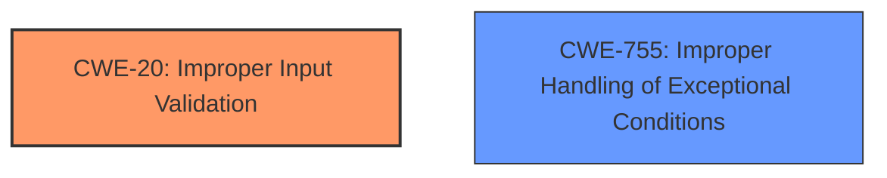

# Analysis Report for CVE-2024-21971

# Vulnerability Analysis Report: CVE-2024-21971

## Description

**Improper input validation** in AMD Crash Defender could allow an attacker to provide the Windows system process ID to a kernel-mode driver, resulting in an operating system crash, potentially leading to denial of service.

## Vulnerability Description Key Phrases

- **Rootcause:** Improper input validation
- **Impact:** operating system crash, denial of service
- **Vector:** provide the Windows system process ID
- **Attacker:** attacker
- **Product:** AMD Crash Defender

## Analysis (with Relationship Data)

# Summary

| CWE ID | CWE Name | Confidence | CWE Abstraction Level | CWE Vulnerability Mapping Label | CWE-Vulnerability Mapping Notes |
|---|---|---|---|---|---|
| CWE-20 ([Improper Input Validation](https://cwe.mitre.org/data/definitions/20.html)) | Improper Input Validation | 0.75 | Class | Allowed | The vulnerability is caused by **improper input validation**. |
| CWE-755 ([Improper Handling of Exceptional Conditions](https://cwe.mitre.org/data/definitions/755.html)) | Improper Handling of Exceptional Conditions | 0.5 | Class | Discouraged | An OS crash is an exceptional condition. |

## Evidence and Confidence

*   **Confidence Score:** 0.7
*   **Evidence Strength:** MEDIUM

## Relationship Analysis

The primary relationship considered is the parent-child relationship, specifically the relationship between CWE-20 ([Improper Input Validation](https://cwe.mitre.org/data/definitions/20.html)) and its potential children. While more specific child CWEs might exist, the provided information doesn't give enough detail to choose one definitively. CWE-755 ([Improper Handling of Exceptional Conditions](https://cwe.mitre.org/data/definitions/755.html)) is included because an OS crash is an exceptional condition. However, it's a Class-level CWE and may have more specific children.



## Vulnerability Chain

The vulnerability chain starts with **improper input validation**, leading to a potential operating system crash and denial of service.

Improper Input Validation -> Operating System Crash -> Denial of Service

CWE-20 ([Improper Input Validation](https://cwe.mitre.org/data/definitions/20.html)) -> Operating System Crash -> Denial of Service

## Summary of Analysis

The initial assessment focuses on identifying the **root cause** of the vulnerability, which is explicitly stated as **improper input validation**. The evidence supports this, with the "Vulnerability Description Key Phrases" section highlighting "**rootcause:** **Improper input validation**". The CVE Reference Links Content Summary also states "**Root cause:** Improper input validation in AMD Crash Defender." This aligns with CWE-20 ([Improper Input Validation](https://cwe.mitre.org/data/definitions/20.html)), which describes scenarios where a product receives input but does not validate that the input has the properties required to process the data safely.

CWE-20 ([Improper Input Validation](https://cwe.mitre.org/data/definitions/20.html)) is a Class-level CWE and the mapping guidance advises against using it when lower-level CWEs are available. However, the provided information lacks the specifics to identify a more precise CWE. For example, it isn't clear whether the improper validation relates to the index, quantity, or other properties of the input. Without this detail, selecting a more specific variant like CWE-129 ([Improper Validation of Array Index](https://cwe.mitre.org/data/definitions/129.html)), CWE-1284 ([Improper Validation of Specified Quantity in Input](https://cwe.mitre.org/data/definitions/1284.html)), or CWE-1285 ([Improper Validation of Specified Index, Position, or Offset in Input](https://cwe.mitre.org/data/definitions/1285.html)) would be speculative.

CWE-755 ([Improper Handling of Exceptional Conditions](https://cwe.mitre.org/data/definitions/755.html)) is considered as a secondary weakness. This is because the **improper input validation** leads to an operating system crash, which can be considered an unhandled or improperly handled exceptional condition. However, it's also a Class-level CWE and less directly related to the **root cause** than CWE-20 ([Improper Input Validation](https://cwe.mitre.org/data/definitions/20.html)).


## CWE Relationship Analysis

Current CWEs represent these abstraction levels: .


### Vulnerability Chain Analysis

**Chain starting from CWE-1284:**
- 1284 (Improper Validation of Specified Quantity in Input) - ROOT


**Chain starting from CWE-1285:**
- 1285 (Improper Validation of Specified Index, Position, or Offset in Input) - ROOT


### CWE Relationship Diagram

```mermaid
graph TD
    classDef primary fill:#f96,stroke:#333,stroke-width:2px
    classDef secondary fill:#69f,stroke:#333
    classDef tertiary fill:#9e9,stroke:#333
```


*Report generated on 2025-07-13 05:40:36*
