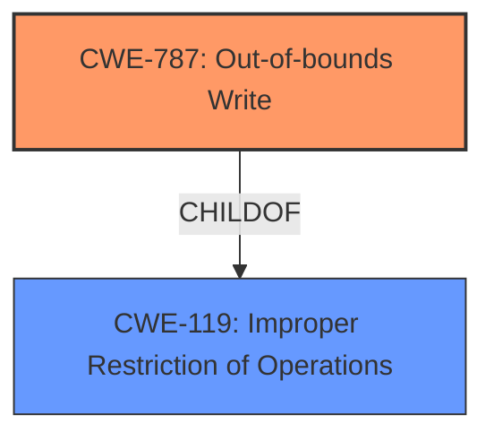

# Enhanced Analysis for CVE-2024-21980

# Summary
| CWE ID | CWE Name | Confidence | CWE Abstraction Level | CWE Vulnerability Mapping Label | CWE-Vulnerability Mapping Notes |
|---|---|---|---|---|---|
| CWE-787 | Out-of-bounds Write | 0.9 | Base | Primary | Allowed |
| CWE-119 | Improper Restriction of Operations within the Bounds of a Memory Buffer | 0.7 | Class | Secondary | Discouraged |

## Evidence and Confidence

*   **Confidence Score:** 0.9
*   **Evidence Strength:** MEDIUM

## Relationship Analysis
The primary CWE, CWE-787, is a base-level CWE that is a child of CWE-119, which is a class-level CWE. CWE-787 accurately describes the **improper restriction of write operations** leading to memory corruption. Although CWE-119 is present as a top retriever result and also reflects the **improper restriction of write operations**, CWE-787 provides greater specificity.



## Vulnerability Chain
The vulnerability chain starts with the **improper restriction of write operations** (CWE-787), which allows a malicious hypervisor to overwrite guest memory or UMC seeds, resulting in loss of confidentiality and integrity.

## Summary of Analysis
The vulnerability description states "**Improper restriction of write operations** in SNP firmware could allow a malicious hypervisor to potentially overwrite a guests memory or UMC seed resulting in loss of confidentiality and integrity." This clearly indicates an out-of-bounds write situation. While CWE-119 is a broader category, CWE-787 is a more specific and accurate representation of the vulnerability.

*   CWE-787 Out-of-bounds Write: This is the primary CWE because the vulnerability specifically involves a write operation outside the intended memory boundary. The description explicitly states that the hypervisor can "overwrite a guests memory or UMC seed." This aligns with the definition of CWE-787.
*   CWE-119 Improper Restriction of Operations within the Bounds of a Memory Buffer: This CWE is a broader category that includes out-of-bounds writes. While it's related, it's less specific than CWE-787. It is included as a secondary CWE.

The retriever results included CWE-119, CWE-1285, CWE-367, CWE-284, CWE-190, CWE-125, CWE-285, CWE-667, CWE-1246, CWE-128.

CWEs considered but not used:
* CWE-1285: Improper Validation of Specified Index, Position, or Offset in Input - While input validation might be a component of the overall security posture, the core issue is the ability to write outside of the allowed boundaries, making CWE-787 a more precise fit.
* CWE-367: Time-of-check Time-of-use (TOCTOU) Race Condition - There is no mention of race conditions in the description.
* CWE-284: Improper Access Control - While access control is relevant, the core issue is the ability to write to unauthorized memory locations, which is better captured by CWE-787.
* CWE-190: Integer Overflow or Wraparound - Integer overflow isn't mentioned in the description.
* CWE-125: Out-of-bounds Read - The vulnerability is specifically about writing, not reading, out of bounds.
* CWE-285: Improper Authorization - While authorization is relevant, the core issue is the ability to write to unauthorized memory locations, which is better captured by CWE-787.
* CWE-667: Improper Locking - No mention of locking issues in the description.
* CWE-1246: Improper Write Handling in Limited-write Non-Volatile Memories - The description does not mention non-volatile memories.
* CWE-128: Wrap-around Error - No mention of wrap-around errors in the description.


## CWE Relationship Analysis

Current CWEs represent these abstraction levels: .


### Vulnerability Chain Analysis

**Chain starting from CWE-125:**
- 125 (Out-of-bounds Read) - ROOT


**Chain starting from CWE-787:**
- 787 (Out-of-bounds Write) - ROOT


### CWE Relationship Diagram

```mermaid
graph TD
    classDef primary fill:#f96,stroke:#333,stroke-width:2px
    classDef secondary fill:#69f,stroke:#333
    classDef tertiary fill:#9e9,stroke:#333
```