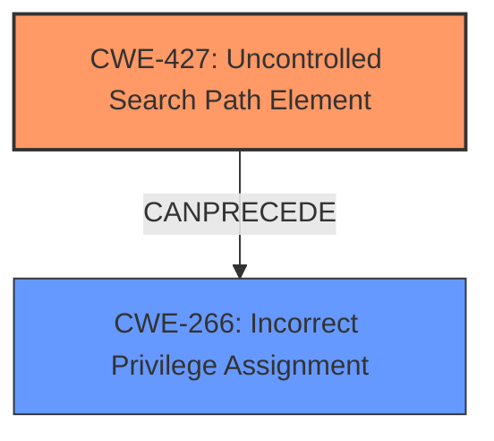

# Raw Analyzer Response for CVE-2024-22002

# Summary
| CWE ID | CWE Name | Confidence | CWE Abstraction Level | CWE Vulnerability Mapping Label | CWE-Vulnerability Mapping Notes |
|---|---|---|---|---|---|
| CWE-427 | Uncontrolled Search Path Element | 0.9 | Base | Primary | Allowed |
| CWE-266 | Incorrect Privilege Assignment | 0.7 | Base | Secondary | Allowed |

## Evidence and Confidence

*   **Confidence Score:** 0.8
*   **Evidence Strength:** HIGH

## Relationship Analysis
The primary weakness is **CWE-427 Uncontrolled Search Path Element**, where the application uses a search path that is modifiable by an unprivileged user. This allows for DLL hijacking. The secondary weakness is **CWE-266 Incorrect Privilege Assignment** because the service runs with elevated privileges (NT AUTHORITY\SYSTEM) which is leveraged by the hijacked DLL.

## Vulnerability Chain
The vulnerability chain begins with the **CWE-427 Uncontrolled Search Path Element**, where an unprivileged user can write to the `cuepkg-1.2.6` directory. This allows for a malicious DLL to be placed in the directory. When `cuepkg.exe` is executed with elevated privileges (**CWE-266 Incorrect Privilege Assignment**), the malicious DLL is loaded, resulting in privilege escalation.

## Summary of Analysis
Based on the provided information, the primary root cause is **CWE-427 Uncontrolled Search Path Element** because the application uses a search path that can be modified by an unprivileged user. The CVE Reference Links Content Summary states: "Since a regular user can create files in this directory, a malicious DLL can be placed there and loaded by `cuepkg.exe` with elevated privileges." The loading of the DLL with elevated privileges leads to **CWE-266 Incorrect Privilege Assignment**. This is further supported by the Retriever Results, where CWE-427 is listed as a potential match. The relationship between CWE-427 and CWE-266 is that the **uncontrolled search path** allows for the **incorrectly privileged process** to load the malicious DLL.

**CWEs Considered But Not Used:**
*   **CWE-732 Incorrect Permission Assignment for Critical Resource**: This was considered but not used as the root cause is the uncontrolled search path. While incorrect permissions are present, the ability for a low-privileged user to insert files into the directory is the primary weakness.
*   **CWE-59 Improper Link Resolution Before File Access ('Link Following')**: This was considered because DLL hijacking can involve manipulating links. However, this vulnerability involves placing a malicious DLL directly into a directory used by the application, making CWE-427 a more accurate fit.
*   **CWE-276 Incorrect Default Permissions**: This was considered but not used as it is not about incorrect default permissions during installation but about the permissions of a specific directory used during the update process.
*   **CWE-73 External Control of File Name or Path**: This was considered, but the core issue isn't directly about external control of the file name or path, but the ability for an attacker to place a file in a trusted location.