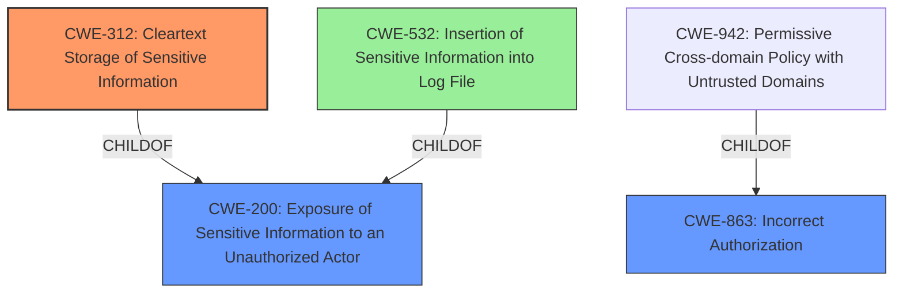

# Analysis for CVE-2024-22032

# Summary
| CWE ID    | CWE Name                                                                 | Confidence | CWE Abstraction Level | CWE Vulnerability Mapping Label | CWE-Vulnerability Mapping Notes |
| --------- | ------------------------------------------------------------------------ | ---------- | ----------------------- | ------------------------------- | ----------------------------- |
| CWE-312   | Cleartext Storage of Sensitive Information                               | 0.9        | Base                    | Primary                         | Allowed                       |
| CWE-200   | Exposure of Sensitive Information to an Unauthorized Actor | 0.7        | Base                    | Secondary                       | Allowed                       |
| CWE-863   | Incorrect Authorization                                                   | 0.5        | Class                   | Secondary                       | Allowed-with-Review         |

## Evidence and Confidence

*   **Confidence Score:** 0.8
*   **Evidence Strength:** HIGH

## Relationship Analysis
The primary relationship impacting the CWE selection is the hierarchical relationship. CWE-312 is chosen as the most specific base CWE that directly addresses the root cause of storing secrets in plaintext. CWE-200 is a parent of CWE-532 (Insertion of Sensitive Information into Log File) and is a more general form of information exposure. CWE-863 is a class-level CWE related to authorization issues.

## Vulnerability Chain
The vulnerability chain starts with the **Kube API secret values written in plaintext on AppliedSpec** (CWE-312). The ability for Cluster owners, Cluster members, and Project members to **view cluster object from apiserver** (CWE-200) represents the exposure of that sensitive information to unauthorized actors. Finally, if authorization checks were improperly performed or missing (CWE-863), this could exacerbate the issue.

## Summary of Analysis
Based on the provided evidence, the primary weakness is the **Kube API secret values written in plaintext on AppliedSpec**. This leads to exposure of sensitive information. The analysis relies heavily on the "Vulnerability Description Key Phrases" and the "CVE Reference Links Content Summary," which clearly indicate the root cause and impact.

The selection of CWE-312 is justified by the direct evidence of plaintext storage of secrets. CWE-200 is included as a secondary weakness because the plaintext secrets are accessible, leading to potential unauthorized exposure. The inclusion of CWE-863 is more speculative but plausible since access control vulnerabilities could contribute to the overall risk.

The abstraction level is optimized by selecting CWE-312 as the base CWE, providing the most specific description of the root cause. CWE-200 is also a base CWE related to the impact.

Relevant CWE Information:

# Enhanced Context (25 CWEs)
The following CWEs were identified as potentially relevant to this vulnerability:

## CWE-267: Privilege Defined With Unsafe Actions
**Abstraction Level**: Base
**Similarity Score**: 0.76
**Source**: dense
This is about using privileges to do unsafe actions. It's not applicable here as the main issue is not about unsafe actions, but rather storing secrets in plaintext.

## CWE-212: Improper Removal of Sensitive Information Before Storage or Transfer
**Abstraction Level**: Base
**Similarity Score**: 0.76
**Source**: dense
This CWE is about failing to remove sensitive info before storage/transfer. While related to the vulnerability, it is not as precise as CWE-312 which specifically calls out cleartext storage.

## CWE-668: Exposure of Resource to Wrong Sphere
**Abstraction Level**: Class
**Similarity Score**: 0.75
**Source**: dense
This is too generic.

## CWE-497: Exposure of Sensitive System Information to an Unauthorized Control Sphere
**Abstraction Level**: Base
**Similarity Score**: 0.75
**Source**: dense
This is similar to CWE-200, but less directly relevant to the core issue of plaintext storage.

## CWE-538: Insertion of Sensitive Information into Externally-Accessible File or Directory
**Abstraction Level**: Base
**Similarity Score**: 0.75
**Source**: dense
This CWE is too specific to files and directories.

## CWE-312: Cleartext Storage of Sensitive Information
**Abstraction Level**: Base
**Similarity Score**: 0.75
**Source**: dense
This is a strong candidate as it directly addresses the root cause.

## CWE-266: Incorrect Privilege Assignment
**Abstraction Level**: Base
**Similarity Score**: 0.74
**Source**: dense
This is not applicable as the issue is not about assigning incorrect privileges.

## CWE-276: Incorrect Default Permissions
**Abstraction Level**: Base
**Similarity Score**: 0.74
**Source**: dense
This is not applicable as the issue is not about default permissions.

## CWE-280: Improper Handling of Insufficient Permissions or Privileges 
**Abstraction Level**: Base
**Similarity Score**: 0.74
**Source**: dense
This is not applicable as the issue is not about handling insufficient permissions.

## CWE-319: Cleartext Transmission of Sensitive Information
**Abstraction Level**: Base
**Similarity Score**: 0.74
**Source**: dense
This is not applicable as the issue is not about transmission, but about storage.

## CWE-863: Incorrect Authorization
**Abstraction Level**: Class
**Similarity Score**: 1923.72
**Source**: sparse
This could be a secondary issue if authorization is not properly implemented to restrict access to the plaintext secrets.

## CWE-285: Improper Authorization
**Abstraction Level**: Class
**Similarity Score**: 1899.53
**Source**: sparse
This is similar to CWE-863, but is discouraged.

## CWE-532: Insertion of Sensitive Information into Log File
**Abstraction Level**: Base
**Similarity Score**: 1881.51
**Source**: sparse
This is similar to CWE-200, but more specific to log files. The secrets are stored in `AppliedSpec` and not a log file.

## CWE-306: Missing Authentication for Critical Function
**Abstraction Level**: Base
**Similarity Score**: 1791.92
**Source**: sparse
This is not applicable as the issue is not about missing authentication.

## CWE-269: Improper Privilege Management
**Abstraction Level**: Class
**Similarity Score**: 1784.36
**Source**: sparse
This is too generic.

## CWE-523: Unprotected Transport of Credentials
**Abstraction Level**: base
**Similarity Score**: 3.64
**Source**: graph
This is not about transport of credentials, but rather storage of secret values.

## CWE-201: Insertion of Sensitive Information Into Sent Data
**Abstraction Level**: base
**Similarity Score**: 2.87
**Source**: graph
This is not about sending data, but about storing it.

## CWE-322: Key Exchange without Entity Authentication
**Abstraction Level**: base
**Similarity Score**: 2.87
**Source**: graph
This is about key exchange and is not relevant here.

## CWE-1272: Sensitive Information Uncleared Before Debug/Power State Transition
**Abstraction Level**: base
**Similarity Score**: 2.73
**Source**: graph
This is about debug/power state transition, which is not relevant here.

## CWE-499: Serializable Class Containing Sensitive Data
**Abstraction Level**: variant
**Similarity Score**: 2.68
**Source**: graph
This is too specific.

## CWE-498: Cloneable Class Containing Sensitive Information
**Abstraction Level**: variant
**Similarity Score**: 2.68
**Source**: graph
This is too specific.

## CWE-942: Permissive Cross-domain Policy with Untrusted Domains
**Abstraction Level**: variant
**Similarity Score**: 2.68
**Source**: graph
This is not relevant.

## CWE-312: Cleartext Storage of Sensitive Information
**Abstraction Level**: Base
**Similarity Score**: 2.49
**Source**: graph
This is a strong candidate as it directly addresses the root cause.

## CWE-532