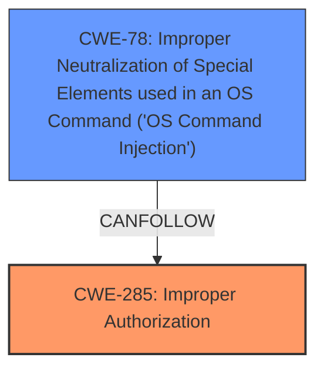

# Analysis Report for CVE-2024-22067

# Vulnerability Analysis Report: CVE-2024-22067

## Description

ZTE NH8091 product has an **improper permission control** vulnerability. Due to **improper permission control** of the Web module interface, an authenticated attacker may exploit the vulnerability to execute arbitrary commands.

## Vulnerability Description Key Phrases

- **Rootcause:** ['improper permission control', 'permission control vulnerability']
- **Impact:** execute arbitrary commands
- **Attacker:** authenticated attacker
- **Product:** ZTE NH8091
- **Component:** Web module interface

## Analysis (with Relationship Data)

# Summary
| CWE ID    | CWE Name                                                                | Confidence | CWE Abstraction Level | CWE Vulnerability Mapping Label | CWE-Vulnerability Mapping Notes |
| :--------- | :---------------------------------------------------------------------- | :--------- | :---------------------- | :------------------------------ | :------------------------------ |
| CWE-285     | Improper Authorization                                                  | 0.9        | Class                   | Primary                         | Discouraged                   |
| CWE-78      | Improper Neutralization of Special Elements used in an OS Command ('OS Command Injection') | 0.7        | Base                    | Secondary                         | Allowed                   |

## Evidence and Confidence

*   **Confidence Score:** 0.8
*   **Evidence Strength:** MEDIUM

## Relationship Analysis
The primary weakness is identified as CWE-285, "Improper Authorization." While it's a Class-level CWE, the provided information doesn't offer enough specificity to pinpoint a more granular Base or Variant. The vulnerability description indicates that the Web module interface has **improper permission control**, allowing an authenticated attacker to execute arbitrary commands. The secondary weakness is CWE-78, which relates to the impact of executing arbitrary commands. The relationship between CWE-285 and CWE-78 is that **improper authorization** can lead to the ability to inject and execute commands.



## Vulnerability Chain
The vulnerability chain starts with **improper permission control** (CWE-285). An authenticated attacker leverages this weakness in the Web module interface to **execute arbitrary commands** (CWE-78).

## Summary of Analysis
The analysis is based on the provided vulnerability description, which points to an **improper permission control** vulnerability in the ZTE NH8091 product's Web module interface. The root cause is the **improper authorization** (CWE-285), which enables an authenticated attacker to execute arbitrary commands (CWE-78).

The primary CWE is CWE-285 because the **improper authorization** is the root cause that allows the attacker to execute commands. CWE-78 is secondary, representing the impact of the **improper authorization**. While CWE-285 is a Class-level CWE and normally discouraged, there is not enough evidence to assign a more granular CWE, so it is the most appropriate.

Relevant CWE Information:

# Enhanced Context (25 CWEs)
The following CWEs were identified as potentially relevant to this vulnerability:

## CWE-285: Improper Authorization
**Abstraction Level**: Class
**Similarity Score**: 2175.33
**Source**: sparse

**Description**:
The product does not perform or incorrectly performs an authorization check when an actor attempts to access a resource or perform an action.

**Mapping Guidance**:
- Usage: Discouraged
- Rationale: CWE-285 is high-level and lower-level CWEs can frequently be used instead. It is a level-1 Class (i.e., a child of a Pillar).

## CWE-78: Improper Neutralization of Special Elements used in an OS Command ('OS Command Injection')
**Abstraction Level**: base
**Similarity Score**: 2.40
**Source**: graph

**Description**:
CWE-78: Improper Neutralization of Special Elements used in an OS Command ('OS Command Injection')

**Mapping Guidance**:
- Usage: Allowed
- Rationale: This CWE entry is at the Base level of abstraction, which is a preferred level of abstraction for mapping to the root causes of vulnerabilities.

## CWE-269: Improper Privilege Management
**Abstraction Level**: Class
**Similarity Score**: 2050.21
**Source**: sparse

**Description**:
The product does not properly assign, modify, track, or check privileges for an actor, creating an unintended sphere of control for that actor.

**Mapping Guidance**:
- Usage: Discouraged
- Rationale: CWE-269 is commonly misused. It can be conflated with "privilege escalation," which is a technical impact that is listed in many low-information vulnerability reports [REF-1287]. It is not useful for trend analysis.

CWE-269 was considered, but not selected because the description focuses on authorization checks rather than privilege management.

CWE-862: Missing Authorization was also considered, but CWE-285 was selected because it covers both missing and incorrect authorization checks.

CWE-732: Incorrect Permission Assignment for Critical Resource was also considered but the weakness is not about assignment, but rather about the authorization check.

* **CWE-285:** The vulnerability description states "**improper permission control** of the Web module interface, an authenticated attacker may exploit the vulnerability to execute arbitrary commands." This aligns directly with CWE-285's description: "The product does not perform or incorrectly performs an authorization check when an actor attempts to access a resource or perform an action."
* **CWE-78:** The vulnerability leads to the ability to "**execute arbitrary commands**," aligning with CWE-78's description: "The product constructs all or part of an OS command using externally-influenced input from an upstream component, but it does not neutralize or incorrectly neutralizes special elements that could modify the intended OS command when it is sent to a downstream component."


## CWE Relationship Analysis

Current CWEs represent these abstraction levels: .


### Vulnerability Chain Analysis

**Chain starting from CWE-732:**
- 732 (Incorrect Permission Assignment for Critical Resource) - ROOT


**Chain starting from CWE-862:**
- 862 (Missing Authorization) - ROOT


### CWE Relationship Diagram

```mermaid
graph TD
    classDef primary fill:#f96,stroke:#333,stroke-width:2px
    classDef secondary fill:#69f,stroke:#333
    classDef tertiary fill:#9e9,stroke:#333
```


*Report generated on 2025-07-13 05:44:09*
