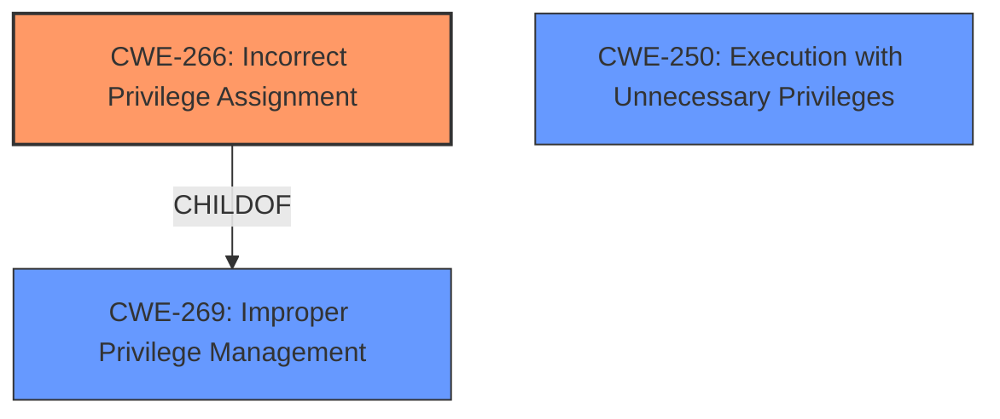

# Raw Analyzer Response for CVE-2024-22106

# Summary
| CWE ID    | CWE Name                                                      | Confidence | CWE Abstraction Level | CWE Vulnerability Mapping Label | CWE-Vulnerability Mapping Notes |
| :-------- | :------------------------------------------------------------ | :--------- | :-------------------- | :------------------------------ | :------------------------------ |
| CWE-266   | Incorrect Privilege Assignment                                | 0.9        | Base                  | Primary CWE                     | Allowed                       |
| CWE-250 | Execution with Unnecessary Privileges   | 0.75     | Base                  | Secondary Candidate                     | Allowed                       |
| CWE-269   | Improper Privilege Management                                 | 0.5       | Class                 | Secondary Candidate                  | Discouraged                  |

## Evidence and Confidence

*   **Confidence Score:** 0.8
*   **Evidence Strength:** MEDIUM

## Relationship Analysis
The primary CWE is CWE-266 Incorrect Privilege Assignment, which is a base-level CWE. Several other CWEs were considered, particularly CWE-269 (Improper Privilege Management), but deemed less specific. CWE-266 is related to CWE-269 as a more specific cause of privilege management issues. The guidance suggests that instead of using the higher-level CWE-269, it is preferable to map to the root cause such as CWE-266. CWE-250 Execution with Unnecessary Privileges was also considered a potential secondary CWE related to privilege escalation.

## Vulnerability Chain
The vulnerability chain starts with **improper privilege management**, specifically an **incorrect privilege assignment** (CWE-266). This leads to the potential for local attackers to escalate privileges, execute arbitrary code, or cause a Denial of Service (DoS). The chain is:

1.  **Incorrect Privilege Assignment** (CWE-266) - Root Cause
2.  Privilege Escalation - Impact
3.  Arbitrary Code Execution - Impact
4.  Denial of Service (DoS) - Impact

## Summary of Analysis
The initial assessment, based on the vulnerability description and CVE details, indicates a privilege management issue. The key phrase "**Improper privilege management**" strongly suggests CWE-269. However, the additional context from the MITRE guidance and the CVE Reference Links Content Summary, particularly the root_cause indicating **incorrect privilege assignment**, points towards a more specific root cause: CWE-266.

The decision to use CWE-266 is based on the evidence: "The vulnerability is due to **improper privilege management** in Jungo's WinDriver" and "A local attacker can potentially cause a denial-of-service (DoS) condition via a Windows blue screen (BSOD) error, and/or gain Windows system privileges to execute arbitrary commands. Successful exploitation may lead to privilege escalation and arbitrary command execution." The MITRE Privilege vs Permission Guidance explicitly advises against using CWE-269 directly and instead recommending using the root cause such as CWE-266.

Relevant CWE Information:

# Enhanced Context (25 CWEs)
The following CWEs were identified as potentially relevant to this vulnerability:

## CWE-266: Incorrect Privilege Assignment
**Abstraction Level**: Base
**Similarity Score**: 0.79
**Source**: dense

**Description**:
A product incorrectly assigns a privilege to a particular actor, creating an unintended sphere of control for that actor.

**Mapping Guidance**:
- Usage: Allowed
- Rationale: This CWE entry is at the Base level of abstraction, which is a preferred level of abstraction for mapping to the root causes of vulnerabilities.

## CWE-250: Execution with Unnecessary Privileges
**Abstraction Level**: Base
**Similarity Score**: 0.604
**Source**: dense

**Description**:
Code runs with higher privileges than needed to complete its function.
Often found in daemons, services, or mobile apps that don't drop privileges.

**Mapping Guidance**:
- Usage: Allowed

## CWE-269: Improper Privilege Management
**Abstraction Level**: Class
**Similarity Score**: 1503.78
**Source**: sparse

**Description**:
The product does not properly assign, modify, track, or check privileges for an actor, creating an unintended sphere of control for that actor.

**Mapping Guidance**:
- Usage: Discouraged
- Rationale: CWE-269 is commonly misused. It can be conflated with "privilege escalation," which is a technical impact that is listed in many low-information vulnerability reports [REF-1287]. It is not useful for trend analysis.

**CWE-266 Incorrect Privilege Assignment** is selected as the primary CWE because the vulnerability stems from how privileges are initially assigned. This maps directly to the CWE description of "A product incorrectly assigns a privilege to a particular actor, creating an unintended sphere of control for that actor." The security implication is that an attacker can leverage these incorrectly assigned privileges to escalate their access and perform unauthorized actions. This aligns with the provided guidance which states that CWE-266 should be used when there's a misconfigured role. Confidence: 0.9

**CWE-250 Execution with Unnecessary Privileges** is selected as a possible secondary CWE. The description says the application runs with elevated privileges and it is possible that it could be dropped. Confidence: 0.75

**CWE-269 Improper Privilege Management** was considered due to the vulnerability description explicitly stating **"Improper privilege management"**. However, the MITRE guidance discourages the use of CWE-269 as it's a high-level class and recommends identifying the root cause instead. Confidence: 0.5

The other CWEs listed in the Retriever Results, such as CWE-119, CWE-20, CWE-732, CWE-121, CWE-284, CWE-703, CWE-415, and CWE-190, do not directly align with the vulnerability's root cause, which is related to privilege assignment. These CWEs cover broader issues like buffer overflows, input validation, and resource management, which are not explicitly mentioned in the vulnerability details. Therefore, they were not selected.