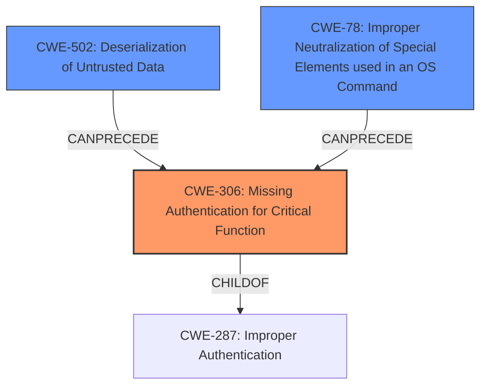

# Raw Analyzer Response for CVE-2024-23470

# Summary
| CWE ID | CWE Name | Confidence | CWE Abstraction Level | CWE Vulnerability Mapping Label | CWE-Vulnerability Mapping Notes |
|---|---|---|---|---|---|
| CWE-306 | Missing Authentication for Critical Function | 1.0 | Base | Primary CWE | Allowed |
| CWE-502 | Deserialization of Untrusted Data | 0.7 | Base | Secondary Candidate | Allowed |
| CWE-78 | Improper Neutralization of Special Elements used in an OS Command ('OS Command Injection') | 0.6 | Base | Secondary Candidate | Allowed |

## Evidence and Confidence

*   **Confidence Score:** 0.9
*   **Evidence Strength:** HIGH

## Relationship Analysis
The primary relationship influencing the selection was the parent-child relationship between CWE-287 (Improper Authentication) and CWE-306. Given the pre-authentication nature of the vulnerability, CWE-306, which is a child of CWE-287, was deemed more specific and appropriate. Additionally, considering the possibility of deserialization and OS command injection, chain relationships like CANPRECEDE influenced the consideration of secondary CWEs such as CWE-502 and CWE-78. The abstraction levels were considered to ensure the selected CWEs were at the Base level, providing sufficient detail.

## Vulnerability Chain
The vulnerability chain starts with the **missing authentication** for a critical function, allowing for potential **deserialization of untrusted data** that leads to **OS command injection**, and finally resulting in **remote code execution**.
  - Root Cause: CWE-306 Missing Authentication for Critical Function
  - Weakness 1: CWE-502 Deserialization of Untrusted Data (potential)
  - Weakness 2: CWE-78 Improper Neutralization of Special Elements used in an OS Command (potential)
  - Impact: Remote Code Execution

## Summary of Analysis
The initial analysis considered the pre-authentication remote code execution vulnerability and the exposed `UserScriptHumster` method in SolarWinds Access Rights Manager (ARM). The primary focus was on identifying the root cause, which appears to be the **lack of authentication** for a critical function. The Retriever results suggested CWE-306, which aligns with the vulnerability description indicating an unauthenticated user can execute commands. Given the available evidence, CWE-306 is the most appropriate primary CWE. The secondary CWEs, CWE-502 and CWE-78, were considered due to the potential for deserialization and command injection based on the exposed method but were not confirmed to be part of the vulnerability based on the evidence provided. Therefore, they are listed as secondary considerations. The final decision is based on the evidence that an unauthenticated user can execute commands, thus indicating a **missing authentication** check.

Relevant CWE Information:

# Enhanced Context (25 CWEs)
The following CWEs were identified as potentially relevant to this vulnerability:

## CWE Classification Guidance

The following guidance has been automatically included because relevant keywords were detected in the vulnerability description:

### Authentication vs Authorization vs Access Control Guidance

**Authentication**:
Determines *who* the actor is (identity validation). This is typically the *first step* in access control.

* Example phrases: "user must log in", "lack of login check", "bypasses login"
* CWE relevance: authentication is usually mapped to CWE-306 or its children.

  * **CWE-306**: *Missing Authentication for Critical Function* – used when no identity validation is enforced for sensitive functionality (e.g., password reset, user deletion).

**Authorization**:
Determines *what* an authenticated actor is allowed to do. It decides access *after* identity is verified.

* Example phrases: "unauthorized access", "regular user can access admin panel", "role checks are missing"
* CWE relevance: use CWEs like 862, 863, 285 for authorization errors:

  * **CWE-862**: *Missing Authorization* – the application doesn't check whether the user is authorized at all.
  * **CWE-863**: *Incorrect Authorization* – the application checks authorization, but does it incorrectly (e.g., flawed logic).
  * **CWE-285**: *Improper Authorization* – general category for any flawed authorization logic or design.

**Access Control**:
A broader term that includes both authentication and authorization. Governs how resources are protected and who can access them under what conditions.

* CWE relevance:

  * **CWE-284**: *Improper Access Control* – top-level category used when access control failure exists but root cause is unclear.
  * This should be avoided **if** a more specific child CWE like 285, 862, 863, or 306 is appropriate.

---

## Mapping Discussion – Common Misclassification Patterns

### 1. **CWE-306 vs CWE-862**:

* **306** is about lack of **authentication** (e.g., *no login required at all*).
* **862** is about lack of **authorization** *after* authentication (e.g., *admin check missing*).
* ✅ Example CWE-306: *“An unauthenticated attacker can invoke the password reset API.”*
* ✅ Example CWE-862: *“An authenticated user without admin privileges can delete any user account.”*

### 2. **CWE-285 vs CWE-284**:

* **285** is specific to authorization flaws – it's a better choice than 284 **if** the issue involves *improper or missing role checks*.
* **284** should be reserved for general access control issues when it’s unclear whether the issue lies in authn or authz.

---

## Technical Impact vs Root Cause Clarification

**Phrase like "unauthorized access" is not enough.**

* If you **cannot determine whether identity was checked**, assume it’s **authorization** and consider 862 or 863.
* If you **know no login happened**, lean toward **authentication** → CWE-306.
* If the **access control policy is unclear or inconsistently enforced**, but it's not due to missing checks, consider **CWE-284**.

---

## Good Mapping Examples

* ✅ **CWE-306**: “The endpoint `/admin/deleteUser` does not require any authentication.”
* ✅ **CWE-862**: “Any logged-in user can change any other user's email without being an admin.”
* ✅ **CWE-863**: “An admin check exists but incorrectly grants access to non-admin users.”
* ✅ **CWE-285**: “Application uses a static role check that fails when roles change dynamically.”
* ✅ **CWE-284**: “Inconsistent enforcement of access rules across services with unclear policy source.”

---

## Summary – Quick LLM Rules of Thumb

| **Indicator**                                              | **Likely CWE** |
| ---------------------------------------------------------- | -------------- |
| No identity check (no login)                               | CWE-306        |
| No role/privilege check after login                        | CWE-862        |
| Role check is present but flawed                           | CWE-863        |
| General or ambiguous authorization failure                 | CWE-285        |
| High-level access control problem with no clear root cause | CWE-284        |

### CWE-306: Missing Authentication for Critical Function
The SolarWinds Access Rights Manager allows an unauthenticated user to run commands and executables. This aligns directly with the description of **CWE-306**, which states that the product does not perform any authentication for functionality that requires a provable user identity. The security implication is that an attacker can execute arbitrary code on the system without needing to authenticate, leading to a complete compromise of the system. The mapping guidance suggests that CWE-306 is appropriate when there is no identity validation for sensitive functionality.

### CWE-502: Deserialization of Untrusted Data
The vulnerability involves an exposed method called `UserScriptHumster`, which might be vulnerable to deserialization of untrusted data. This could allow an attacker to inject malicious code into the deserialization process, leading to remote code execution. While the evidence isn't conclusive, the possibility warrants consideration of **C