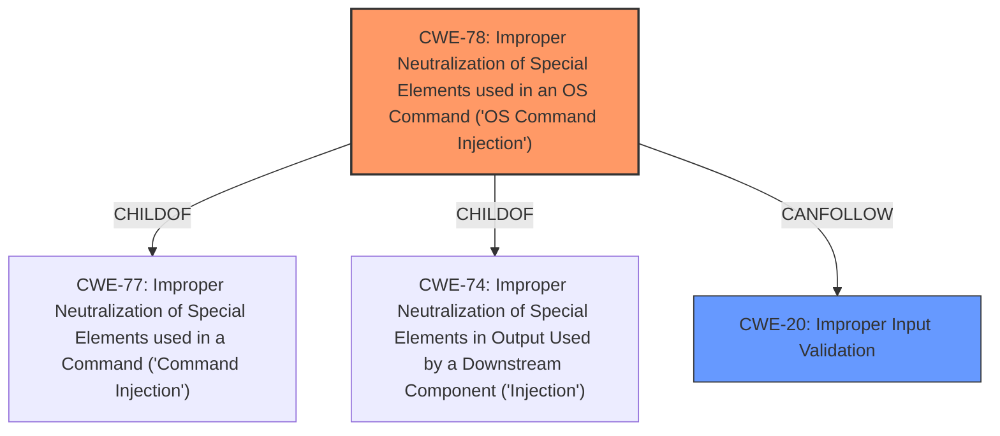

# Raw Analyzer Response for CVE-2024-23483

# Summary
| CWE ID | CWE Name | Confidence | CWE Abstraction Level | CWE Vulnerability Mapping Label | CWE-Vulnerability Mapping Notes |
|---|---|---|---|---|---|
| CWE-78 | Improper Neutralization of Special Elements used in an OS Command ('OS Command Injection') | 1.0 | Base | Primary | Allowed |
| CWE-20 | Improper Input Validation | 0.7 | Class | Secondary | Discouraged |

## Evidence and Confidence

*   **Confidence Score:** 0.9
*   **Evidence Strength:** HIGH

## Relationship Analysis
The primary CWE is CWE-78, which is a base level CWE and a child of CWE-77 (Improper Neutralization of Special Elements used in a Command) and CWE-74 (Improper Neutralization of Special Elements in Output Used by a Downstream Component ('Injection')). The vulnerability involves **Improper Input Validation** leading to OS **Command Injection**. While **Improper Input Validation** is present, the more specific CWE-78 accurately captures the nature of the **Command Injection** vulnerability. CWE-20 is a class-level CWE and is often misused when lower-level CWEs are more appropriate.

## Vulnerability Chain
The vulnerability chain starts with **Improper Input Validation** (CWE-20), which allows an attacker to inject malicious commands. This leads to the execution of those commands by the operating system, resulting in OS **Command Injection** (CWE-78).
  - CWE-20 (Root Cause - **Improper Input Validation**) -> CWE-78 (Impact - OS **Command Injection**)

## Summary of Analysis
The vulnerability is classified as CWE-78 (Improper Neutralization of Special Elements used in an OS Command ('OS Command Injection')) with high confidence. The vulnerability description clearly states that the **Improper Input Validation** leads to OS **Command Injection**. The retriever results also list CWE-78 as a highly relevant CWE for the given vulnerability. While CWE-20 (Improper Input Validation) is a contributing factor, CWE-78 provides a more specific and accurate representation of the vulnerability. The relationship analysis shows that CWE-78 is a child of CWE-77 and CWE-74, indicating a more specialized form of injection. Therefore, CWE-78 is the primary CWE. CWE-20 is considered a secondary CWE, but it is less specific.

Relevant CWE Information:
*   **CWE-78:** The product constructs all or part of an OS command using externally-influenced input from an upstream component, but it does not neutralize or incorrectly neutralizes special elements that could modify the intended OS command when it is sent to a downstream component. This directly aligns with the OS **Command Injection** described in the vulnerability.
*   **CWE-20:** The product receives input or data, but it does not validate or incorrectly validates that the input has the properties that are required to process the data safely and correctly. This is a general weakness, and while it contributes to the vulnerability, it is not the most specific CWE.

Other CWEs Considered:
*   CWE-77 (Improper Neutralization of Special Elements used in a Command ('Command Injection')): Considered but deemed less specific than CWE-78, which explicitly mentions OS commands.
*   CWE-74 (Improper Neutralization of Special Elements in Output Used by a Downstream Component ('Injection')): Considered but deemed less specific than CWE-78, as the injection directly leads to OS command execution, not just any downstream component.
*   CWE-88 (Improper Neutralization of Argument Delimiters in a Command ('Argument Injection')): Not selected because the vulnerability description does not specifically mention argument delimiters.
*   CWE-138 (Improper Neutralization of Special Elements): Considered but deemed less specific than CWE-78, which directly addresses OS command injection.
*   CWE-1286 (Improper Validation of Syntactic Correctness of Input): Considered but deemed less specific than CWE-78, as the focus is on the lack of neutralization of special elements in OS commands, rather than just syntactic correctness.