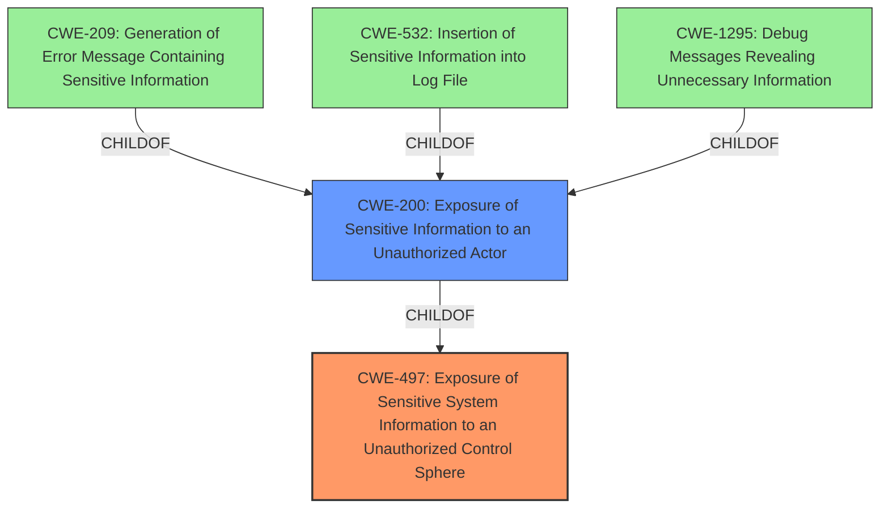

# Analysis Report for CVE-2024-23562

# Vulnerability Analysis Report: CVE-2024-23562

## Description

A security vulnerability in HCL Domino could allow disclosure of sensitive configuration information. A remote unauthenticated attacker could exploit this vulnerability to obtain information to launch further attacks against the affected system.

## Vulnerability Description Key Phrases

- **Impact:** obtain information to launch further attacks
- **Attacker:** remote unauthenticated attacker
- **Product:** HCL Domino

## Analysis (with Relationship Data)

# Summary
| CWE ID | CWE Name | Confidence | CWE Abstraction Level | CWE Vulnerability Mapping Label | CWE-Vulnerability Mapping Notes |
|---|---|---|---|---|---|
| CWE-497 | Exposure of Sensitive System Information to an Unauthorized Control Sphere | 0.7 | Base | Allowed | Primary CWE |
| CWE-200 | Exposure of Sensitive Information to an Unauthorized Actor | 0.5 | Class | Discouraged | Secondary Candidate |

## Evidence and Confidence

*   **Confidence Score:** 0.7
*   **Evidence Strength:** LOW

## Relationship Analysis
The primary CWE, CWE-497, is a Base-level CWE which means it is a good level of abstraction. CWE-497 can be a parent of other CWEs such as CWE-200.
CWE-200 is a Class-level CWE and is a parent of CWE-209, CWE-532, CWE-1295. Since the vulnerability description refers to "disclosure of sensitive configuration information" and the lack of specific information on how this occurs, CWE-497 is more suitable.



## Vulnerability Chain
The vulnerability chain starts with the **Exposure of Sensitive System Information to an Unauthorized Control Sphere (CWE-497)**, which then leads to **Exposure of Sensitive Information to an Unauthorized Actor (CWE-200)**. The **impact** is that an attacker could obtain information to launch further attacks.

## Summary of Analysis
The initial assessment considered CWE-200 due to the **impact** of the vulnerability being information exposure. However, upon closer inspection, the root cause is the **disclosure of sensitive configuration information**, making CWE-497 a more accurate fit. CWE-497 focuses on the exposure of system-level information, which aligns well with the vulnerability description. The relationship graph shows that CWE-200 is a child of CWE-497, indicating that the exposure of sensitive information is a consequence of the system information exposure.

The evidence for this assessment is primarily based on the vulnerability description, which states that the vulnerability could allow **disclosure of sensitive configuration information**. However, evidence is low since the CVE Reference Links Content Summary is unrelated.

Relevant CWE Information:

# Enhanced Context (25 CWEs)
The following CWEs were identified as potentially relevant to this vulnerability:

## CWE-497: Exposure of Sensitive System Information to an Unauthorized Control Sphere
**Abstraction Level**: Base
**Similarity Score**: 0.76
**Source**: dense

**Description**:
The product does not properly prevent sensitive system-level information from being accessed by unauthorized actors who do not have the same level of access to the underlying system as the product does.

**Mapping Guidance**:
- Usage: Allowed
- Rationale: This CWE entry is at the Base level of abstraction, which is a preferred level of abstraction for mapping to the root causes of vulnerabilities.

## CWE-200: Exposure of Sensitive Information to an Unauthorized Actor
**Abstraction Level**: Class
**Similarity Score**: 0.72
**Source**: dense

**Description**:
The product exposes sensitive information to an actor that is not explicitly authorized to have access to that information.

**Mapping Guidance**:
- Usage: Discouraged
- Rationale: CWE-200 is commonly misused to represent the loss of confidentiality in a vulnerability, but confidentiality loss is a technical impact - not a root cause error. As of CWE 4.9, over 400 CWE entries can lead to a loss of confidentiality. Other options are often available. [REF-1287].

### CWE Selection Rationale:

*   **CWE-497: Exposure of Sensitive System Information to an Unauthorized Control Sphere**
    *   The vulnerability description states "disclosure of sensitive configuration information," which aligns with the description of CWE-497.
    *   CWE-497 is at the Base level of abstraction, which is a preferred level.
    *   This CWE accurately captures the root cause of the vulnerability.
*   **CWE-200: Exposure of Sensitive Information to an Unauthorized Actor**
    *   While the vulnerability does result in the exposure of sensitive information, CWE-200 is a Class-level CWE and is generally discouraged as it represents the impact rather than the root cause.
    *   CWE-200 is a broader category, and CWE-497 provides a more specific classification.

**CWEs Considered But Not Used:**

*   CWE-522, CWE-209, CWE-256, CWE-89, CWE-532, CWE-284, CWE-327, CWE-306, and CWE-1272 were considered but not used because they did not align as closely with the root cause of the vulnerability as CWE-497. These CWEs represent different types of vulnerabilities such as credential issues, SQL injection, or cryptographic algorithm problems, which are not directly described in the vulnerability description.


## CWE Relationship Analysis

Current CWEs represent these abstraction levels: .


### Vulnerability Chain Analysis

**Chain starting from CWE-89:**
- 89 (Improper Neutralization of Special Elements used in an SQL Command ('SQL Injection')) - ROOT


**Chain starting from CWE-1272:**
- 1272 (Sensitive Information Uncleared Before Debug/Power State Transition) - ROOT


### CWE Relationship Diagram

```mermaid
graph TD
    classDef primary fill:#f96,stroke:#333,stroke-width:2px
    classDef secondary fill:#69f,stroke:#333
    classDef tertiary fill:#9e9,stroke:#333
```


*Report generated on 2025-07-13 06:02:30*
