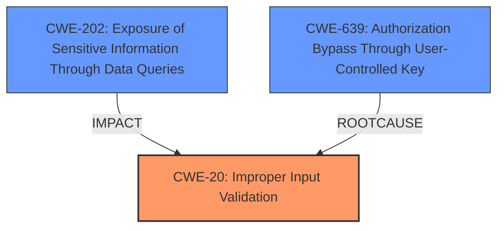

# Analysis for CVE-2024-23600

# Summary
| CWE ID | CWE Name | Confidence | CWE Abstraction Level | CWE Vulnerability Mapping Label | CWE-Vulnerability Mapping Notes |
|---|---|---|---|---|---|
| CWE-20 (**Improper Input Validation**) | Improper Input Validation | 0.9 | Class | Primary CWE | Discouraged |
| CWE-202 (**Exposure of Sensitive Information Through Data Queries**) | Exposure of Sensitive Information Through Data Queries | 0.7 | Base | Secondary Candidate | Allowed |
| CWE-639 (**Authorization Bypass Through User-Controlled Key**) | Authorization Bypass Through User-Controlled Key | 0.6 | Base | Secondary Candidate | Allowed |

## Evidence and Confidence

*   **Confidence Score:** 0.7
*   **Evidence Strength:** MEDIUM

## Relationship Analysis
The primary CWE is CWE-20 (**Improper Input Validation**), which is a high-level Class. While it captures the essence of the vulnerability, it's generally discouraged to use it if more specific CWEs are available. CWE-20 is a parent of more specific input validation flaws. The secondary candidates, CWE-202 (**Exposure of Sensitive Information Through Data Queries**) and CWE-639 (**Authorization Bypass Through User-Controlled Key**), offer more granularity. CWE-202 describes the impact (information exposure), while CWE-639 suggests a potential authorization bypass through manipulating keys.

## Vulnerability Chain
The vulnerability chain starts with **Improper Input Validation** (CWE-20) of query search results. This allows an attacker to inject malicious queries. The injected queries then lead to the **Exposure of Sensitive Information Through Data Queries** (CWE-202), potentially including user passwords or other sensitive data. It is possible that the attacker can bypass authorization checks by manipulating query parameters, which would be **Authorization Bypass Through User-Controlled Key** (CWE-639).

## Summary of Analysis
The initial assessment identified **Improper Input Validation** (CWE-20) as the primary weakness, which aligns with the "**rootcause:** **Improper Input Validation**" phrase from the vulnerability description. However, the retriever results and relationship analysis suggest exploring more specific CWEs.

The "CVE Reference Links Content Summary" highlights the following:
- **Query Filter Injection:** The primary vulnerability is the ability to inject arbitrary queries into the API's filtering mechanism.
- **Insufficient Input Sanitization:** The API does not properly sanitize or validate the input provided to the `_queryFilter` parameter.
- **Exposure of Protected Field:** The 'password' field...can be used in a query.

CWE-202 (**Exposure of Sensitive Information Through Data Queries**) is a reasonable secondary CWE because the vulnerability leads to information disclosure. "impact: information disclosure"

CWE-639 (**Authorization Bypass Through User-Controlled Key**) is included as a secondary CWE because the attacker is able to manipulate query parameters to access unauthorized data.

While CWE-20 is a class-level CWE and generally discouraged, the provided information does not give sufficient detail to pinpoint a more specific Base or Variant level CWE for the **Improper Input Validation**. Therefore, CWE-20 is used, but with a lower confidence score.

# Relevant CWE Information:

# Enhanced Context (25 CWEs)
The following CWEs were identified as potentially relevant to this vulnerability:

## CWE-204: Observable Response Discrepancy
**Abstraction Level**: Base
**Similarity Score**: 0.75
**Source**: dense

**Description**:
The product provides different responses to incoming requests in a way that reveals internal state information to an unauthorized actor outside of the intended control sphere.

**Mapping Guidance**:
- Usage: Allowed
- Rationale: This CWE entry is at the Base level of abstraction, which is a preferred level of abstraction for mapping to the root causes of vulnerabilities.

## CWE-90: Improper Neutralization of Special Elements used in an LDAP Query ('LDAP Injection')
**Abstraction Level**: Base
**Similarity Score**: 0.75
**Source**: dense

**Description**:
The product constructs all or part of an LDAP query using externally-influenced input from an upstream component, but it does not neutralize or incorrectly neutralizes special elements that could modify the intended LDAP query when it is sent to a downstream component.

**Mapping Guidance**:
- Usage: Allowed
- Rationale: This CWE entry is at the Base level of abstraction, which is a preferred level of abstraction for mapping to the root causes of vulnerabilities.

## CWE-74: Improper Neutralization of Special Elements in Output Used by a Downstream Component ('Injection')
**Abstraction Level**: Class
**Similarity Score**: 0.74
**Source**: dense

**Description**:
The product constructs all or part of a command, data structure, or record using externally-influenced input from an upstream component, but it does not neutralize or incorrectly neutralizes special elements that could modify how it is parsed or interpreted when it is sent to a downstream component.

**Mapping Guidance**:
- Usage: Discouraged
- Rationale: CWE-74 is high-level and often misused when lower-level weaknesses are more appropriate.

## CWE-1391: Use of Weak Credentials
**Abstraction Level**: Class
**Similarity Score**: 0.74
**Source**: dense

**Description**:
The product uses weak credentials (such as a default key or hard-coded password) that can be calculated, derived, reused, or guessed by an attacker.

**Mapping Guidance**:
- Usage: Allowed-with-Review
- Rationale: This CWE entry is a Class and might have Base-level children that would be more appropriate

## CWE-807: Reliance on Untrusted Inputs in a Security Decision
**Abstraction Level**: Base
**Similarity Score**: 0.74
**Source**: dense

**Description**:
The product uses a protection mechanism that relies on the existence or values of an input, but the input can be modified by an untrusted actor in a way that bypasses the protection mechanism.

**Mapping Guidance**:
- Usage: Allowed
- Rationale: This CWE entry is at the Base level of abstraction, which is a preferred level of abstraction for mapping to the root causes of vulnerabilities.

## CWE-303: Incorrect Implementation of Authentication Algorithm
**Abstraction Level**: Base
**Similarity Score**: 0.74
**Source**: dense

**Description**:
The requirements for the product dictate the use of an established authentication algorithm, but the implementation of the algorithm is incorrect.

**Mapping Guidance**:
- Usage: Allowed
- Rationale: This CWE entry is at the Base level of abstraction, which is a preferred level of abstraction for mapping to the root causes of vulnerabilities.

## CWE-497: Exposure of Sensitive System Information to an Unauthorized Control Sphere
**Abstraction Level**: Base
**Similarity Score**: 0.73
**Source**: dense

**Description**:
The product does not properly prevent sensitive system-level information from being accessed by unauthorized actors who do not have the same level of access to the underlying system as the product does.

**Mapping Guidance**:
- Usage: Allowed
- Rationale: This CWE entry is at the Base level of abstraction, which is a preferred level of abstraction for mapping to the root causes of vulnerabilities.

## CWE-639: Authorization Bypass Through User-Controlled Key
**Abstraction Level**: Base
**Similarity Score**: 0.73
**Source**: dense

**Description**:
The system's authorization functionality does not prevent one user from gaining access to another user's data or record by modifying the key value identifying the data.

**Mapping Guidance**:
- Usage: Allowed
- Rationale: This CWE entry is at the Base level of abstraction, which is a preferred level of abstraction for mapping to the root causes of vulnerabilities.

## CWE-288: Authentication Bypass Using an Alternate Path or Channel
**Abstraction Level**: Base
**Similarity Score**: 0.73
**Source**: dense

**Description**:
The product requires authentication, but the product has an alternate path or channel that does not require authentication.

**Mapping Guidance**:
- Usage: Allowed
- Rationale: This CWE entry is at the Base level of abstraction, which is a preferred level of abstraction for mapping to the root causes of vulnerabilities.

## CWE-538: Insertion of Sensitive Information into Externally-Accessible File or Directory
**Abstraction Level**: Base
**Similarity Score**: 0.73
**Source**: dense

**Description**:
The product places sensitive information into files or directories that are accessible to actors who are allowed to have access to the files, but not to the sensitive information.

**Mapping Guidance**:
- Usage: Allowed
- R