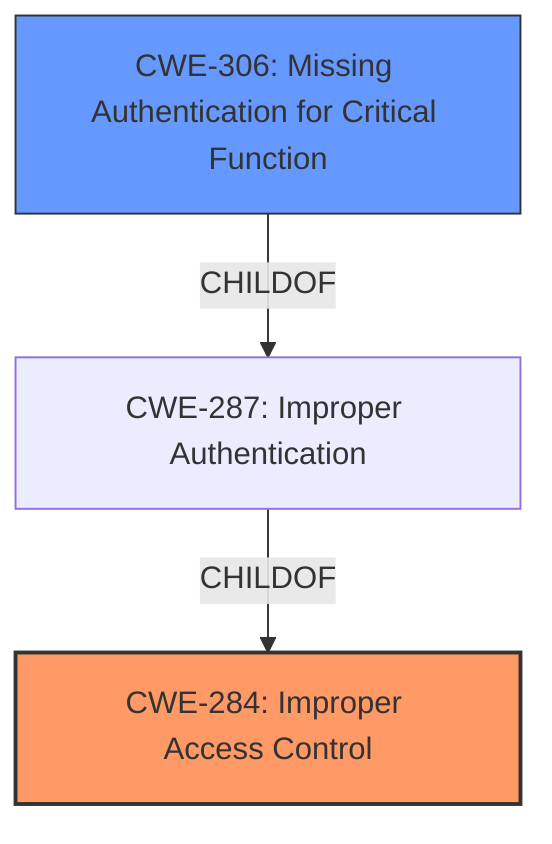

# Analysis Report for CVE-2024-23920

# Vulnerability Analysis Report: CVE-2024-23920

## Description

This vulnerability allows network-adjacent attackers to execute arbitrary code on affected installations of ChargePoint Home Flex charging stations. Authentication is not required to exploit this vulnerability. The specific flaw exists within the onboardee module. The issue results from **improper access control**. An attacker can leverage this vulnerability to execute code in the context of root.

## Vulnerability Description Key Phrases

- **Component:** onboardee module
- **Rootcause:** improper access control
- **Product:** ChargePoint Home Flex charging stations
- **Impact:** execute arbitrary code, execute code in the context of root
- **Attacker:** network-adjacent attackers

## Analysis (with Relationship Data)

# Summary
| CWE ID | CWE Name | Confidence | CWE Abstraction Level | CWE Vulnerability Mapping Label | CWE-Vulnerability Mapping Notes |
|---|---|---|---|---|---|
| CWE-284 | Improper Access Control | 1.0 | Class | Primary | Allowed |
| CWE-306 | Missing Authentication for Critical Function | 0.7 | Base | Secondary Candidate | Allowed |

## Evidence and Confidence

*   **Confidence Score:** 0.9
*   **Evidence Strength:** HIGH

## Relationship Analysis
The primary CWE is CWE-284, Improper Access Control, which is a high-level class. CWE-306, Missing Authentication for Critical Function, is a potential related weakness as the description indicates that authentication is not required. Since **improper access control** is listed as the root cause, CWE-284 is chosen as the primary CWE. CWE-306 could be a more specific root cause, but the information is not present to make that claim.



## Vulnerability Chain
The vulnerability chain starts with **improper access control**, which leads to the ability for network-adjacent attackers to execute arbitrary code in the context of root.
  - The **Primary CWE** is CWE-284 Improper Access Control.
  - There is a lack of authentication which is a secondary candidate CWE-306 Missing Authentication for Critical Function.
  - The impact is the ability to execute arbitrary code in the context of root.

## Summary of Analysis
The vulnerability description indicates an **improper access control** issue within the onboardee module of ChargePoint Home Flex charging stations, allowing network-adjacent attackers to execute arbitrary code with root privileges. The absence of required authentication further exacerbates the vulnerability.

The primary CWE is CWE-284 Improper Access Control, because **improper access control** is listed as the root cause. This aligns with the description of the vulnerability, where the product fails to properly restrict access to critical functions, leading to unauthorized code execution. The retriever results also suggested CWE-285, Improper Authorization, but the guidance for CWE-285 suggests to use a more specific CWE if possible, and since the vulnerability description mentions **improper access control**, CWE-284 is a better fit.

CWE-306 Missing Authentication for Critical Function is a plausible secondary CWE, since the vulnerability description specifically states that "Authentication is not required to exploit this vulnerability". This is a strong indicator that a critical function lacks proper authentication. This is mapped as a secondary candidate because there is not quite enough information to determine if a critical function lacks authentication.

Other CWEs were considered but deemed less relevant:

*   CWE-285 and CWE-863: While these relate to authorization issues, the initial root cause is the broader access control problem.
*   CWE-306: This relates to missing authentication, which is a contributing factor, but the primary issue is **improper access control**.
*   CWE-78: Improper Neutralization of Special Elements used in an OS Command ('OS Command Injection') - This CWE could be a secondary impact of the vulnerability if the code execution leads to command injection, but it is not the root cause.
*   CWE-20: Improper Input Validation - The vulnerability description does not mention input validation, so this CWE is not relevant.
*   CWE-259 and CWE-321: These relate to hard-coded credentials, but the vulnerability description does not mention anything about credentials.

The selected CWEs are at the optimal level of specificity, addressing both the **improper access control** and the lack of authentication. This provides a comprehensive understanding of the vulnerability and its potential impact.

Relevant CWE Information:

# Enhanced Context (25 CWEs)
The following CWEs were identified as potentially relevant to this vulnerability:

## CWE-345: Insufficient Verification of Data Authenticity
**Abstraction Level**: Class
**Similarity Score**: 0.77
**Source**: dense

**Description**:
The product does not sufficiently verify the origin or authenticity of data, in a way that causes it to accept invalid data.

**Mapping Guidance**:
- Usage: Discouraged
- Rationale: This CWE entry is a level-1 Class (i.e., a child of a Pillar). It might have lower-level children that would be more appropriate


## CWE-280: Improper Handling of Insufficient Permissions or Privileges 
**Abstraction Level**: Base
**Similarity Score**: 0.77
**Source**: dense

**Description**:
The product does not handle or incorrectly handles when it has insufficient privileges to access resources or functionality as specified by their permissions. This may cause it to follow unexpected code paths that may leave the product in an invalid state.

**Mapping Guidance**:
- Usage: Allowed
- Rationale: This CWE entry is at the Base level of abstraction, which is a preferred level of abstraction for mapping to the root causes of vulnerabilities.


## CWE-41: Improper Resolution of Path Equivalence
**Abstraction Level**: Base
**Similarity Score**: 0.76
**Source**: dense

**Description**:
The product is vulnerable to file system contents disclosure through path equivalence. Path equivalence involves the use of special characters in file and directory names. The associated manipulations are intended to generate multiple names for the same object.

**Mapping Guidance**:
- Usage: Allowed
- Rationale: This CWE entry is at the Base level of abstraction, which is a preferred level of abstraction for mapping to the root causes of vulnerabilities.


## CWE-74: Improper Neutralization of Special Elements in Output Used by a Downstream Component ('Injection')
**Abstraction Level**: Class
**Similarity Score**: 0.76
**Source**: dense

**Description**:
The product constructs all or part of a command, data structure, or record using externally-influenced input from an upstream component, but it does not neutralize or incorrectly neutralizes special elements that could modify how it is parsed or interpreted when it is sent to a downstream component.

**Mapping Guidance**:
- Usage: Discouraged
- Rationale: CWE-74 is high-level and often misused when lower-level weaknesses are more appropriate.


## CWE-1391: Use of Weak Credentials
**Abstraction Level**: Class
**Similarity Score**: 0.76
**Source**: dense

**Description**:
The product uses weak credentials (such as a default key or hard-coded password) that can be calculated, derived, reused, or guessed by an attacker.

**Mapping Guidance**:
- Usage: Allowed-with-Review
- Rationale: This CWE entry is a Class and might have Base-level children that would be more appropriate


## CWE-754: Improper Check for Unusual or Exceptional Conditions
**Abstraction Level**: Class
**Similarity Score**: 0.76
**Source**: dense

**Description**:
The product does not check or incorrectly checks for unusual or exceptional conditions that are not expected to occur frequently during day to day operation of the product.

**Mapping Guidance**:
- Usage: Allowed-with-Review
- Rationale: This CWE entry is a Class and might have Base-level children that would be more appropriate


## CWE-668: Exposure of Resource to Wrong Sphere
**Abstraction Level**: Class
**Similarity Score**: 0.75
**Source**: dense

**Description**:
The product exposes a resource to the wrong control sphere, providing unintended actors with inappropriate access to the resource.

**Mapping Guidance**:
- Usage: Discouraged
- Rationale: CWE-668 is high-level and is often misused as a catch-all when lower-level CWE IDs might be applicable. It is sometimes used for low-information vulnerability reports [REF-1287]. It is a level-1 Class (i.e., a child of a Pillar). It is not useful for trend analysis.


## CWE-497: Exposure of Sensitive System Information to an Unauthorized Control Sphere
**Abstraction Level**: Base
**Similarity Score**: 0.75
**Source**: dense

**Description**:
The product does not properly prevent sensitive system-level information from being accessed by unauthorized actors who do not have the same level of access to the underlying system as the product does.

**Mapping Guidance**:
- Usage: Allowed
- Rationale: This CWE entry is at the Base level of abstraction, which is a preferred level of abstraction for mapping to the root causes of vulnerabilities.


## CWE-267: Privilege Defined With Unsafe Actions
**Abstraction Level**: Base
**Similarity Score**: 0.75
**Source**: dense

**Description**:
A particular privilege, role, capability, or right can be used to perform unsafe actions that were not intended, even when it is assigned to the correct entity.

**Mapping Guidance**:
- Usage: Allowed
- Rationale


## CWE Relationship Analysis

Current CWEs represent these abstraction levels: .


### Vulnerability Chain Analysis

**Chain starting from CWE-863:**
- 863 (Incorrect Authorization) - ROOT


**Chain starting from CWE-321:**
- 321 (Use of Hard-coded Cryptographic Key) - ROOT


### CWE Relationship Diagram

```mermaid
graph TD
    classDef primary fill:#f96,stroke:#333,stroke-width:2px
    classDef secondary fill:#69f,stroke:#333
    classDef tertiary fill:#9e9,stroke:#333
```


*Report generated on 2025-07-13 06:08:31*
