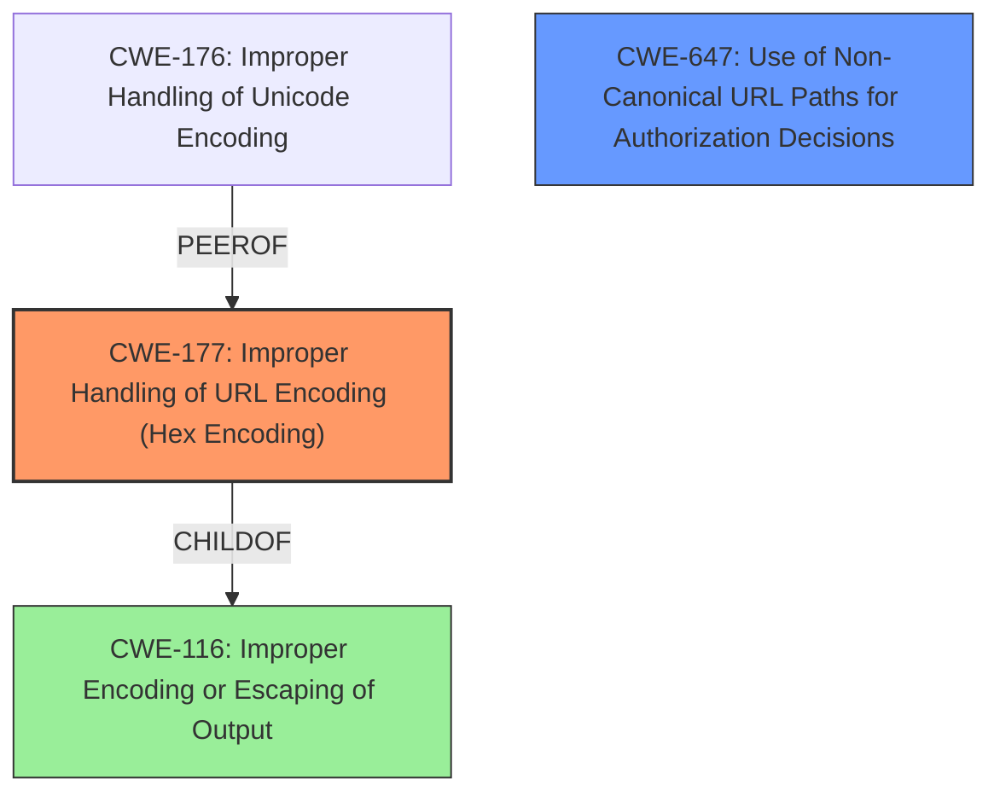

# Enhanced Analysis for CVE-2024-23983

# Summary
| CWE ID | CWE Name | Confidence | CWE Abstraction Level | CWE Vulnerability Mapping Label | CWE-Vulnerability Mapping Notes |
|---|---|---|---|---|---|
| CWE-177 | Improper Handling of URL Encoding (Hex Encoding) | 0.8 | Variant | Primary | Allowed |
| CWE-647 | Use of Non-Canonical URL Paths for Authorization Decisions | 0.6 | Variant | Secondary Candidate | Allowed |

## Evidence and Confidence

*   **Confidence Score:** 0.7
*   **Evidence Strength:** MEDIUM

## Relationship Analysis
The primary relationship that influenced my decision was the parent-child relationship between CWE-116 (Improper Encoding or Escaping of Output) and CWE-177 (Improper Handling of URL Encoding (Hex Encoding)), as well as its peer relationship to CWE-176 (Improper Handling of Unicode Encoding). The vulnerability description specifically mentions "URL-encoding," making CWE-177 a more specific and appropriate choice than its parent. CWE-647 (Use of Non-Canonical URL Paths for Authorization Decisions) was also considered because URL encoding issues can lead to non-canonical paths, however, the root cause is the **improper handling of the URL encoding** itself.



## Vulnerability Chain
The vulnerability chain starts with **improper handling of canonical URL-encoding** (CWE-177), leading to a bypass of request rules.

## Summary of Analysis
The primary weakness identified is CWE-177, as the vulnerability description explicitly mentions **"Improper handling of canonical URL-encoding."** This aligns directly with the description of CWE-177, which focuses on the product's failure to properly handle URL-encoded inputs. The retriever results support this, with CWE-177 being a strong candidate. The provided evidence and the relationship analysis both support the selection of CWE-177 as the primary weakness. Other CWEs, such as CWE-647, were considered, but they represent potential consequences or related issues rather than the direct root cause of the **improper URL encoding**.

Relevant CWE Information:

# Enhanced Context (25 CWEs)
The following CWEs were identified as potentially relevant to this vulnerability:

## CWE-177: Improper Handling of URL Encoding (Hex Encoding)
**Abstraction Level**: Variant
**Similarity Score**: 0.72
**Source**: dense

**Description**:
The product does not properly handle when all or part of an input has been URL encoded.

**Mapping Guidance**:
- Usage: Allowed
- Rationale: This CWE entry is at the Variant level of abstraction, which is a preferred level of abstraction for mapping to the root causes of vulnerabilities.

## CWE-647: Use of Non-Canonical URL Paths for Authorization Decisions
**Abstraction Level**: Variant
**Similarity Score**: 0.161
**Source**: sparse

**Description**:
The software uses the non-canonical version of a URL path when making authorization decisions, which might allow an attacker to bypass intended access controls by manipulating the URL path in a way that is not properly normalized.

**Mapping Guidance**:
- Usage: Allowed
- Rationale: This CWE entry is at the Variant level of abstraction, which is a preferred level of abstraction for mapping to the root causes of vulnerabilities.

**CWE-177:** The vulnerability description states **"Improper handling of canonical URL-encoding** may lead to bypass not properly constrained by request rules." The CVE Reference Links Content Summary confirms that the fix involves addressing URL-encoded characters. The root cause is the **improper handling of URL encoding**, which aligns perfectly with CWE-177's description: "The product does not properly handle when all or part of an input has been URL encoded." Therefore, CWE-177 is the most appropriate primary CWE.

**CWE-647:** While URL encoding issues can lead to non-canonical paths and potentially bypass authorization, the primary issue highlighted in the vulnerability description is the **improper handling of the encoding** itself. CWE-647 is a secondary effect.


## CWE Relationship Analysis

Current CWEs represent these abstraction levels: .


### Vulnerability Chain Analysis

**Chain starting from CWE-177:**
- 177 (Improper Handling of URL Encoding (Hex Encoding)) - ROOT


**Chain starting from CWE-647:**
- 647 (Use of Non-Canonical URL Paths for Authorization Decisions) - ROOT


### CWE Relationship Diagram

```mermaid
graph TD
    classDef primary fill:#f96,stroke:#333,stroke-width:2px
    classDef secondary fill:#69f,stroke:#333
    classDef tertiary fill:#9e9,stroke:#333
```