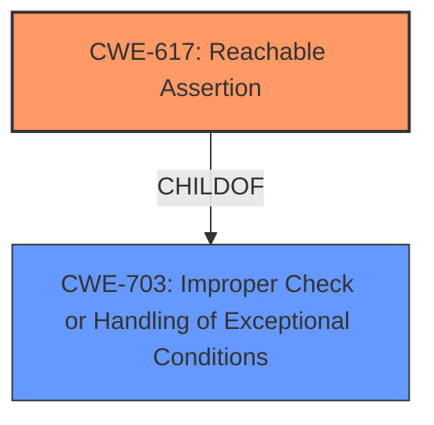

# Analysis for CVE-2024-24424

# Summary
| CWE ID | CWE Name | Confidence | CWE Abstraction Level | CWE Vulnerability Mapping Label | CWE-Vulnerability Mapping Notes |
|---|---|---|---|---|---|
| CWE-617 | Reachable Assertion | 1.0 | Base | Primary | Allowed |
| CWE-703 | Improper Check or Handling of Exceptional Conditions | 0.4 | Pillar | Secondary | Discouraged |

## Evidence and Confidence

*   **Confidence Score:** 1.0
*   **Evidence Strength:** HIGH

## Relationship Analysis
The primary relationship that influenced the decision was the direct match of the vulnerability description to CWE-617. The other potential CWEs were considered but deemed less specific or relevant. The abstraction level of CWE-617 is Base, which is the preferred level.

## Vulnerability Chain
The vulnerability chain is straightforward: a crafted NAS packet triggers a **reachable assertion** (CWE-617) in the `decode_access_point_name_ie` function, leading to a Denial of Service (DoS). The root cause is the **reachable assertion** itself.

## Summary of Analysis
The primary CWE is CWE-617, "Reachable Assertion," because the vulnerability description explicitly states that a **reachable assertion** allows attackers to cause a Denial of Service. The evidence is direct and clear. The retriever results also strongly support this, listing CWE-617 as the top result.

CWE-703, "Improper Check or Handling of Exceptional Conditions," was considered as a broader category that might encompass the specific issue of a **reachable assertion**. However, CWE-617 is more specific and directly reflects the vulnerability description. CWE-703 is a Pillar-level CWE, which is discouraged when a more specific Base-level CWE exists.

Relevant CWE Information:

# Enhanced Context (25 CWEs)
The following CWEs were identified as potentially relevant to this vulnerability:

## CWE-617: Reachable Assertion
**Abstraction Level**: Base
**Similarity Score**: 0.73
**Source**: dense

**Description**:
The product contains an assert() or similar statement that can be triggered by an attacker, which leads to an application exit or other behavior that is more severe than necessary.

**Mapping Guidance**:
- Usage: Allowed
- Rationale: This CWE entry is at the Base level of abstraction, which is a preferred level of abstraction for mapping to the root causes of vulnerabilities.

## CWE-703: Improper Check or Handling of Exceptional Conditions
**Abstraction Level**: Pillar
**Similarity Score**: 0.69
**Source**: dense

**Description**:
The product does not properly anticipate or handle exceptional conditions that rarely occur during normal operation of the product.

**Mapping Guidance**:
- Usage: Discouraged
- Rationale: This CWE entry is extremely high-level, a Pillar.