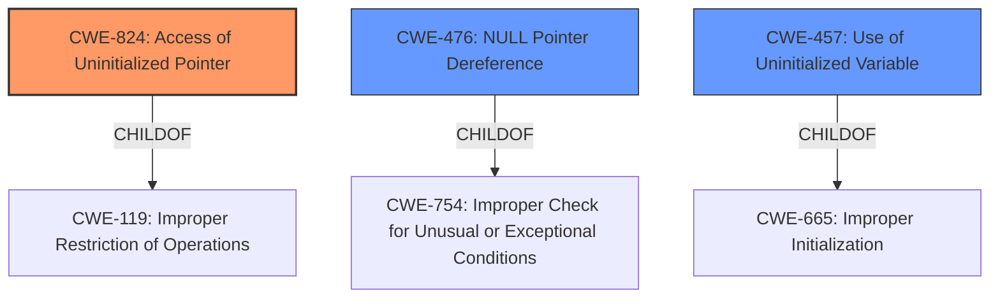

# Enhanced Analysis for CVE-2024-24446

# Summary
| CWE ID | CWE Name | Confidence | CWE Abstraction Level | CWE Vulnerability Mapping Label | CWE-Vulnerability Mapping Notes |
|---|---|---|---|---|---|
| CWE-824 | Access of Uninitialized Pointer | 0.9 | Base | Allowed | Primary CWE |
| CWE-476 | NULL Pointer Dereference | 0.7 | Base | Allowed | Secondary Candidate |
| CWE-457 | Use of Uninitialized Variable | 0.6 | Variant | Allowed | Secondary Candidate |

## Evidence and Confidence

*   **Confidence Score:** 0.8
*   **Evidence Strength:** HIGH

## Relationship Analysis
The primary CWE is CWE-824 **Access of Uninitialized Pointer**. This is a base-level CWE that describes accessing or using a pointer that has not been initialized. CWE-824 is a child of CWE-119 **Improper Restriction of Operations within the Bounds of a Memory Buffer**.

CWE-476 **NULL Pointer Dereference** is considered as a secondary CWE because the vulnerability description explicitly mentions the pointer being uninitialized leading to a potential null dereference. CWE-476 is a child of CWE-754 **Improper Check for Unusual or Exceptional Conditions**.

CWE-457 **Use of Uninitialized Variable** is also considered because an uninitialized pointer is essentially an uninitialized variable holding a memory address. It's a variant level CWE.



## Vulnerability Chain
The vulnerability chain starts with the **uninitialized pointer**, which leads to an **access of an uninitialized pointer**, and subsequently, a **denial of service** due to a potential **NULL pointer dereference**.
  - **Root Cause:** Uninitialized pointer in the `InitialContextSetupResponseMsg` class.
  - **Weakness:** CWE-824 **Access of Uninitialized Pointer** due to optional fields `pduSessionResourceSetupResponseList` and `pduSessionResourceFailedToSetupResponseList` not being initialized by default.
  - **Impact:** Denial of Service (DoS) when the uninitialized pointer is dereferenced.

## Summary of Analysis
The vulnerability description clearly states that the root cause is an **uninitialized pointer dereference**. The evidence is strong because both the vulnerability description and CVE reference links content summary highlight this.

CWE-824 **Access of Uninitialized Pointer** is chosen as the primary CWE because it accurately describes the **root cause** of the vulnerability, where the code attempts to access a pointer that hasn't been properly initialized. This aligns with the description: "The product accesses or uses a pointer that has not been initialized."

CWE-476 **NULL Pointer Dereference** is a possible consequence, as an uninitialized pointer might contain a NULL value, leading to a dereference. However, CWE-824 is more precise in capturing the initial error. The CVE Reference Links Content Summary also mentions "Null pointer dereference".

CWE-457 **Use of Uninitialized Variable** is considered because the uninitialized pointer can be viewed as an uninitialized variable.

The graph relationships support the selection of CWE-824 because it's a base-level CWE directly related to memory management issues. The other CWEs represent potential consequences or related conditions. The evidence and relationships strongly support the primary classification of CWE-824.


## CWE Relationship Analysis

Current CWEs represent these abstraction levels: .


### Vulnerability Chain Analysis

**Chain starting from CWE-665:**
- 665 (Improper Initialization) - ROOT


**Chain starting from CWE-457:**
- 457 (Use of Uninitialized Variable) - ROOT


### CWE Relationship Diagram

```mermaid
graph TD
    classDef primary fill:#f96,stroke:#333,stroke-width:2px
    classDef secondary fill:#69f,stroke:#333
    classDef tertiary fill:#9e9,stroke:#333
```