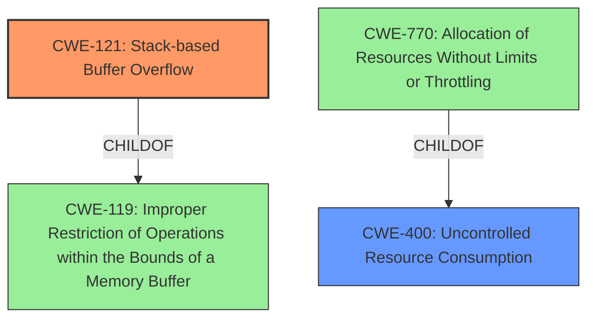

# Analysis for CVE-2024-24451

# Summary
| CWE ID | CWE Name | Confidence | CWE Abstraction Level | CWE Vulnerability Mapping Label | CWE-Vulnerability Mapping Notes |
|---|---|---|---|---|---|
| CWE-121 | Stack-based Buffer Overflow | 1.0 | Variant | Allowed | Primary CWE |
| CWE-400 | Uncontrolled Resource Consumption | 0.6 | Class | Discouraged | Secondary Candidate |

## Evidence and Confidence

*   **Confidence Score:** 0.8
*   **Evidence Strength:** MEDIUM

## Relationship Analysis
The primary relationship that influences the selection is the direct match of the **stack overflow** description to CWE-121. CWE-400 is a Class-level CWE and a parent of CWE-770 (Allocation of Resources Without Limits or Throttling), which relates to DoS but isn't a precise fit for the **stack overflow** itself. The graph shows that CWE-121 is a child of CWE-119 (Improper Restriction of Operations within the Bounds of a Memory Buffer), indicating a hierarchical relationship.

## Vulnerability Chain
The vulnerability chain starts with the **stack overflow** (CWE-121) due to repeatedly establishing SCTP connections. The impact is a Denial of Service (DoS).

CWE-121 (Root Cause: Stack-based Buffer Overflow) -> DoS (Impact)

## Summary of Analysis
The primary CWE is CWE-121 (Stack-based Buffer Overflow) because the vulnerability description explicitly mentions a **stack overflow**. The description says "A **stack overflow** in the sctp_serversctp_receiver_thread component of OpenAirInterface CN5G AMF (oai-cn5g-amf) up to v2.0.0 allows attackers to cause a Denial of Service (DoS) by repeatedly establishing SCTP connections with the N2 interface." This direct reference makes CWE-121 the most appropriate. The retriever results also ranked CWE-121 as the top match.

CWE-400 (Uncontrolled Resource Consumption) was considered because the **stack overflow** is triggered by repeatedly establishing SCTP connections, leading to resource exhaustion and a Denial of Service. However, CWE-400 is more of a consequence than the direct cause, and its usage is "Discouraged".

The selection of CWE-121 is at the optimal level of specificity because it directly describes the **stack overflow** condition, which is the root cause of the vulnerability.

Relevant CWE Information:

# Enhanced Context (25 CWEs)
The following CWEs were identified as potentially relevant to this vulnerability:

## CWE-121: Stack-based Buffer Overflow
**Abstraction Level**: Variant
**Similarity Score**: 0.73
**Source**: dense

**Description**:
A stack-based buffer overflow condition is a condition where the buffer being overwritten is allocated on the stack (i.e., is a local variable or, rarely, a parameter to a function).

**Mapping Guidance**:
- Usage: Allowed
- Rationale: This CWE entry is at the Variant level of abstraction, which is a preferred level of abstraction for mapping to the root causes of vulnerabilities.