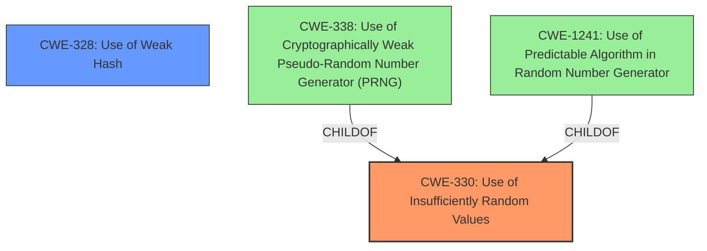

# Enhanced Analysis for CVE-2024-24554

# Summary
| CWE ID | CWE Name | Confidence | CWE Abstraction Level | CWE Vulnerability Mapping Label | CWE-Vulnerability Mapping Notes |
|---|---|---|---|---|---|
| CWE-330 | Use of Insufficiently Random Values | 0.9 | Class | Primary | Allowed-with-Review |
| CWE-328 | Use of Weak Hash | 0.8 | Base | Secondary | Allowed |

## Evidence and Confidence

*   **Confidence Score:** 0.85
*   **Evidence Strength:** HIGH

## Relationship Analysis
The primary CWE is CWE-330, which describes the use of insufficiently random values. CWE-330 is a Class-level CWE. The secondary CWE is CWE-328, which describes the use of a weak hash. CWE-328 is a Base-level CWE. CWE-330 is a parent of CWE-338 (Use of Cryptographically Weak Pseudo-Random Number Generator (PRNG)) and CWE-1241 (Use of Predictable Algorithm in Random Number Generator).



## Vulnerability Chain
The vulnerability chain starts with the use of **predictable methods to generate tokens** (CWE-330). This leads to the use of a weak hash (MD5) (CWE-328). The impact is that attackers can authenticate against the Bludit API.
  - **Root Cause:** **Predictable Methods to Generate Tokens** (CWE-330)
  - Weakness: Use of Weak Hash (CWE-328)
  - Impact: Authentication Bypass

## Summary of Analysis
The vulnerability lies in the **predictable methods used to generate tokens**, making them susceptible to brute-force attacks. The analysis is strongly based on the provided evidence, particularly the "Vulnerability Description Key Phrases" and "CVE Reference Links Content Summary". The root cause is the usage of insufficiently random values (CWE-330) in conjunction with a weak hashing algorithm (CWE-328).

The "CVE Reference Links Content Summary" explicitly mentions that "The API and user auth tokens are generated using a combination of `uniqid()`, `time()`, and the website's domain, then hashed with MD5." It further states that "The use of `uniqid()` which is based on current time in microseconds and is not cryptographically secure, combined with the usage of MD5 makes tokens **predictable** and vulnerable to brute-force attacks."

The graph relationships influenced the selection by highlighting how CWE-330 relates to more specific CWEs like CWE-338 and CWE-1241, but those are too specific. CWE-330 is the most appropriate level of abstraction, as it captures the core issue of using insufficiently random values. CWE-328 is also relevant because the tokens are hashed with MD5, which is a weak hashing algorithm.

CWE-330 is selected because the tokens are generated using predictable methods. CWE-328 is selected because the tokens are hashed with MD5, which is a weak hashing algorithm.

The selected CWEs are at the optimal level of specificity because they directly address the root cause and contributing factor to the vulnerability. More specific CWEs, while related, do not fully capture the broader issue of **insufficient randomness** and **weak hashing**.

**CWEs Considered But Not Used:**

*   CWE-338: Use of Cryptographically Weak Pseudo-Random Number Generator (PRNG) - While `uniqid()` can be considered a PRNG, the description doesn't explicitly state it's cryptographically weak. CWE-330 is more general and appropriate.
*   CWE-1241: Use of Predictable Algorithm in Random Number Generator - Similar to CWE-338, this is more specific than the general use of insufficient randomness.
*   CWE-1391: Use of Weak Credentials - While the result is weak credentials, the root cause is how the credentials are created, not the credentials themselves.


## CWE Relationship Analysis

Current CWEs represent these abstraction levels: .


### Vulnerability Chain Analysis

**Chain starting from CWE-338:**
- 338 (Use of Cryptographically Weak Pseudo-Random Number Generator (PRNG)) - ROOT


**Chain starting from CWE-330:**
- 330 (Use of Insufficiently Random Values) - ROOT


### CWE Relationship Diagram

```mermaid
graph TD
    classDef primary fill:#f96,stroke:#333,stroke-width:2px
    classDef secondary fill:#69f,stroke:#333
    classDef tertiary fill:#9e9,stroke:#333
```