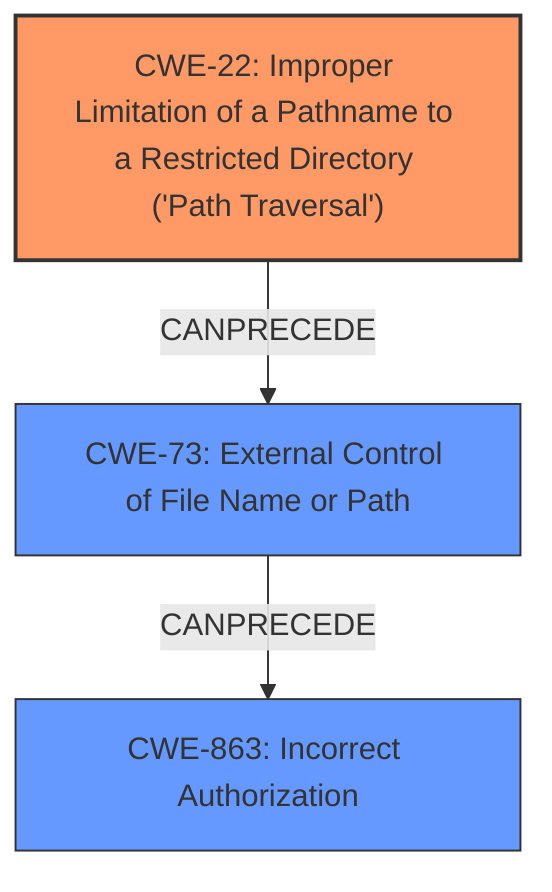

# Analysis for CVE-2024-24749

# Summary

| CWE ID    | CWE Name                                                                                                   | Confidence | CWE Abstraction Level | CWE Vulnerability Mapping Label | CWE-Vulnerability Mapping Notes |
| --------- | ---------------------------------------------------------------------------------------------------------- | ---------- | ----------------------- | ------------------------------- | ------------------------------- |
| CWE-22    | Improper Limitation of a Pathname to a Restricted Directory ('Path Traversal')                               | 0.9        | Base                    | Primary CWE                     | Allowed                         |
| CWE-73    | External Control of File Name or Path                                                                      | 0.7        | Base                    | Secondary Candidate             | Allowed                         |
| CWE-863    | Incorrect Authorization                                                                               | 0.6        | Base                    | Secondary Candidate             | Allowed                         |

## Evidence and Confidence

*   **Confidence Score:** 0.8
*   **Evidence Strength:** MEDIUM

## Relationship Analysis

The primary weakness is **CWE-22 Improper Limitation of a Pathname to a Restricted Directory ('Path Traversal')**. The product **bypasses existing input validation**, which allows an attacker to read arbitrary classpath resources. This can potentially lead to **CWE-73 External Control of File Name or Path**, as the attacker can control the path used in filesystem operations. If the GeoServer instance is configured with default credentials or the attacker can read configuration files to obtain credentials, it can lead to **CWE-863 Incorrect Authorization**, allowing the attacker to **gain administrator privileges**.

## Vulnerability Chain

The vulnerability chain starts with **CWE-22 Improper Limitation of a Pathname to a Restricted Directory ('Path Traversal')**, where **bypassing existing input validation** enables reading arbitrary files. This leads to **CWE-73 External Control of File Name or Path**, which could then result in **CWE-863 Incorrect Authorization** if the attacker can access credentials or configuration files. The ultimate impact is **gain administrator privileges**.

## Summary of Analysis

The primary weakness is **CWE-22 Improper Limitation of a Pathname to a Restricted Directory ('Path Traversal')**, as the vulnerability stems from the application's failure to properly restrict file pathnames, leading to potential exposure of sensitive information and privilege escalation. This is supported by the vulnerability description that details the ability to **bypass existing input validation** and read arbitrary classpath resources.

The other candidate CWEs, such as **CWE-73 External Control of File Name or Path** and **CWE-863 Incorrect Authorization**, are secondary because they represent potential consequences of the initial **path traversal** vulnerability.

The selection is based on the provided evidence and the relationship analysis, which suggests that the **path traversal** is the root cause. The chosen CWEs are at the optimal level of specificity, providing a detailed and accurate representation of the vulnerability.

Relevant CWE Information:

# Enhanced Context (25 CWEs)

## CWE-917: Improper Neutralization of Special Elements used in an Expression Language Statement ('Expression Language Injection')
This CWE was considered, but is less appropriate than **CWE-22 Improper Limitation of a Pathname to a Restricted Directory ('Path Traversal')** as the vulnerability is more directly related to file path manipulation than expression language injection.

## CWE-668: Exposure of Resource to Wrong Sphere
This CWE was considered, but it is too high-level and doesn't provide specific details about the nature of the vulnerability. It is discouraged to use this CWE.

## CWE-41: Improper Resolution of Path Equivalence
This CWE was considered, but is less appropriate than **CWE-22 Improper Limitation of a Pathname to a Restricted Directory ('Path Traversal')** as the vulnerability is more directly related to file path manipulation than path equivalence.

## CWE-74: Improper Neutralization of Special Elements in Output Used by a Downstream Component ('Injection')
This CWE was considered, but is less appropriate than **CWE-22 Improper Limitation of a Pathname to a Restricted Directory ('Path Traversal')** as the vulnerability is more directly related to file path manipulation than injection. It is discouraged to use this CWE.

## CWE-497: Exposure of Sensitive System Information to an Unauthorized Control Sphere
This CWE was considered, but it is not as precise as **CWE-22 Improper Limitation of a Pathname to a Restricted Directory ('Path Traversal')** or **CWE-73 External Control of File Name or Path**.

## CWE-303: Incorrect Implementation of Authentication Algorithm
This CWE was considered, but it doesn't fit since the issue isn't related to the authentication algorithm itself, but rather to the ability to access resources and potentially **gain administrator privileges** through other means.

## CWE-23: Relative Path Traversal
This CWE was considered, but **CWE-22 Improper Limitation of a Pathname to a Restricted Directory ('Path Traversal')** is a more general case of path traversal.

## CWE-73: External Control of File Name or Path
This CWE was considered and it can be a secondary CWE since it is a consequence of the primary weakness, **CWE-22 Improper Limitation of a Pathname to a Restricted Directory ('Path Traversal')**.

## CWE-138: Improper Neutralization of Special Elements
This CWE was considered, but it is a Class and it might have lower-level children that would be more appropriate

## CWE-807: Reliance on Untrusted Inputs in a Security Decision
This CWE was considered, but it is not as precise as **CWE-22 Improper Limitation of a Pathname to a Restricted Directory ('Path Traversal')** or **CWE-73 External Control of File Name or Path**.