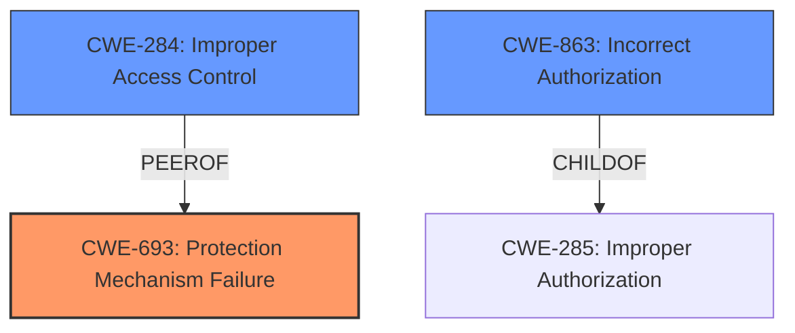

# Analysis Report for CVE-2024-24980

# Vulnerability Analysis Report: CVE-2024-24980

## Description

**Protection mechanism failure** in some 3rd, 4th, and 5th Generation Intel(R) Xeon(R) Processors may allow a privileged user to potentially enable escalation of privilege via local access.

## Vulnerability Description Key Phrases

- **Rootcause:** Protection mechanism failure
- **Impact:** escalation of privilege
- **Attacker:** privileged user
- **Product:** 3rd, 4th, and 5th Generation Intel(R) Xeon(R) Processors

## Analysis (with Relationship Data)

# Summary
| CWE ID    | CWE Name                                                           | Confidence | CWE Abstraction Level | CWE Vulnerability Mapping Label | CWE-Vulnerability Mapping Notes |
| :---------- | :----------------------------------------------------------------- | :--------- | :---------------------- | :------------------------------ | :------------------------------ |
| CWE-693     | **Protection Mechanism Failure**                                   | 0.9        | Pillar                  | Primary                         | Discouraged                   |
| CWE-284     | Improper Access Control                                            | 0.6        | Pillar                  | Secondary                       | Discouraged                   |
| CWE-863     | Incorrect Authorization                                            | 0.5        | Class                  | Secondary                       | Allowed-with-Review              |

## Evidence and Confidence

*   **Confidence Score:** 0.7
*   **Evidence Strength:** MEDIUM

## Relationship Analysis

The primary CWE selected is CWE-693 (**Protection Mechanism Failure**), which is a high-level Pillar. Given the lack of specific details about the **protection mechanism failure**, choosing a more specific CWE is difficult. CWE-284 (**Improper Access Control**) is also a high-level Pillar. CWE-863 (**Incorrect Authorization**) is a child of CWE-285 (**Improper Authorization**), but there isn't enough evidence to determine if the authorization mechanism is present but flawed. Therefore, I chose the highest level CWE as a starting point.



## Vulnerability Chain

The vulnerability chain starts with a **protection mechanism failure** (CWE-693). This leads to the ability to perform actions one should not be allowed to do (**Improper Access Control** CWE-284). This ultimately results in **escalation of privilege**. The chain is: CWE-693 (Root Cause) -> CWE-284 -> Escalation of Privilege (Impact).

## Summary of Analysis

The analysis is based on the provided evidence, which indicates a **protection mechanism failure** leading to **escalation of privilege**. The selection of CWE-693 as the primary CWE is based on the **root cause** identified in the vulnerability description and the retriever results.

The evidence supporting CWE-693 is:
*   "**Protection mechanism failure** in some 3rd, 4th, and 5th Generation Intel(R) Xeon(R) Processors may allow a privileged user to potentially enable escalation of privilege via local access."
*   "**Root Cause:** A protection mechanism failure in certain Intel Xeon processors."
*   "**Weaknesses/Vulnerabilities:** The vulnerability lies in a flaw in a protection mechanism within the listed Intel Xeon processors, which can be exploited by a privileged user."

CWE-693 is at the Pillar level, but given the limited information, it's the most accurate representation of the **root cause**. While CWE-284 is also a Pillar and is often overused, it accurately reflects the impact of the **protection mechanism failure**, leading to **improper access control**. The relationship between CWE-693 and CWE-284 is that the former enables the latter.

I also considered CWE-863 (**Incorrect Authorization**), but given the lack of specifics, I only included it as a possible secondary candidate.


## CWE Relationship Analysis

Current CWEs represent these abstraction levels: .


### Vulnerability Chain Analysis

**Chain starting from CWE-284:**
- 284 (Improper Access Control) - ROOT


**Chain starting from CWE-863:**
- 863 (Incorrect Authorization) - ROOT


### CWE Relationship Diagram

```mermaid
graph TD
    classDef primary fill:#f96,stroke:#333,stroke-width:2px
    classDef secondary fill:#69f,stroke:#333
    classDef tertiary fill:#9e9,stroke:#333
```


*Report generated on 2025-07-13 06:17:37*
