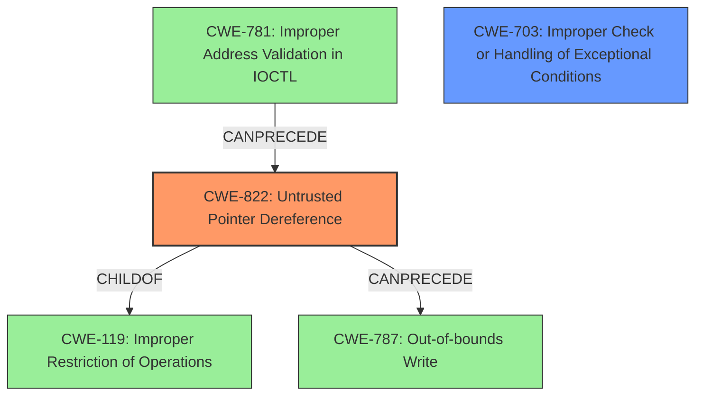

# Analysis Report for CVE-2024-25074

# Vulnerability Analysis Report: CVE-2024-25074

## Description

An issue was discovered in Samsung Semiconductor Mobile Processor and Modem Exynos 9820, Exynos 9825, Exynos 980, Exynos 990, Exynos 850, Exynos 1080, Exynos 2100, Exynos 2200, Exynos 1280, Exynos 1380, Exynos 1330, Exynos 9110, Exynos W920, Exynos W930, Exynos Modem 5123, Exynos Modem 5300. The baseband software **does not properly check a pointer specified by the SM** (Session Management module), which can lead to Denial of Service (**Untrusted Pointer Dereference**).

## Vulnerability Description Key Phrases

- **Rootcause:** does not properly check a pointer specified by the SM
- **Weakness:** Untrusted Pointer Dereference
- **Impact:** Denial of Service
- **Product:** ['Samsung Semiconductor Mobile Processor', 'Modem']
- **Component:** baseband software

## Analysis (with Relationship Data)

# Summary
| CWE ID | CWE Name | Confidence | CWE Abstraction Level | CWE Vulnerability Mapping Label | CWE-Vulnerability Mapping Notes |
|---|---|---|---|---|---|
| CWE-822 | Untrusted Pointer Dereference | 0.9 | Base | Primary | Allowed |
| CWE-703 | Improper Check or Handling of Exceptional Conditions | 0.6 | Pillar | Secondary | Discouraged |

## Evidence and Confidence

*   **Confidence Score:** 0.9
*   **Evidence Strength:** HIGH

## Relationship Analysis
The primary relationship influencing the decision is the parent-child relationship where CWE-822 (**Untrusted Pointer Dereference**) is a child of CWE-119 (**Improper Restriction of Operations within the Bounds of a Memory Buffer**). However, since there is a direct mention of **Untrusted Pointer Dereference** in the vulnerability description key phrases, CWE-822 is more appropriate and specific. CWE-703 (**Improper Check or Handling of Exceptional Conditions**) is a high-level pillar and less specific than CWE-822, which is a base CWE. The "CanPrecede" and "CanFollow" relationships associated with CWE-822 (e.g., CanPrecede CWE-787 (**Out-of-bounds Write**), CanFollow CWE-781 (**Improper Address Validation in IOCTL with METHOD_NEITHER I/O Control Code**)) didn't directly impact the primary CWE selection but provide context for potential related vulnerabilities.



## Vulnerability Chain
The vulnerability chain starts with the baseband software failing to properly validate a pointer provided by the Session Management module. This **lack of validation** leads to an **Untrusted Pointer Dereference** (CWE-822), which results in a Denial of Service.

## Summary of Analysis
The analysis is primarily based on the explicit mention of "Untrusted Pointer Dereference" in the vulnerability description and CVE Reference Links Content Summary. The vulnerability description clearly states that the baseband software **does not properly check a pointer**, leading to an **Untrusted Pointer Dereference** which results in a Denial of Service. This directly aligns with the description of CWE-822.

The relationship graph reinforces that CWE-822 is a specific type of memory corruption issue, fitting the context of the vulnerability.

CWE-822 is selected because it is the most specific and accurate representation of the **weakness** described in the vulnerability report. While other CWEs like CWE-703 (**Improper Check or Handling of Exceptional Conditions**) were considered, they were deemed too general. The description focuses on pointer validation, making CWE-822 the optimal choice.

Relevant CWE Information:

# Enhanced Context (25 CWEs)

## CWE-822: Untrusted Pointer Dereference
**Abstraction Level**: Base
**Similarity Score**: 0.77
**Source**: dense

**Description**:
The product obtains a value from an untrusted source, converts this value to a pointer, and dereferences the resulting pointer.

**Mapping Guidance**:
- Usage: Allowed
- Rationale: This CWE entry is at the Base level of abstraction, which is a preferred level of abstraction for mapping to the root causes of vulnerabilities.

**Justification**: This is the primary CWE because the vulnerability description explicitly states the **weakness** as "**Untrusted Pointer Dereference**" and details that the baseband software **does not properly check a pointer specified by the SM** module. The "CVE Reference Links Content Summary" also supports this by stating "The core issue is that the software blindly trusts a pointer supplied by the SM module without any checks. This lack of validation can lead to the software attempting to access arbitrary memory locations."

## CWE-1285: Improper Validation of Specified Index, Position, or Offset in Input
**Abstraction Level**: Base
**Similarity Score**: 0.77
**Source**: dense

**Description**:
The product receives input that is expected to specify an index, position, or offset into an indexable resource such as a buffer or file, but it does not validate or incorrectly validates that the specified index/position/offset has the required properties.

**Mapping Guidance**:
- Usage: Allowed
- Rationale: This CWE entry is at the Base level of abstraction, which is a preferred level of abstraction for mapping to the root causes of vulnerabilities.

**Why Not Selected**: While related to validation, this is more specific to indexes, positions, or offsets. The current description focuses on a more general untrusted pointer dereference.

## CWE-703: Improper Check or Handling of Exceptional Conditions
**Abstraction Level**: Pillar
**Similarity Score**: 0.75
**Source**: dense

**Description**:
The product does not properly anticipate or handle exceptional conditions that rarely occur during normal operation of the product.

**Mapping Guidance**:
- Usage: Discouraged
- Rationale: This CWE entry is extremely high-level, a Pillar.

**Justification as Secondary CWE**: The **rootcause** of the vulnerability is that the baseband software **does not properly check a pointer specified by the SM**. In general, this is the **improper check** which relates to CWE-703.
**Why Not Selected as Primary CWE**: CWE-703 is too general and high-level.

## CWE-824: Access of Uninitialized Pointer
**Abstraction Level**: Base
**Similarity Score**: 0.75
**Source**: dense

**Description**:
The product accesses or uses a pointer that has not been initialized.

**Mapping Guidance**:
- Usage: Allowed
- Rationale: This CWE entry is at the Base level of abstraction, which is a preferred level of abstraction for mapping to the root causes of vulnerabilities.

**Why Not Selected**: The vulnerability is not explicitly about an uninitialized pointer but rather a pointer that is not properly validated before being dereferenced.

## CWE-755: Improper Handling of Exceptional Conditions
**Abstraction Level**: Class
**Similarity Score**: 0.75
**Source**: dense

**Description**:
The product does not handle or incorrectly handles an exceptional condition.

**Mapping Guidance**:
- Usage: Discouraged
- Rationale: This CWE entry is a level-1 Class (i.e., a child of a Pillar). It might have lower-level children that would be more appropriate

**Why Not Selected**: Similar to CWE-703, this is too general.

## CWE-345: Insufficient Verification of Data Authenticity
**Abstraction Level**: Class
**Similarity Score**: 0.74
**Source**: dense

**Description**:
The product does not sufficiently verify the origin or authenticity of data, in a way that causes it to accept invalid data.

**Mapping Guidance**:
- Usage: Discouraged
- Rationale: This CWE entry is a level-1 Class (i.e., a child of a Pillar). It might have lower-level children that would be more appropriate

**Why Not Selected**: This vulnerability is not specifically about data authenticity, but about pointer validation.

## CWE-754: Improper Check for Unusual or Exceptional Conditions
**Abstraction Level**: Class
**Similarity Score**: 0.73
**Source**: dense

**Description**:
The product does not check or incorrectly checks for unusual or exceptional conditions that are not expected to occur frequently during day to day operation of the product.

**Mapping Guidance**:
- Usage: Allowed-with-Review
- Rationale: This CWE entry is a Class and might have Base-level children that would be more appropriate

**Why Not Selected**: This is too general; CWE-822 is more specific.

## CWE-252: Unchecked Return Value
**Abstraction Level**: Base
**Similarity Score**: 0.73
**Source**: dense

**Description**:
The product does not check the return value from a method or function, which can prevent it from detecting unexpected states and conditions.

**Mapping Guidance**:
- Usage: Allowed
- Rationale: This CWE entry is at the Base level of abstraction, which is a preferred level of abstraction for mapping to the root causes of vulnerabilities.

**Why Not Selected**: This is not related to unchecked return values but improper pointer validation.

## CWE-131: Incorrect Calculation of Buffer Size
**Abstraction Level**:


## CWE Relationship Analysis

Current CWEs represent these abstraction levels: .


### Vulnerability Chain Analysis

**Chain starting from CWE-345:**
- 345 (Insufficient Verification of Data Authenticity) - ROOT


**Chain starting from CWE-131:**
- 131 (Incorrect Calculation of Buffer Size) - ROOT


### CWE Relationship Diagram

```mermaid
graph TD
    classDef primary fill:#f96,stroke:#333,stroke-width:2px
    classDef secondary fill:#69f,stroke:#333
    classDef tertiary fill:#9e9,stroke:#333
```


*Report generated on 2025-07-13 06:20:57*
