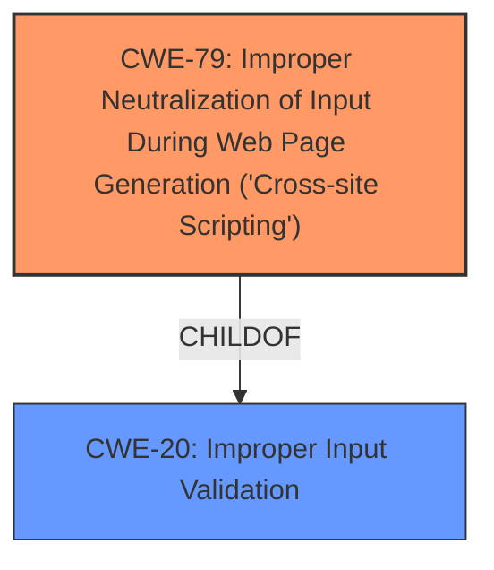

# Enhanced Analysis for CVE-2024-25090

# Summary
| CWE ID  | CWE Name                                                                    | Confidence | CWE Abstraction Level | CWE Vulnerability Mapping Label | CWE-Vulnerability Mapping Notes |
| :-------- | :-------------------------------------------------------------------------- | :--------- | :---------------------- | :------------------------------ | :------------------------------ |
| CWE-79 | Improper Neutralization of Input During Web Page Generation ('Cross-site Scripting') | 1.0 | Base | Primary | Allowed |
| CWE-20 | Improper Input Validation | 0.7 | Class | Secondary | Allowed-with-Review |

## Evidence and Confidence

*   **Confidence Score:** 0.9
*   **Evidence Strength:** HIGH

## Relationship Analysis
The primary weakness is CWE-79, which is caused by **insufficient input validation**. CWE-79 is a Base level CWE. CWE-20 is a Class level CWE and a parent of many input validation related CWEs, including those that could lead to XSS.



## Vulnerability Chain
The vulnerability chain begins with **insufficient input validation** (CWE-20). This leads to **improper neutralization of input** and ultimately results in Cross-Site Scripting (CWE-79).

## Summary of Analysis
The vulnerability is an **XSS** vulnerability due to **insufficient input validation**.

The primary CWE is CWE-79 (Improper Neutralization of Input During Web Page Generation ('Cross-site Scripting')). The vulnerability description explicitly states that **insufficient input validation** in multiple features of Apache Roller allows an authenticated user to perform an **XSS** attack. This aligns directly with the description of CWE-79, which involves the product not neutralizing or incorrectly neutralizing user-controllable input before it is placed in output that is used as a web page served to other users.

CWE-20 (Improper Input Validation) is included as a secondary CWE because the root cause identified is **insufficient input validation**. While the primary impact is XSS, the underlying cause is a failure to properly validate and sanitize input, which is what CWE-20 addresses.

Other CWEs were considered but deemed less appropriate:

*   CWE-1333 (Inefficient Regular Expression Complexity): While this CWE appears in the retrieved results, there is no indication in the vulnerability description that inefficient regular expressions are involved.
*   CWE-347 (Improper Verification of Cryptographic Signature): There is no mention of cryptographic signatures in the vulnerability description.
*   CWE-116 (Improper Encoding or Escaping of Output): While encoding and escaping are related to neutralization, the primary issue described is the **lack of input validation**, making CWE-79 a more direct fit.
*   CWE-863 (Incorrect Authorization): The vulnerability description does not suggest any authorization issues, but rather focuses on input validation.

The selected CWEs are at the optimal level of specificity. CWE-79 is a Base level CWE that directly addresses the XSS vulnerability, while CWE-20 highlights the underlying input validation issue.


## CWE Relationship Analysis

Current CWEs represent these abstraction levels: .


### Vulnerability Chain Analysis

**Chain starting from CWE-863:**
- 863 (Incorrect Authorization) - ROOT


**Chain starting from CWE-116:**
- 116 (Improper Encoding or Escaping of Output) - ROOT


### CWE Relationship Diagram

```mermaid
graph TD
    classDef primary fill:#f96,stroke:#333,stroke-width:2px
    classDef secondary fill:#69f,stroke:#333
    classDef tertiary fill:#9e9,stroke:#333
```