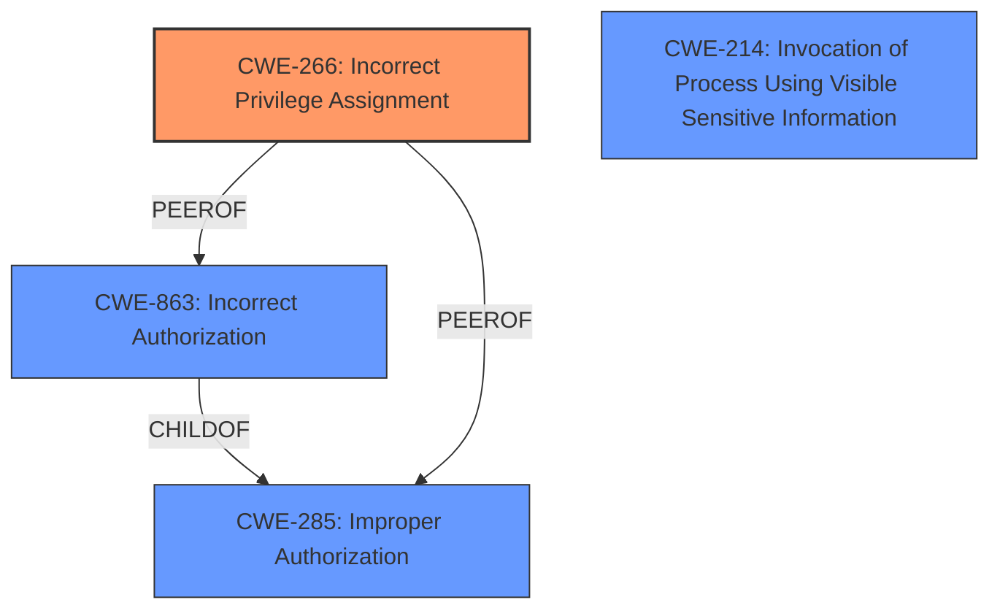

# Analysis Report for CVE-2024-25133

# Vulnerability Analysis Report: CVE-2024-25133

## Description

A flaw was found in the Hive ClusterDeployments resource in OpenShift Dedicated. In certain conditions, this issue may allow a developer account on a Hive-enabled cluster to obtain cluster-admin privileges by executing arbitrary commands on the hive/hive-controllers pod.

## Vulnerability Description Key Phrases

- **Impact:** obtain cluster-admin privileges
- **Attacker:** developer account
- **Product:** OpenShift Dedicated
- **Component:** Hive ClusterDeployments resource

## Analysis (with Relationship Data)

# Summary

| CWE ID  | CWE Name                                                        | Confidence | CWE Abstraction Level | CWE Vulnerability Mapping Label | CWE-Vulnerability Mapping Notes |
| :-------- | :-------------------------------------------------------------- | :--------- | :-------------------- | :------------------------------ | :------------------------------ |
| CWE-266 | Incorrect Privilege Assignment                               | 0.9        | Base                  | Primary CWE                     | Allowed                       |
| CWE-285 | Improper Authorization                                          | 0.7        | Class                 | Secondary Candidate             | Discouraged                  |
| CWE-863 | Incorrect Authorization                                          | 0.6        | Class                 | Secondary Candidate             | Allowed-with-Review           |
| CWE-214 | Invocation of Process Using Visible Sensitive Information | 0.5        | Base                  | Secondary Candidate             | Allowed                       |

## Evidence and Confidence

*   **Confidence Score:** 0.8
*   **Evidence Strength:** HIGH

## Relationship Analysis

The primary weakness is **CWE-266 Incorrect Privilege Assignment** because the vulnerability allows a developer account to obtain cluster-admin privileges, which is a privilege issue. **CWE-285 Improper Authorization** and **CWE-863 Incorrect Authorization** are also considered but are less specific. **CWE-214 Invocation of Process Using Visible Sensitive Information** could be a contributing factor as the **ROOTCAUSE** appears to be related to how processes are invoked with potentially sensitive configurations, but it is not the primary driver.



## Vulnerability Chain

The vulnerability chain starts with the **ROOTCAUSE** of insecure configuration (`credential_process` in AWS, `users[].user.exec` in Kubernetes), leading to **CWE-266 Incorrect Privilege Assignment**, and finally resulting in the **impact** of a developer gaining cluster-admin privileges.

## Summary of Analysis

The assessment is based on the provided evidence, specifically the CVE Reference Links Content Summary. The key evidence includes:

*   The vulnerability arises from the inherent capabilities of AWS and Kubernetes client configurations, specifically the `credentials_process` in AWS and `users[].user.exec` in Kubernetes client configurations, which allows for command execution.
*   A developer account on a Hive-enabled cluster can obtain cluster-admin privileges by executing arbitrary commands on the `hive/hive-controllers` pod.

The graph relationships helped to differentiate between privilege and authorization issues, leading to the selection of **CWE-266 Incorrect Privilege Assignment** as the primary CWE. The selected CWEs are at the optimal level of specificity, with **CWE-266 Incorrect Privilege Assignment** being a Base level CWE, providing a detailed description of the weakness.

Relevant CWE Information:

*   **CWE-266: Incorrect Privilege Assignment:** The system assigns incorrect privileges to a user (e.g., admin instead of guest). This aligns with the vulnerability description where a developer account gains cluster-admin privileges.
*   **CWE-285: Improper Authorization:** The product does not perform or incorrectly performs an authorization check when an actor attempts to access a resource or perform an action. This is a broader category and less specific than **CWE-266 Incorrect Privilege Assignment**.
*   **CWE-863: Incorrect Authorization:** The product performs an authorization check when an actor attempts to access a resource or perform an action, but it does not correctly perform the check. This is also a broader category and less specific than **CWE-266 Incorrect Privilege Assignment**.
*   **CWE-214: Invocation of Process Using Visible Sensitive Information:** Could apply, given that the vulnerability depends on the configuration of the AWS and Kubernetes client to execute arbitrary commands.

Other CWEs Considered But Not Used:

*   **CWE-287: Improper Authentication** - While authentication is a prerequisite, the core issue is incorrect privilege assignment after a developer account is already authenticated.
*   **CWE-306: Missing Authentication for Critical Function** - Authentication is present; the problem lies in the incorrect privilege assignment.
*   **CWE-732: Incorrect Permission Assignment for Critical Resource** - Focuses on resource permissions, not user privileges.
*   **CWE-208: Observable Timing Discrepancy, CWE-532: Insertion of Sensitive Information into Log File, CWE-674: Uncontrolled Recursion, CWE-385: Covert Timing Channel** - These CWEs are not relevant to the vulnerability description.


## CWE Relationship Analysis

Current CWEs represent these abstraction levels: .


### Vulnerability Chain Analysis

**Chain starting from CWE-863:**
- 863 (Incorrect Authorization) - ROOT


**Chain starting from CWE-732:**
- 732 (Incorrect Permission Assignment for Critical Resource) - ROOT


### CWE Relationship Diagram

```mermaid
graph TD
    classDef primary fill:#f96,stroke:#333,stroke-width:2px
    classDef secondary fill:#69f,stroke:#333
    classDef tertiary fill:#9e9,stroke:#333
```


*Report generated on 2025-07-13 06:23:09*
