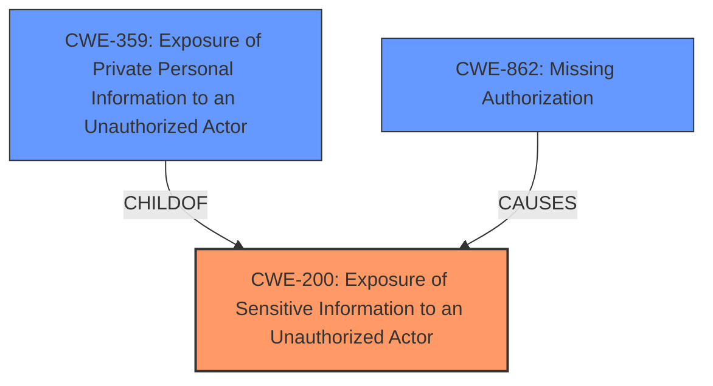

# Analysis for CVE-2024-2541

# Summary
| CWE ID | CWE Name | Confidence | CWE Abstraction Level | CWE Vulnerability Mapping Label | CWE-Vulnerability Mapping Notes |
|---|---|---|---|---|---|
| CWE-200 | Exposure of Sensitive Information to an Unauthorized Actor | 0.9 | Class | Allowed | The vulnerability results in sensitive information being exposed to unauthorized actors. |
| CWE-359 | Exposure of Private Personal Information to an Unauthorized Actor | 0.8 | Base | Allowed | The vulnerability specifically involves the exposure of private personal information. |
| CWE-862 | Missing Authorization | 0.7 | Class | Allowed-with-Review | The vulnerability exists because the system does not properly authorize access to the sensitive data. |

## Evidence and Confidence

*   **Confidence Score:** 0.9
*   **Evidence Strength:** HIGH

## Relationship Analysis
The primary weakness is **CWE-200 Exposure of Sensitive Information to an Unauthorized Actor**, a Class-level CWE. **CWE-359 Exposure of Private Personal Information to an Unauthorized Actor** is a more specific Base-level CWE, providing greater detail as the exposed information is specifically private personal information. **CWE-862 Missing Authorization** is included as a contributing factor, because the root cause of the exposure is likely due to a **missing authorization** check. **CWE-862** is a Class level CWE and could have a more specific Base-level Child.

## Vulnerability Chain
The vulnerability chain starts with a **missing authorization** (**CWE-862**) on the Subscribers Import feature, leading to the **exposure of sensitive information** (**CWE-200**) and specifically **private personal information** (**CWE-359**) to unauthorized actors.

## Summary of Analysis
The analysis is based on the vulnerability description, which explicitly states that the Popup Builder plugin is vulnerable to **Sensitive Information Exposure** via the Subscribers Import feature. The CVE Reference Links Content Summary confirms that the root cause is a **lack of access control**, leading to the **exposure of PII**.

**CWE-200 Exposure of Sensitive Information to an Unauthorized Actor** is selected as the primary CWE because it directly addresses the vulnerability's main characteristic. It is a Class-level CWE, but it accurately represents the vulnerability.

**CWE-359 Exposure of Private Personal Information to an Unauthorized Actor** is included as a more specific Base-level CWE to capture the nature of the exposed information (PII).

**CWE-862 Missing Authorization** is included as a secondary CWE because the **lack of access control** is a contributing factor to the vulnerability.

The retriever results also suggest **CWE-306 Missing Authentication for Critical Function** as another possible weakness, however, this is not the case since the Subscribers Import feature is performed by an authenticated user, so authentication is present.

Based on the evidence, the selected CWEs provide a comprehensive representation of the vulnerability. They are at the appropriate level of specificity and accurately reflect the root cause and impact of the vulnerability.