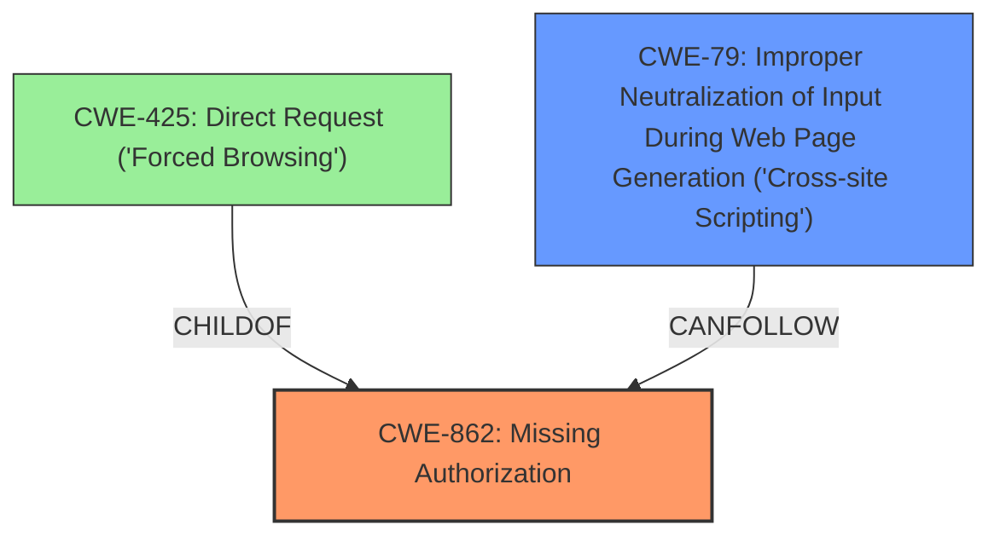

# Analysis for CVE-2024-2544

# Summary
| CWE ID | CWE Name | Confidence | CWE Abstraction Level | CWE Vulnerability Mapping Label | CWE-Vulnerability Mapping Notes |
|---|---|---|---|---|---|
| CWE-862 | Missing Authorization | 1.0 | Class | Primary | Allowed-with-Review |
| CWE-79 | Improper Neutralization of Input During Web Page Generation ('Cross-site Scripting') | 0.7 | Base | Secondary | Allowed |

## Evidence and Confidence

*   **Confidence Score:** 0.9
*   **Evidence Strength:** HIGH

## Relationship Analysis
The primary relationship is that **CWE-862** Missing Authorization is a class-level CWE and **CWE-425** Direct Request ('Forced Browsing') is a ChildOf **CWE-862**, however the description doesn't indicate direct request, and the **missing capability check** indicates **CWE-862** is the better choice.
**CWE-79** Improper Neutralization of Input During Web Page Generation ('Cross-site Scripting') is listed as an impact in the description, but is not the primary cause.

## Vulnerability Chain
The vulnerability chain starts with a **missing capability check** (**CWE-862**) which leads to unauthorized actions such as deleting and importing subscribers, and finally results in stored **cross-site scripting** attacks (**CWE-79**).

## Summary of Analysis
The primary **root cause** of this vulnerability is the **missing capability check** on AJAX actions in the Popup Builder plugin, which allows authenticated attackers with low-level access to perform unauthorized actions. This directly corresponds to **CWE-862** Missing Authorization. The description also mentions the possibility of stored **cross-site scripting** attacks due to improper handling of imported subscriber data, which maps to **CWE-79** Improper Neutralization of Input During Web Page Generation ('Cross-site Scripting').

The evidence for **CWE-862** is strong, as indicated by the "Vulnerability Description Key Phrases" which identifies "**missing capability check**" as the **rootcause**. The "CVE Reference Links Content Summary" section also supports this by stating: "The root cause is a **missing authorization check** in multiple AJAX actions within the Popup Builder plugin."

The evidence for **CWE-79** is less direct, but it is supported by the description stating that the vulnerability "makes it possible for authenticated attackers...to perform multiple unauthorized actions, such as deleting subscribers, and importing subscribers to conduct stored **cross-site scripting** attacks." The "CVE Reference Links Content Summary" further supports this by noting "**Stored Cross-Site Scripting (XSS):** Attackers can import malicious data (e.g., through subscriber import) that can be used to execute XSS attacks on other users."

I considered other CWEs such as **CWE-425** Direct Request ('Forced Browsing'), but the **missing capability check** is the more accurate **root cause**, and **CWE-425** is too specific of a child. I also considered **CWE-863** Incorrect Authorization, but the summary clearly indicates authorization is **missing**, not incorrect. I am overriding the retriever in this case, since the retriever results are not weighted towards identifying the **missing capability check** **rootcause**.

Relevant CWE Information:

# Enhanced Context (25 CWEs)

## CWE-352: Cross-Site Request Forgery (CSRF)
**Abstraction Level**: Compound
**Similarity Score**: 0.77
**Source**: dense

**Description**:
The web application does not, or can not, sufficiently verify whether a well-formed, valid, consistent request was intentionally provided by the user who submitted the request.

**Mapping Guidance**:
- Usage: Allowed
- Rationale: This is a well-known Composite of multiple weaknesses that must all occur simultaneously, although it is attack-oriented in nature.

## CWE-472: External Control of Assumed-Immutable Web Parameter
**Abstraction Level**: Base
**Similarity Score**: 0.73
**Source**: dense

**Description**:
The web application does not sufficiently verify inputs that are assumed to be immutable but are actually externally controllable, such as hidden form fields.

**Mapping Guidance**:
- Usage: Allowed
- Rationale: This CWE entry is at the Base level of abstraction, which is a preferred level of abstraction for mapping to the root causes of vulnerabilities.

## CWE-862: Missing Authorization
**Abstraction Level**: Class
**Similarity Score**: 0.73
**Source**: dense

**Description**:
The product does not perform an authorization check when an actor attempts to access a resource or perform an action.

**Mapping Guidance**:
- Usage: Allowed-with-Review
- Rationale: This CWE entry is a Class and might have Base-level children that would be more appropriate

## CWE-425: Direct Request ('Forced Browsing')
**Abstraction Level**: Base
**Similarity Score**: 0.73
**Source**: dense

**Description**:
The web application does not adequately enforce appropriate authorization on all restricted URLs, scripts, or files.

**Mapping Guidance**:
- Usage: Allowed
- Rationale: This CWE entry is at the Base level of abstraction, which is a preferred level of abstraction for mapping to the root causes of vulnerabilities.

## CWE-116: Improper Encoding or Escaping of Output
**Abstraction Level**: Class
**Similarity Score**: 0.72
**Source**: dense

**Description**:
The product prepares a structured message for communication with another component, but encoding or escaping of the data is either missing or done incorrectly. As a result, the intended structure of the message is not preserved.

**Mapping Guidance**:
- Usage: Allowed-with-Review
- Rationale: This CWE entry is a Class and might have Base-level children that would be more appropriate

## CWE-639: Authorization Bypass Through User-Controlled Key
**Abstraction Level**: Base
**Similarity Score**: 0.72
**Source**: dense

**Description**:
The system's authorization functionality does not prevent one user from gaining access to another user's data or record by modifying the key value identifying the data.

**Mapping Guidance**:
- Usage: Allowed
- Rationale: This CWE entry is at the Base level of abstraction, which is a preferred level of abstraction for mapping to the root causes of vulnerabilities.

## CWE-434: Unrestricted Upload of File with Dangerous Type
**Abstraction Level**: Base
**Similarity Score**: 0.71
**Source**: dense

**Description**:
The product allows the upload or transfer of dangerous file types that are automatically processed within its environment.

**Mapping Guidance**:
- Usage: Allowed
- Rationale: This CWE entry is at the Base level of abstraction, which is a preferred level of abstraction for mapping to the root causes of vulnerabilities.

## CWE-79: Improper Neutralization of Input During Web Page Generation ('Cross-site Scripting')
**Abstraction Level**: Base
**Similarity Score**: 0.71
**Source**: dense

**Description**:
The product does not neutralize or incorrectly neutralizes user-controllable input before it is placed in output that is used as a web page that is served to other users.

**Mapping Guidance**:
- Usage: Allowed
- Rationale: This CWE entry is at the Base level of abstraction, which is a preferred level of abstraction for mapping to the root causes of vulnerabilities.

## CWE-201: Insertion of Sensitive Information Into Sent Data
**Abstraction Level**: Base
**Similarity Score**: 0.71
**Source**: dense

**Description**:
The code transmits data to another actor, but a portion of the data includes sensitive information that should not be accessible to that actor.

**Mapping Guidance**:
- Usage: Allowed
- Rationale: This CWE entry is at the Base level of abstraction, which is a preferred level of abstraction for mapping to the root causes of vulnerabilities.

## CWE-863: Incorrect Authorization
**Abstraction Level**: Class
**Similarity Score**: 0.70
**Source**: dense

**Description**:
The product performs an authorization check when an actor attempts to access a resource or perform an action, but it does not correctly perform the check.

**Mapping Guidance**:
- Usage: Allowed-with-Review
- Rationale: This CWE entry is a Class and might have Base-level children that would be more appropriate

## CWE-352: Cross-Site Request Forgery (CSRF)
**Abstraction Level**: Compound
**