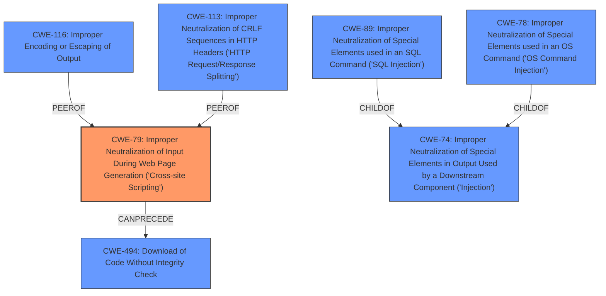

# Analysis Report for CVE-2024-25639

# Vulnerability Analysis Report: CVE-2024-25639

## Description

Khoj is an application that creates personal AI agents. The Khoj Obsidian, Desktop and Web clients **inadequately sanitize the AI models response and user inputs**. This can trigger Cross Site Scripting (XSS) via Prompt Injection from untrusted documents either indexed by the user on Khoj or read by Khoj from the internet when the user invokes the /online command. This vulnerability is fixed in 1.13.0.

## Vulnerability Description Key Phrases

- **Rootcause:** inadequately sanitize the AI models response and user inputs
- **Weakness:** cross-site scripting
- **Vector:** prompt injection
- **Product:** Khoj
- **Version:** before 1.13.0
- **Component:** Obsidian, Desktop and Web clients

## Analysis (with Relationship Data)

# Summary
| CWE ID | CWE Name | Confidence | CWE Abstraction Level | CWE Vulnerability Mapping Label | CWE-Vulnerability Mapping Notes |
|---|---|---|---|---|---|
| CWE-79 | Improper Neutralization of Input During Web Page Generation ('Cross-site Scripting') | 1.0 | Base | Allowed | Primary CWE: Root cause is **improper sanitization** leading to XSS. |

## Evidence and Confidence

*   **Confidence Score:** 1.0
*   **Evidence Strength:** HIGH

## Relationship Analysis
The primary relationship that influenced the decision was the direct match of the vulnerability description to CWE-79. While other CWEs like CWE-116 (Improper Encoding or Escaping of Output) were considered, CWE-79 directly addresses the **improper neutralization** of input leading to Cross-Site Scripting (XSS). The graph relationships between CWE-79 and other injection-related CWEs (e.g., CWE-89, CWE-78) highlight the broader context of input validation vulnerabilities, but CWE-79 remains the most specific and relevant.



## Vulnerability Chain
The vulnerability chain begins with the **inadequate sanitization** of user inputs and AI model responses. This leads to the possibility of **prompt injection**, which then results in the generation of malicious web page content, and finally the execution of that content in a user's browser as **Cross-Site Scripting (XSS)**.

Inadequate Sanitization -> Prompt Injection -> Malicious Web Page Content -> XSS

## Summary of Analysis
The initial analysis focused on identifying the root cause of the vulnerability, which is the **inadequate sanitization** of AI model responses and user inputs. The subsequent prompt injection leading to XSS confirms this. The vulnerability description clearly states that the Khoj application **inadequately sanitizes the AI models response and user inputs**, which is the primary cause. This leads to Cross Site Scripting (XSS).

The retriever results and graph relationships support the selection of CWE-79 as the primary CWE. CWE-79 (Improper Neutralization of Input During Web Page Generation ('Cross-site Scripting')) directly addresses the core issue of failing to neutralize user-controllable input before placing it in a web page. The fix involving DOMPurify sanitization and CSP implementation further validates that improper output sanitization was the root cause.

The selection of CWE-79 is at the optimal level of specificity because it accurately reflects the **improper neutralization** of input leading directly to XSS. While other CWEs like CWE-116 (Improper Encoding or Escaping of Output) could be related, CWE-79 is the most direct and specific representation of the vulnerability.


## CWE Relationship Analysis

Current CWEs represent these abstraction levels: .


### Vulnerability Chain Analysis

**Chain starting from CWE-89:**
- 89 (Improper Neutralization of Special Elements used in an SQL Command ('SQL Injection')) - ROOT


**Chain starting from CWE-116:**
- 116 (Improper Encoding or Escaping of Output) - ROOT


### CWE Relationship Diagram

```mermaid
graph TD
    classDef primary fill:#f96,stroke:#333,stroke-width:2px
    classDef secondary fill:#69f,stroke:#333
    classDef tertiary fill:#9e9,stroke:#333
```


*Report generated on 2025-07-13 06:26:13*
