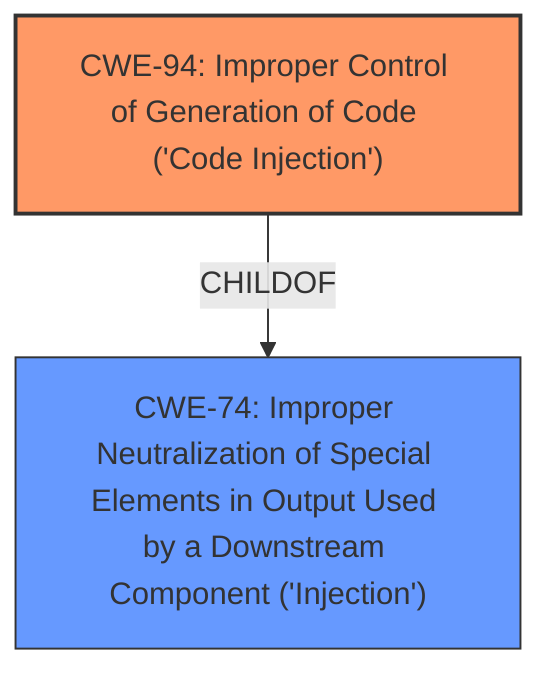

# Analysis Report for CVE-2024-26020

# Vulnerability Analysis Report: CVE-2024-26020

## Description

An arbitrary script execution vulnerability exists in the MPV functionality of Ankitects Anki 24.04. A specially crafted flashcard can lead to a arbitrary code execution. An attacker can send malicious flashcard to trigger this vulnerability.

## Vulnerability Description Key Phrases

- **Impact:** arbitrary code execution, script execution
- **Vector:** specially crafted flashcard
- **Product:** Anki
- **Version:** 24.04
- **Component:** MPV functionality

## Analysis (with Relationship Data)

# Summary
| CWE ID | CWE Name | Confidence | CWE Abstraction Level | CWE Vulnerability Mapping Label | CWE-Vulnerability Mapping Notes |
|---|---|---|---|---|---|
| CWE-94 | Improper Control of Generation of Code ('Code Injection') | 1.0 | Base | Allowed-with-Review | Primary CWE. The Anki application does not properly sanitize user-supplied input when constructing the command to execute MPV leading to code injection. |
| CWE-74 | Improper Neutralization of Special Elements in Output Used by a Downstream Component ('Injection') | 0.7 | Class | Discouraged | Secondary CWE. The vulnerability is a script injection flaw but CWE-94 is more precise. |

## Evidence and Confidence

*   **Confidence Score:** 0.9
*   **Evidence Strength:** HIGH

## Relationship Analysis
The primary relationship that influenced the selection was the parent-child relationship between CWE-74 and CWE-94. While CWE-74 broadly describes injection issues, CWE-94 specifically addresses code injection, which is a more accurate representation of the vulnerability.



## Vulnerability Chain
The vulnerability chain starts with the **improper handling of user-supplied input**, leading to **command injection** and culminating in **arbitrary code execution**.

1.  **Root Cause:** **Improper Control of Generation of Code ('Code Injection') (CWE-94)** - The Anki application does not properly sanitize user-supplied input when constructing the command to execute MPV.
2.  **Impact:** Arbitrary code execution on the user's system.

## Summary of Analysis
The analysis is primarily based on the provided content, specifically the "CVE Reference Links Content Summary" section. The key evidence supporting the selection of CWE-94 is the statement that "The Anki application does not properly sanitize user-supplied input when constructing the command to execute MPV" and that this leads to "full command injection on the user's system". This directly aligns with the description of CWE-94, which focuses on the **improper control of code generation** due to **unsanitized input**.

The relationship between CWE-74 and CWE-94 was crucial in determining the most specific and accurate CWE. While CWE-74 is a broader category encompassing various injection flaws, CWE-94 specifically targets code injection, making it a more precise fit for this vulnerability. The evidence clearly indicates that the vulnerability involves injecting code, not just any type of special element, justifying the selection of CWE-94.

The retriever results also support this conclusion, with CWE-94 having a high relevance score (0.502). While some other CWEs were considered, they were either too broad (e.g., CWE-20, CWE-74) or did not directly address the root cause of the vulnerability (e.g., CWE-120, CWE-78).

The selected CWEs are at the optimal level of specificity because they accurately represent the root cause (CWE-94) and provide additional context about the nature of the vulnerability (CWE-74). They are not overly broad or generic, nor are they so specific that they miss the overall nature of the flaw.

Relevant CWE Information:

# Enhanced Context (25 CWEs)

## CWE-116: Improper Encoding or Escaping of Output
**Abstraction Level**: Class
**Similarity Score**: 0.73
**Source**: dense

**Description**:
The product prepares a structured message for communication with another component, but encoding or escaping of the data is either missing or done incorrectly. As a result, the intended structure of the message is not preserved.

**Mapping Guidance**:
- Usage: Allowed-with-Review
- Rationale: This CWE entry is a Class and might have Base-level children that would be more appropriate

*This CWE was considered but it is not the primary issue. The issue is not so much about encoding or escaping but about constructing a command with unsanitized input.*

## CWE-138: Improper Neutralization of Special Elements
**Abstraction Level**: Class
**Similarity Score**: 0.73
**Source**: dense

**Description**:
The product receives input from an upstream component, but it does not neutralize or incorrectly neutralizes special elements that could be interpreted as control elements or syntactic markers when they are sent to a downstream component.

**Mapping Guidance**:
- Usage: Discouraged
- Rationale: This CWE entry is a level-1 Class (i.e., a child of a Pillar). It might have lower-level children that would be more appropriate

*This CWE was considered but it is not the most specific. CWE-94 and CWE-74 are more specific in describing the injection.*

## CWE-125: Out-of-bounds Read
**Abstraction Level**: Base
**Similarity Score**: 0.72
**Source**: dense

**Description**:
The product reads data past the end, or before the beginning, of the intended buffer.

**Mapping Guidance**:
- Usage: Allowed
- Rationale: This CWE entry is at the Base level of abstraction, which is a preferred level of abstraction for mapping to the root causes of vulnerabilities.

*This CWE is not relevant because the vulnerability is related to code injection, not buffer access.*

## CWE-74: Improper Neutralization of Special Elements in Output Used by a Downstream Component ('Injection')
**Abstraction Level**: Class
**Similarity Score**: 0.71
**Source**: dense

**Description**:
The product constructs all or part of a command, data structure, or record using externally-influenced input from an upstream component, but it does not neutralize or incorrectly neutralizes special elements that could modify how it is parsed or interpreted when it is sent to a downstream component.

**Mapping Guidance**:
- Usage: Discouraged
- Rationale: CWE-74 is high-level and often misused when lower-level weaknesses are more appropriate.

*This CWE was selected as a secondary CWE.*

## CWE-134: Use of Externally-Controlled Format String
**Abstraction Level**: Base
**Similarity Score**: 0.71
**Source**: dense

**Description**:
The product uses a function that accepts a format string as an argument, but the format string originates from an external source.

**Mapping Guidance**:
- Usage: Allowed
- Rationale: This CWE entry is at the Base level of abstraction, which is a preferred level of abstraction for mapping to the root causes of vulnerabilities.

*This CWE is not relevant as the vulnerability doesn't involve format string usage.*

## CWE-184: Incomplete List of Disallowed Inputs
**Abstraction Level**: Base
**Similarity Score**: 0.71
**Source**: dense

**Description**:
The product implements a protection mechanism that relies on a list of inputs (or properties of inputs) that are not allowed by policy or otherwise require other action to neutralize before additional processing takes place, but the list is incomplete.

**Mapping Guidance**:
- Usage: Allowed
- Rationale: This CWE entry is at the Base level of abstraction, which is a preferred level of abstraction for mapping to the root causes of vulnerabilities.

*This CWE is not relevant as the vulnerability is not due to an incomplete list of disallowed inputs.*

## CWE-88: Improper Neutralization of Argument Delimiters in a Command ('Argument Injection')
**Abstraction Level**: Base
**Similarity Score**: 0.71
**Source**: dense

**Description**:
The product constructs a string for a command to be executed by a separate component
in another control sphere, but it does not properly delimit the
intended arguments, options, or switches within that command string.

**Mapping Guidance**:
- Usage: Allowed
- Rationale: This CWE entry is at the Base level of abstraction, which is a preferred level of abstraction for mapping to the root causes of vulnerabilities.

*This CWE is similar but not as precise as CWE-94, which describes the general case of code injection rather than just argument injection.*

## CWE-345: Insufficient Verification of Data Authenticity
**Abstraction Level**: Class
**Similarity Score**: 0.71
**Source**: dense

**Description**:
The product does not sufficiently verify the origin or authenticity of data, in a way that causes it to accept invalid data.

**Mapping Guidance**:
- Usage: Discouraged
- Rationale: This CWE entry is a level-1 Class (i.e., a child of a Pillar). It might have lower-level children that would be more appropriate

*This CWE is not relevant to this vulnerability.*

## CWE-131: Incorrect Calculation of Buffer Size
**Abstraction Level**: Base
**Similarity Score**: 0.71
**Source**: dense

**Description**:
The product does not correctly calculate the size to be used when allocating a buffer, which could lead to a buffer overflow.

**Mapping Guidance


## CWE Relationship Analysis

Current CWEs represent these abstraction levels: .


### Vulnerability Chain Analysis

**Chain starting from CWE-94:**
- 94 (Improper Control of Generation of Code ('Code Injection')) - ROOT


**Chain starting from CWE-116:**
- 116 (Improper Encoding or Escaping of Output) - ROOT


### CWE Relationship Diagram

```mermaid
graph TD
    classDef primary fill:#f96,stroke:#333,stroke-width:2px
    classDef secondary fill:#69f,stroke:#333
    classDef tertiary fill:#9e9,stroke:#333
```


*Report generated on 2025-07-13 06:27:34*
