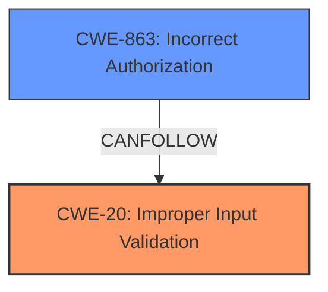

# Raw Analyzer Response for CVE-2024-26126

# Summary
| CWE ID | CWE Name | Confidence | CWE Abstraction Level | CWE Vulnerability Mapping Label | CWE-Vulnerability Mapping Notes |
|---|---|---|---|---|---|
| CWE-20 | CWE-20: Improper Input Validation | 0.9 | Base | Primary | Allowed |
| CWE-863 | CWE-863: Incorrect Authorization | 0.5 | Base | Secondary | Not listed as a possible mapping, but the bypass of the security feature implies an authorization issue |

## Evidence and Confidence

*   **Confidence Score:** 0.7
*   **Evidence Strength:** MEDIUM

## Relationship Analysis
The primary weakness identified is **CWE-20: Improper Input Validation**, a base-level CWE. While **CWE-285: Improper Authorization** is related and often stems from input validation issues, the description specifically mentions bypassing a security feature, which could imply **CWE-863: Incorrect Authorization**. The relationship analysis shows **CWE-20** can lead to various consequences, and a security feature bypass can be considered one of them if authorization depends on the input.

## Vulnerability Chain
The vulnerability chain starts with **CWE-20: Improper Input Validation**. A low-privileged attacker provides **improper input**, and because the input is not properly validated, a **security feature bypass** occurs, leading to a potential impact on the **integrity of the page**.

## Summary of Analysis
The initial analysis identified **CWE-20: Improper Input Validation** as the primary weakness due to the explicit mention of "Improper Input Validation" in the vulnerability description. The analysis considered the relationships of other CWEs to **CWE-20**. While the description does not detail what type of input is not validated, the fact that a "security feature bypass" is mentioned I am adding **CWE-863: Incorrect Authorization** as a secondary weakness because bypassing a security feature can be related to an authorization issue.

Relevant CWE Information:

# Enhanced Context (25 CWEs)
The following CWEs were identified as potentially relevant to this vulnerability:

## CWE-807: Reliance on Untrusted Inputs in a Security Decision
**Abstraction Level**: Base
**Similarity Score**: 0.78
**Source**: dense

**Description**:
The product uses a protection mechanism that relies on the existence or values of an input, but the input can be modified by an untrusted actor in a way that bypasses the protection mechanism.

**Mapping Guidance**:
- Usage: Allowed
- Rationale: This CWE entry is at the Base level of abstraction, which is a preferred level of abstraction for mapping to the root causes of vulnerabilities.

## CWE-20: Improper Input Validation
**Abstraction Level**: Base
**Similarity Score**: 346.19
**Source**: Keyphrase Analysis

**Description**:
The product receives input or data, but it does not validate or incorrectly validates that the input has the properties that are required to process the data safely and correctly.

**Mapping Guidance**:
- Usage: Allowed
- Rationale: This CWE entry is at the Base level of abstraction, which is a preferred level of abstraction for mapping to the root causes of vulnerabilities.

## CWE-863: Incorrect Authorization
**Abstraction Level**: Base
**Similarity Score**: 104.66
**Source**: Keyphrase Analysis

**Description**:
The product performs an authorization check when an actor attempts to access a resource or perform an action, but it does not correctly perform the check.

**Mapping Guidance**:
- Usage: Allowed
- Rationale: This CWE entry is at the Base level of abstraction, which is a preferred level of abstraction for mapping to the root causes of vulnerabilities.