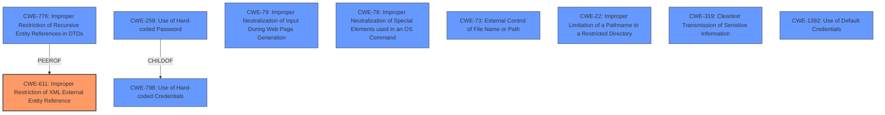

# Analysis for CVE-2024-27142

# Summary
| CWE ID | CWE Name | Confidence | CWE Abstraction Level | CWE Vulnerability Mapping Label | CWE-Vulnerability Mapping Notes |
|---|---|---|---|---|---|
| CWE-611 | Improper Restriction of XML External Entity Reference | 1.0 | Base | Allowed | Primary CWE. Matches the vulnerability description of a time-based blind XML External Entity (XXE) vulnerability. |
| CWE-776 | Improper Restriction of Recursive Entity References in DTDs ('XML Entity Expansion') | 0.7 | Base | Allowed | Secondary candidate. Although XXE is the primary weakness, recursive entity references could be related. |
| CWE-319 | Cleartext Transmission of Sensitive Information | 0.6 | Base | Allowed | Secondary candidate. The CVE reference link mentions "Cleartext Transmission of Sensitive Information". |
| CWE-798 | Use of Hard-coded Credentials | 0.6 | Base | Allowed | Secondary candidate. The CVE reference link mentions "Use of Hard-coded Credentials". |
| CWE-259 | Use of Hard-coded Password | 0.6 | Variant | Allowed | Secondary candidate. The CVE reference link mentions "Use of Hard-coded Password". |
| CWE-79 | Improper Neutralization of Input During Web Page Generation ('Cross-site Scripting') | 0.6 | Base | Allowed | Secondary candidate. The CVE reference link mentions "Cross-site Scripting". |
| CWE-78 | Improper Neutralization of Special Elements used in an OS Command ('OS Command Injection') | 0.6 | Base | Allowed | Secondary candidate. The CVE reference link mentions "OS Command Injection". |
| CWE-73 | External Control of File Name or Path | 0.6 | Base | Allowed | Secondary candidate. The CVE reference link mentions "External Control of File Name or Path". |
| CWE-22 | Improper Limitation of a Pathname to a Restricted Directory ('Path Traversal') | 0.6 | Base | Allowed | Secondary candidate. The CVE reference link mentions "Path Traversal". |
| CWE-1392 | Use of Default Credentials | 0.6 | Base | Allowed | Secondary candidate. The CVE reference link mentions "Use of Default Credentials". |

## Evidence and Confidence

*   **Confidence Score:** 0.9
*   **Evidence Strength:** MEDIUM

## Relationship Analysis
The primary CWE is CWE-611, which describes the core vulnerability. CWE-776 is considered as a related weakness because XML entity expansion is related to XXE. Other CWEs (CWE-798, CWE-259, CWE-79, CWE-78, CWE-73, CWE-22, CWE-319, CWE-1392) are present in the CVE reference links summary but are not directly indicated in the vulnerability description.

## Vulnerability Chain
The vulnerability chain starts with the **XML parsing library being used** without proper restrictions, leading to a **time-based blind XML External Entity (XXE)** vulnerability. This can then be exploited by an attacker to retrieve information or cause a DoS. Other weaknesses from the CVE Reference Links may exist but are not explicitly stated in the Vulnerability Description.

## Summary of Analysis
The primary focus is on the **XML External Entity (XXE)** vulnerability due to **improper restriction in the XML parsing library**. The evidence from the vulnerability description and key phrases strongly supports CWE-611 as the primary CWE. The CVE reference link provides supporting evidence for other weaknesses like hardcoded credentials, command injection, path traversal, cleartext transmission of sensitive information, and cross-site scripting which are included as secondary candidates.

CWE-611 is the most specific and accurate representation of the vulnerability based on the provided information, particularly the description of the **time-based blind XXE**.

Other CWEs considered but not used:

*   CWE-941, CWE-639, CWE-522, CWE-674, CWE-1333, CWE-407, CWE-121, and CWE-184 were considered based on retriever results but were deemed less relevant than CWE-611 and CWE-776 given the specific vulnerability description.