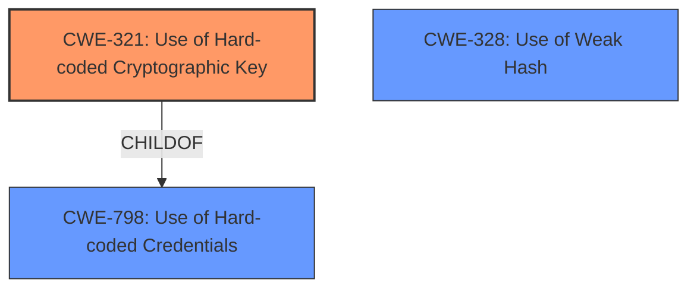

# Analysis for CVE-2024-27159

# Summary
| CWE ID | CWE Name | Confidence | CWE Abstraction Level | CWE Vulnerability Mapping Label | CWE-Vulnerability Mapping Notes |
|---|---|---|---|---|---|
| CWE-321 | Use of Hard-coded Cryptographic Key | 1.0 | Variant | Allowed | Primary CWE. Root cause is the use of a hardcoded cryptographic key. |
| CWE-328 | Use of Weak Hash | 0.7 | Base | Allowed | Secondary CWE. The use of MD5 is a weak hashing algorithm. |

## Evidence and Confidence

*   **Confidence Score:** 0.9
*   **Evidence Strength:** HIGH

## Relationship Analysis
The primary relationship is that CWE-321 [Use of Hard-coded Cryptographic Key] is a variant of CWE-798 [Use of Hard-coded Credentials]. Also, CWE-328 [Use of Weak Hash] is related to the use of MD5. Since the vulnerability involves a hardcoded cryptographic key, CWE-321 is the most specific and appropriate choice.

## Vulnerability Chain
The vulnerability chain starts with the **use of the same hardcoded key to encrypt logs** (CWE-321). This **root cause** leads to the impact of an attacker being able to **decrypt encrypted files**, potentially exposing sensitive information. The use of the **weak MD5 hashing algorithm** (CWE-328) exacerbates the issue.

## Summary of Analysis
The analysis indicates that the primary weakness is the **use of a hardcoded cryptographic key** (CWE-321). The "Vulnerability Description Key Phrases" section states the **rootcause** is **use of same hardcoded key to encrypt logs**. The CVE Reference Links Content Summary provides further evidence of this. The vulnerability also uses a weak cipher MD5 (CWE-328). Both CWE-321 and CWE-328 are at the Base or Variant level of abstraction, which is ideal.

Relevant CWE Information:

# Enhanced Context (25 CWEs)
The following CWEs were identified as potentially relevant to this vulnerability:

## CWE-321: Use of Hard-coded Cryptographic Key
**Abstraction Level**: Variant
**Similarity Score**: 0.76
**Source**: dense

**Description**:
The use of a hard-coded cryptographic key significantly increases the possibility that encrypted data may be recovered.

**Mapping Guidance**:
- Usage: Allowed
- Rationale: This CWE entry is at the Variant level of abstraction, which is a preferred level of abstraction for mapping to the root causes of vulnerabilities.

## CWE-798: Use of Hard-coded Credentials
**Abstraction Level**: Base
**Similarity Score**: 0.75
**Source**: dense

**Description**:
The product contains hard-coded credentials, such as a password or cryptographic key.

**Mapping Guidance**:
- Usage: Allowed
- Rationale: This CWE entry is at the Base level of abstraction, which is a preferred level of abstraction for mapping to the root causes of vulnerabilities.

## CWE-259: Use of Hard-coded Password
**Abstraction Level**: Variant
**Similarity Score**: 0.75
**Source**: dense

**Description**:
The product contains a hard-coded password, which it uses for its own inbound authentication or for outbound communication to external components.

**Mapping Guidance**:
- Usage: Allowed
- Rationale: This CWE entry is at the Variant level of abstraction, which is a preferred level of abstraction for mapping to the root causes of vulnerabilities.

## CWE-328: Use of Weak Hash
**Abstraction Level**: Base
**Similarity Score**: 0.72
**Source**: dense

**Description**:
The product uses an algorithm that produces a digest (output value) that does not meet security expectations for a hash function that allows an adversary to reasonably determine the original input (preimage attack), find another input that can produce the same hash (2nd preimage attack), or find multiple inputs that evaluate to the same hash (birthday attack).

**Mapping Guidance**:
- Usage: Allowed
- Rationale: This CWE entry is at the Base level of abstraction, which is a preferred level of abstraction for mapping to the root causes of vulnerabilities.

## Other CWEs Considered:

*   CWE-798 [Use of Hard-coded Credentials]: While related, it's a more general case of using hardcoded credentials. Since the specific credential used is a cryptographic key, CWE-321 is more appropriate.
*   CWE-259 [Use of Hard-coded Password]: This is specifically about passwords, not cryptographic keys used for encryption.
*   CWE-327 [Use of a Broken or Risky Cryptographic Algorithm]: While the CVE mentions a weak MD5 digest cipher (CWE-328), the primary issue is the hardcoded key itself. The MD5 is a secondary issue.
*   CWE-1391 [Use of Weak Credentials]: This is a Class and might have Base-level children that would be more appropriate.

I am confident in the assessment, as the evidence strongly supports the selection of CWE-321 as the primary weakness and CWE-328 as a secondary one.