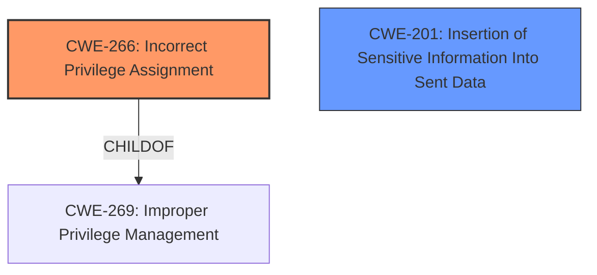

# Raw Analyzer Response for CVE-2024-27181

# Summary
| CWE ID | CWE Name | Confidence | CWE Abstraction Level | CWE Vulnerability Mapping Label | CWE-Vulnerability Mapping Notes |
|---|---|---|---|---|---|
| CWE-266 | Incorrect Privilege Assignment | 0.9 | Base | Primary CWE | Allowed |
| CWE-201 | Insertion of Sensitive Information Into Sent Data | 0.6 | Base | Secondary Candidate | Allowed |

## Evidence and Confidence

*   **Confidence Score:** 0.75
*   **Evidence Strength:** MEDIUM

## Relationship Analysis
The primary relationship that influenced the selection was the hierarchical relationship between Class-level CWEs like CWE-269 (Improper Privilege Management) and more specific Base-level CWEs like CWE-266 (Incorrect Privilege Assignment). The guidance explicitly discourages the use of CWE-269 and recommends CWE-266 when a role misassignment is the root cause. CWE-201 is a base level CWE that can also be a secondary issue.

## Vulnerability Chain
The vulnerability chain starts with **incorrect privilege assignment** (CWE-266). This leads to the impact of **privilege escalation**, which further allows access to Linkis Token information (CWE-201).

## Summary of Analysis
The initial analysis focused on identifying the root cause of the vulnerability, which is a **privilege escalation** issue. The provided evidence and the MITRE mapping guidance both pointed towards **incorrect privilege assignment** as the underlying cause.

The vulnerability description clearly states that a trusted user can escalate privileges and gain access to Linkis's Token information. This aligns with the definition of CWE-266 (Incorrect Privilege Assignment), where a product incorrectly assigns a privilege to a particular actor, creating an unintended sphere of control for that actor. The MITRE mapping guidance explicitly recommends using CWE-266 when there's a misconfigured role.

The phrase "allows access to Linkis's Token information" suggests that sensitive data is being exposed, which aligns with CWE-201 (Insertion of Sensitive Information Into Sent Data).

I considered other CWEs, such as CWE-269 (Improper Privilege Management), but the MITRE mapping guidance discourages its use and recommends more specific CWEs like CWE-266 when the root cause is a misconfigured role. CWE-285 (Improper Authorization) and CWE-863 (Incorrect Authorization) were also considered, but they focus on flawed permission checking, which is not the primary issue in this case. The primary issue is the incorrect assignment of privileges, which then leads to the privilege escalation.

The selected CWEs are at the optimal level of specificity because they accurately represent the root cause and the resulting impact of the vulnerability. CWE-266 captures the **incorrect privilege assignment**, and CWE-201 captures the exposure of sensitive information.

Relevant CWE Information:

# Enhanced Context (25 CWEs)
The following CWEs were identified as potentially relevant to this vulnerability:

## CWE-266: Incorrect Privilege Assignment
**Abstraction Level**: Base
**Similarity Score**: 0.80
**Source**: dense

**Description**:
A product incorrectly assigns a privilege to a particular actor, creating an unintended sphere of control for that actor.

**Mapping Guidance**:
- Usage: Allowed
- Rationale: This CWE entry is at the Base level of abstraction, which is a preferred level of abstraction for mapping to the root causes of vulnerabilities.

**Evidence:** The **Vulnerability Description Key Phrases** contain "privilege escalation", the **CVE Reference Links Content Summary** contains, "Privilege Escalation in Basic management services where the attacking user is a trusted account allows access to Linkis's Token information." This aligns with the **Incorrect Privilege Assignment**

## CWE-201: Insertion of Sensitive Information Into Sent Data
**Abstraction Level**: base
**Similarity Score**: 2.61
**Source**: graph

**Description**:
CWE-201: Insertion of Sensitive Information Into Sent Data

**Mapping Guidance**:
- Usage: Allowed
- Rationale: This CWE entry is at the Base level of abstraction, which is a preferred level of abstraction for mapping to the root causes of vulnerabilities.

**Evidence:** The **Vulnerability Description Key Phrases** contain "Privilege Escalation and access to Linkis Token information", the **CVE Reference Links Content Summary** contains, "Privilege Escalation in Basic management services where the attacking user is a trusted account allows access to Linkis's Token information." This aligns with the **Insertion of Sensitive Information Into Sent Data**