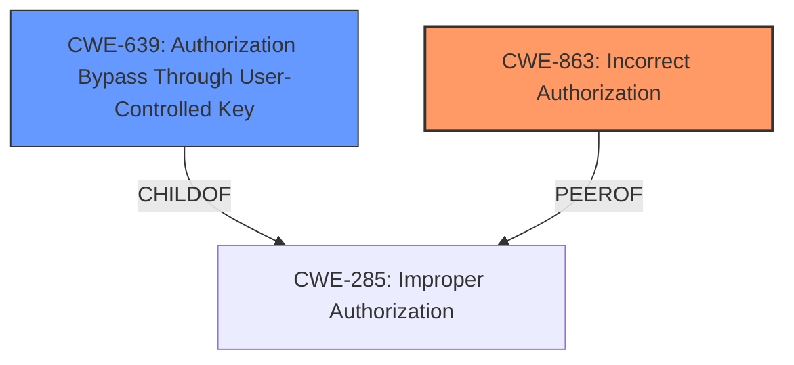

# Analysis Report for CVE-2024-27187

# Vulnerability Analysis Report: CVE-2024-27187

## Description

**Improper Access Controls** allows backend users to overwrite their username when disallowed.

## Vulnerability Description Key Phrases

- **Rootcause:** Improper Access Controls
- **Impact:** overwrite their username
- **Attacker:** backend users

## Analysis (with Relationship Data)

# Summary
| CWE ID | CWE Name | Confidence | CWE Abstraction Level | CWE Vulnerability Mapping Label | CWE-Vulnerability Mapping Notes |
|---|---|---|---|---|---|
| CWE-863 | Incorrect Authorization | 0.8 | Class | Allowed-with-Review | Primary CWE |
| CWE-639 | Authorization Bypass Through User-Controlled Key | 0.6 | Base | Allowed | Secondary Candidate |

## Evidence and Confidence

*   **Confidence Score:** 0.7
*   **Evidence Strength:** HIGH

## Relationship Analysis
The primary CWE is CWE-863, which is a Class-level CWE. The retriever results also suggest CWE-639, which is a more specific Base-level CWE and a child of CWE-285, which is a parent of CWE-863. The relationship between these CWEs helps to refine the selection toward a more specific classification when possible.



## Vulnerability Chain
The vulnerability chain starts with **Improper Access Controls**, leading to the ability of backend users to overwrite their username.

Improper Access Controls -> Overwrite Username

CWE-863 is the root cause.

## Summary of Analysis
The initial assessment identifies **Improper Access Controls** as the root cause, leading to the ability of backend users to overwrite their username. The retriever results suggest CWE-863 (Incorrect Authorization) and CWE-639 (Authorization Bypass Through User-Controlled Key) as potential mappings.

Based on the vulnerability description, the core issue is that backend users are able to perform an action (overwriting their username) that they should not be authorized to do. This aligns with CWE-863 (Incorrect Authorization), which describes a scenario where a product performs an authorization check but does not correctly perform the check.

CWE-639 (Authorization Bypass Through User-Controlled Key) is also relevant, as it describes a scenario where a user can gain access to another user's data by modifying the key value. While the vulnerability description does not explicitly mention modifying keys, the ability to overwrite a username can be seen as a form of authorization bypass, especially if the username is used as an identifier for authorization purposes.

Ultimately, CWE-863 is chosen as the primary CWE because it more broadly captures the **incorrect authorization** issue, while CWE-639 could be a secondary issue.

Relevant CWE Information:

*   **CWE-863: Incorrect Authorization**
    *   **Description:** The product performs an authorization check when an actor attempts to access a resource or perform an action, but it does not correctly perform the check.
    *   The **rootcause** is **Improper Access Controls**.
*   **CWE-639: Authorization Bypass Through User-Controlled Key**
    *   **Description:** The system's authorization functionality does not prevent one user from gaining access to another user's data or record by modifying the key value identifying the data.

I am overriding the retriever results and selecting CWE-863 (Incorrect Authorization) as the primary CWE due to the strong evidence of **improper access controls** allowing backend users to overwrite their username. While CWE-639 is also relevant, it is considered a secondary issue.

Given the above analysis, CWE-863 (Incorrect Authorization) is the most appropriate primary CWE for this vulnerability, and CWE-639 could be a secondary issue.

<!-- cweid: CWE-863 -->
<!-- cweid: CWE-639 -->


## CWE Relationship Analysis

Current CWEs represent these abstraction levels: .


### Vulnerability Chain Analysis

**Chain starting from CWE-863:**
- 863 (Incorrect Authorization) - ROOT


**Chain starting from CWE-285:**
- 285 (Improper Authorization) - ROOT


### CWE Relationship Diagram

```mermaid
graph TD
    classDef primary fill:#f96,stroke:#333,stroke-width:2px
    classDef secondary fill:#69f,stroke:#333
    classDef tertiary fill:#9e9,stroke:#333
```


*Report generated on 2025-07-13 06:34:12*
