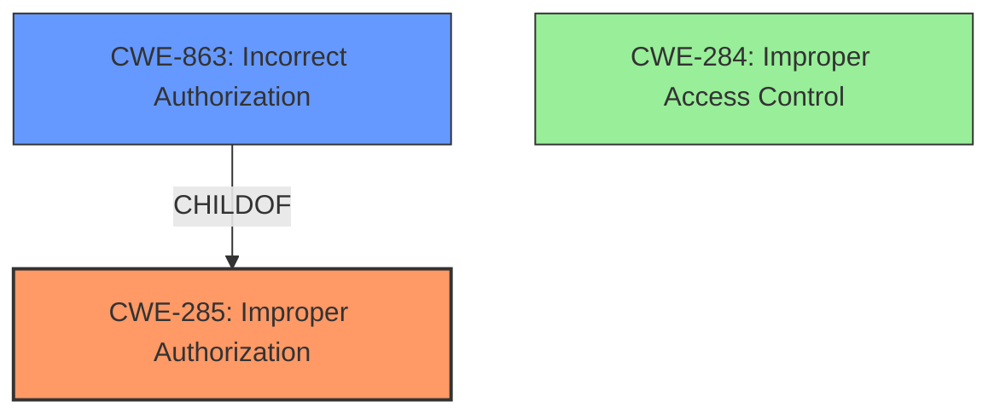

# Analysis Report for CVE-2024-27200

# Vulnerability Analysis Report: CVE-2024-27200

## Description

**Improper access control** in some Intel(R) Granulate(TM) software before version 4.30.1 may allow a authenticated user to potentially enable escalation of privilege via local access.

## Vulnerability Description Key Phrases

- **Rootcause:** Improper access control
- **Impact:** escalation of privilege
- **Vector:** local access
- **Attacker:** authenticated user
- **Product:** Intel(R) Granulate(TM)
- **Version:** before version 4.30.1

## Analysis (with Relationship Data)

# Summary
| CWE ID  | CWE Name                                          | Confidence | CWE Abstraction Level | CWE Vulnerability Mapping Label | CWE-Vulnerability Mapping Notes |
|---------|---------------------------------------------------|------------|-----------------------|---------------------------------|---------------------------------|
| CWE-285 | Improper Authorization                            | 0.9        | Class                 | Primary CWE                       | Discouraged                     |
| CWE-863 | Incorrect Authorization                           | 0.7        | Class                 | Secondary Candidate             | Allowed-with-Review            |
| CWE-284 | Improper Access Control                           | 0.6        | Pillar                | Secondary Candidate             | Discouraged                     |

## Evidence and Confidence

*   **Confidence Score:** 0.9
*   **Evidence Strength:** HIGH

## Relationship Analysis
The primary CWE is CWE-285, **Improper Authorization**, which is a class-level CWE. The analysis considered its child CWEs, such as CWE-863 (**Incorrect Authorization**), but stuck with the parent due to the general nature of the description. CWE-284 (**Improper Access Control**) was also considered but deemed too high-level, as the issue appears to be related to authorization.



## Vulnerability Chain
The vulnerability chain starts with **improper access control**, leading to a potential escalation of privilege.

*   **Root Cause:** **Improper Authorization** (CWE-285)
*   **Impact:** Escalation of Privilege

## Summary of Analysis
The initial assessment pointed towards **Improper Authorization** (CWE-285) as the primary weakness, supported by the vulnerability description emphasizing **improper access control** and the potential for privilege escalation. This is supported by the "Authentication vs Authorization vs Access Control Guidance" section. The guidance states "*CWE relevance: use CWEs like 862, 863, 285 for authorization errors*." Furthermore, The "Mapping Discussion – Common Misclassification Patterns" section states "***285** is specific to authorization flaws – it's a better choice than 284 **if** the issue involves *improper or missing role checks*."
The presence of "Improper Access Control" within the vulnerability description suggests that the core issue lies in how the application manages authorization. The vulnerability description states "**Improper access control** in some Intel(R) Granulate(TM) software before version 4.30.1 may allow a authenticated user to potentially enable escalation of privilege via local access."

**CWE-285 (Improper Authorization)** is selected as the primary CWE because the problem is with authorization and the application incorrectly grants access.

CWE-863 (**Incorrect Authorization**) was considered, but not selected as the primary because the description does not provide enough information to tell if the authorization logic exists but is flawed.

CWE-284 (**Improper Access Control**) was considered, but not selected as it is a high-level CWE, and more specific CWEs like CWE-285 are more appropriate given the available information.


## CWE Relationship Analysis

Current CWEs represent these abstraction levels: .


### Vulnerability Chain Analysis

**Chain starting from CWE-284:**
- 284 (Improper Access Control) - ROOT


**Chain starting from CWE-863:**
- 863 (Incorrect Authorization) - ROOT


### CWE Relationship Diagram

```mermaid
graph TD
    classDef primary fill:#f96,stroke:#333,stroke-width:2px
    classDef secondary fill:#69f,stroke:#333
    classDef tertiary fill:#9e9,stroke:#333
```


*Report generated on 2025-07-13 06:34:27*
