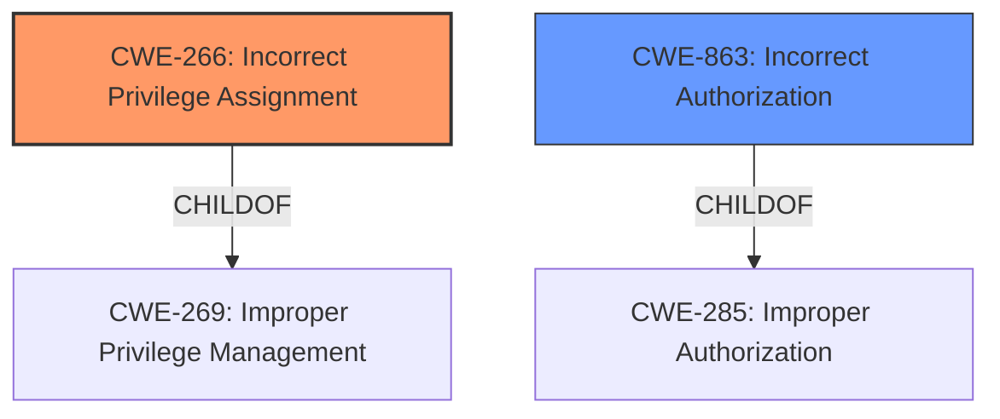

# Analysis for CVE-2024-27275

# Summary

| CWE ID | CWE Name | Confidence | CWE Abstraction Level | CWE Vulnerability Mapping Label | CWE-Vulnerability Mapping Notes |
|---|---|---|---|---|---|
| CWE-266 | Incorrect Privilege Assignment | 0.9 | Base | Primary CWE | Allowed |
| CWE-267 | Privilege Defined With Unsafe Actions | 0.7 | Base | Secondary Candidate | Allowed |
| CWE-863 | Incorrect Authorization | 0.6 | Class | Secondary Candidate | Allowed-with-Review |

## Evidence and Confidence

*   **Confidence Score:** 0.9
*   **Evidence Strength:** HIGH

## Relationship Analysis
The primary CWE is CWE-266, which focuses on incorrect privilege assignment. It's a base-level CWE, providing sufficient specificity. CWE-267 and CWE-863 were considered as secondary options. The relationship analysis reveals a hierarchical structure where more generic classes like CWE-269 (Improper Privilege Management) exist, but the description warrants a more specific base-level CWE.

## Vulnerability Chain
The vulnerability chain starts with the **insufficient authority requirement** (root cause) leading to a **privilege escalation vulnerability** (weakness) where a local user without administrator privilege can configure a physical file trigger to execute with elevated privileges.
  - **Root Cause:** **Insufficient authority requirement** when configuring a file trigger.
  - **Weakness:** **Privilege escalation**
  - **Impact:** Unauthorized execution with elevated privileges.

## Summary of Analysis
The primary assessment is based on the clear evidence presented in the vulnerability description stating an **insufficient authority requirement** as the root cause of a **privilege escalation vulnerability**. The retriever results and complete CWE specifications were reviewed to confirm that CWE-266 accurately represents the identified weakness. The guidance on privileges vs permissions helped confirm this.

The vulnerability description explicitly mentions **insufficient authority requirement**, which directly aligns with the definition of CWE-266. "A local user without administrator privilege can configure a physical file trigger to execute with the privileges of a user socially engineered to access the target file."

The selection of CWE-266 is at the optimal level of specificity because it directly addresses the root cause of the vulnerability: an incorrect assignment of privileges.

Relevant CWE Information:

# Enhanced Context (25 CWEs)
The following CWEs were identified as potentially relevant to this vulnerability:

## CWE-266: Incorrect Privilege Assignment
**Abstraction Level**: Base
**Similarity Score**: 0.78
**Source**: dense

**Description**:
A product incorrectly assigns a privilege to a particular actor, creating an unintended sphere of control for that actor.

**Mapping Guidance**:
- Usage: Allowed
- Rationale: This CWE entry is at the Base level of abstraction, which is a preferred level of abstraction for mapping to the root causes of vulnerabilities.

**Why CWE-266 was selected:** The description states an **insufficient authority requirement**. This indicates an incorrect privilege assignment, making CWE-266 the most appropriate choice.

## CWE-267: Privilege Defined With Unsafe Actions
**Abstraction Level**: Base
**Similarity Score**: 0.77
**Source**: dense

**Description**:
A particular privilege, role, capability, or right can be used to perform unsafe actions that were not intended, even when it is assigned to the correct entity.

**Mapping Guidance**:
- Usage: Allowed
- Rationale: This CWE entry is at the Base level of abstraction, which is a preferred level of abstraction for mapping to the root causes of vulnerabilities.

**Why CWE-267 was considered:** Although not the primary cause, the vulnerability involves a privilege being used in an unsafe way. It's a consequence of the **insufficient authority requirement**.

## CWE-274: Improper Handling of Insufficient Privileges
**Abstraction Level**: Base
**Similarity Score**: 0.77
**Source**: dense

**Description**:
The product does not handle or incorrectly handles when it has insufficient privileges to perform an operation, leading to resultant weaknesses.

**Mapping Guidance**:
- Usage: Discouraged
- Rationale: This CWE entry could be deprecated in a future version of CWE.

**Why CWE-274 was not selected:** While related to privileges, it focuses on handling insufficient privileges, whereas the core issue is the incorrect assignment of privileges.

## CWE-280: Improper Handling of Insufficient Permissions or Privileges 
**Abstraction Level**: Base
**Similarity Score**: 0.76
**Source**: dense

**Description**:
The product does not handle or incorrectly handles when it has insufficient privileges to access resources or functionality as specified by their permissions. This may cause it to follow unexpected code paths that may leave the product in an invalid state.

**Mapping Guidance**:
- Usage: Allowed
- Rationale: This CWE entry is at the Base level of abstraction, which is a preferred level of abstraction for mapping to the root causes of vulnerabilities.

**Why CWE-280 was not selected:** It's similar to CWE-274 and less relevant than the direct privilege assignment issue in CWE-266.

## CWE-276: Incorrect Default Permissions
**Abstraction Level**: Base
**Similarity Score**: 0.74
**Source**: dense

**Description**:
During installation, installed file permissions are set to allow anyone to modify those files.

**Mapping Guidance**:
- Usage: Allowed
- Rationale: This CWE entry is at the Base level of abstraction, which is a preferred level of abstraction for mapping to the root causes of vulnerabilities.

**Why CWE-276 was not selected:** This is related to default permissions for files, not privilege assignments for users or actors.

## CWE-269: Improper Privilege Management
**Abstraction Level**: Class
**Similarity Score**: 0.74
**Source**: dense

**Description**:
The product does not properly assign, modify, track, or check privileges for an actor, creating an unintended sphere of control for that actor.

**Mapping Guidance**:
- Usage: Discouraged
- Rationale: CWE-269 is commonly misused. It can be conflated with "privilege escalation," which is a technical impact that is listed in many low-information vulnerability reports [REF-1287]. It is not useful for trend analysis.

**Why CWE-269 was not selected:** It's a high-level class, and CWE-266 is a more specific base-level CWE that fits better. The guidance discourages the use of CWE-269 because it is too generic.

## CWE-807: Reliance on Untrusted Inputs in a Security Decision
**Abstraction Level**: Base
**Similarity Score**: 0.74
**Source**: dense

**Description**:
The product uses a protection mechanism that relies on the existence or values of an input, but the input can be modified by an untrusted actor in a way that bypasses the protection mechanism.

**Mapping Guidance**:
- Usage: Allowed
- Rationale: This CWE entry is at the Base level of abstraction, which is a preferred level of abstraction for mapping to the root causes of vulnerabilities.

**Why CWE-807 was not selected:** The vulnerability isn't directly related to reliance on untrusted inputs but rather on the incorrect assignment of privileges.

## CWE-668: Exposure of Resource to Wrong Sphere
**Abstraction Level**: Class
**Similarity Score**: 0.74
**Source**: dense

**Description**:
The product exposes a resource to the wrong control sphere, providing unintended actors with inappropriate access to the resource.

**Mapping Guidance**:
- Usage: Discouraged
- Rationale: CWE-668 is high-level and is often misused as a catch-all when lower-level CWE IDs might be applicable. It is sometimes used for low-information vulnerability reports [REF-1287]. It is a level-1 Class (i.e., a child of a Pillar). It is not useful for trend analysis.

**Why CWE-668 was not selected:** It's a class-level CWE and too generic. The issue is more specifically related to privilege assignment.

## CWE-41: Improper Resolution of Path Equivalence
**Abstraction Level**: Base
**Similarity Score**: 0.74
**Source**: dense

**Description**:
The product is vulnerable to file system contents disclosure through path equivalence. Path equivalence involves the use of special characters in file and directory names. The associated manipulations are intended to generate multiple names for the same object.

**Mapping Guidance**:
- Usage: