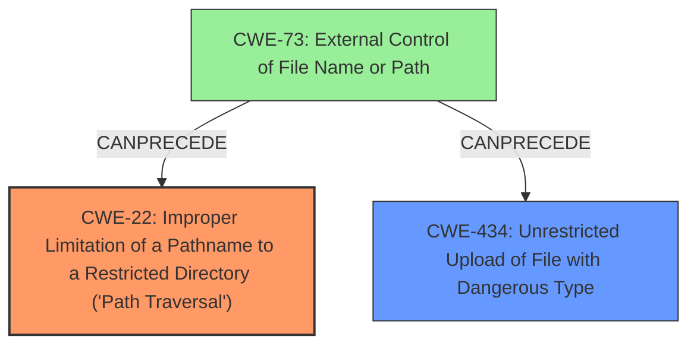

# Enhanced Analysis for CVE-2024-27311

# Summary
| CWE ID | CWE Name | Confidence | CWE Abstraction Level | CWE Vulnerability Mapping Label | CWE-Vulnerability Mapping Notes |
|---|---|---|---|---|---|
| CWE-22 | Improper Limitation of a Pathname to a Restricted Directory ('Path Traversal') | 1.0 | Base | Allowed | Primary CWE. The vulnerability allows uploading files to arbitrary locations due to **improper path limitation**. |
| CWE-434 | Unrestricted Upload of File with Dangerous Type | 0.7 | Base | Allowed | Secondary CWE. Files can be uploaded without restriction on the file type. |

## Evidence and Confidence

*   **Confidence Score:** 0.9
*   **Evidence Strength:** HIGH

## Relationship Analysis
The primary CWE is CWE-22, which describes **improper limitation of a pathname to a restricted directory**. CWE-22 has child CWEs such as CWE-23 (Relative Path Traversal) and CWE-24 (Path Traversal: '../filedir'), however, the description does not give enough information to select these more specific CWEs. CWE-434 (Unrestricted Upload of File with Dangerous Type) is a related weakness, where the uploaded file can be of a dangerous type which is allowed by the application. CWE-73 (External Control of File Name or Path) can precede CWE-434 and CWE-22.



## Vulnerability Chain
1.  The user supplies a file path via the IPAM API. This file path is influenced by external input (CWE-73).
2.  The application **does not properly limit the path to a restricted directory** (CWE-22).
3.  The application allows the upload of files with dangerous types (CWE-434).
4.  An attacker uploads new files to the server folder, potentially compromising system integrity and security.

## Summary of Analysis
The vulnerability is a **directory traversal** that allows the user to upload new files to the server folder. The root cause is the **improper limitation of a pathname to a restricted directory** (CWE-22). The vulnerability description states that the user can upload new files to the server folder, indicating that the application **does not properly limit the path to a restricted directory**. The CVE reference links content summary mentions that the **root cause** is an unfiltered parameter and unchecked decompression of zip files within the IPAM API of ManageEngine DDI Central. This leads to arbitrary file writing and **directory traversal**. The retriever results also suggest CWE-22 as the top candidate. CWE-434 is a secondary weakness, as the application also **does not restrict the type of files that can be uploaded**.

I considered CWE-23 (Relative Path Traversal), CWE-24 (Path Traversal: '../filedir'), CWE-29 (Path Traversal: '\..\filename'), CWE-28 (Path Traversal: '..\filedir'), and CWE-36 (Absolute Path Traversal), but these are more specific variants of CWE-22 and there isn't enough information provided to select these more specific CWEs. I also considered CWE-59 (Improper Link Resolution Before File Access ('Link Following')), but this is not relevant to the vulnerability description.


## CWE Relationship Analysis

Current CWEs represent these abstraction levels: .


### Vulnerability Chain Analysis

**Chain starting from CWE-22:**
- 22 (Improper Limitation of a Pathname to a Restricted Directory ('Path Traversal')) - ROOT


**Chain starting from CWE-29:**
- 29 (Path Traversal: '\..\filename') - ROOT


### CWE Relationship Diagram

```mermaid
graph TD
    classDef primary fill:#f96,stroke:#333,stroke-width:2px
    classDef secondary fill:#69f,stroke:#333
    classDef tertiary fill:#9e9,stroke:#333
```