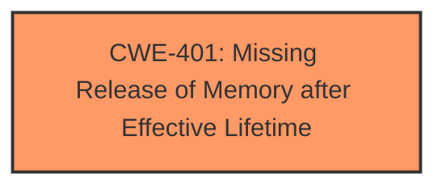

# Analysis for CVE-2024-27529

# Summary
| CWE ID | CWE Name | Confidence | CWE Abstraction Level | CWE Vulnerability Mapping Label | CWE-Vulnerability Mapping Notes |
|---|---|---|---|---|---|
| CWE-401 | Missing Release of Memory after Effective Lifetime | 1.0 | Variant | Primary | Allowed |

## Evidence and Confidence

*   **Confidence Score:** 1.0
*   **Evidence Strength:** HIGH

## Relationship Analysis
The primary relationship to consider is that CWE-401 is a variant, indicating a specific type of resource management issue. No other direct relationships significantly impacted the decision. The abstraction level of Variant is suitable given the specificity of the **memory leak**.

## Vulnerability Chain
The vulnerability chain starts with the **missing release of memory**, leading to a **memory leak**, which results in a potential Denial of Service (DoS).

## Summary of Analysis
The analysis focuses on identifying the root cause of the vulnerability. The primary evidence for CWE-401 is the description of **memory leaks** in the `Read_utf8` function in `wasm3`. The "CVE Reference Links Content Summary" explicitly states that "memory allocated for UTF-8 strings during parsing is not always freed...leading to these leaks." This aligns directly with the definition of CWE-401: "Missing Release of Memory after Effective Lifetime." The "Retriever Results" also strongly support CWE-401 as the top candidate.

The selection of CWE-401 at the Variant level is based on the detailed description of the **memory leak** and the specific function (`Read_utf8`) and scenario (parsing import sections). This level of specificity is appropriate given the available evidence.

The other CWEs from **Complete CWE Specifications** were considered but not used because they do not directly represent the root cause of the vulnerability. For example, CWE-125 (Out-of-bounds Read) and CWE-190 (Integer Overflow or Wraparound) are not relevant to the described **memory leak**. CWE-212 (Improper Removal of Sensitive Information Before Storage or Transfer) and CWE-226 (Sensitive Information in Resource Not Removed Before Reuse) focus on sensitive information handling, which is not the core issue in this case.