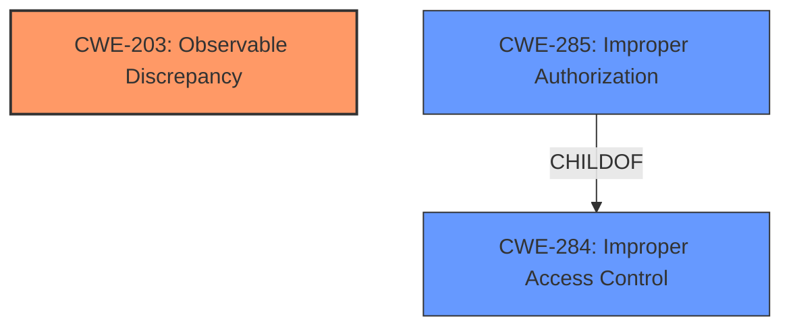

# Analysis Report for CVE-2024-27711

# Vulnerability Analysis Report: CVE-2024-27711

## Description

An issue in Eskooly Free Online School management Software v.3.0 and before allows a remote attacker to escalate privileges via the Sin-up process function in the account settings.

## Vulnerability Description Key Phrases

- **Rootcause:** improper access control
- **Impact:** escalate privileges
- **Attacker:** remote attacker
- **Product:** Eskooly Free Online School management Software
- **Version:** v.3.0 and before
- **Component:** Sin-up process function in account settings

## Analysis (with Relationship Data)

# Summary
| CWE ID | CWE Name | Confidence | CWE Abstraction Level | CWE Vulnerability Mapping Label | CWE-Vulnerability Mapping Notes |
|---|---|---|---|---|---|
| CWE-203 | Observable Discrepancy | 0.9 | Base | Primary CWE | Allowed |
| CWE-285 | Improper Authorization | 0.6 | Class | Secondary Candidate | Discouraged |
| CWE-284 | Improper Access Control | 0.5 | Pillar | Secondary Candidate | Discouraged |

## Evidence and Confidence

*   **Confidence Score:** 0.8
*   **Evidence Strength:** MEDIUM

## Relationship Analysis
The primary relationship that influenced the CWE selection was the parent-child relationship. CWE-203 is related to information exposure via observable discrepancies, which aligns with the user enumeration aspect of the vulnerability. While CWE-285 and CWE-284 were considered due to the access control context, the vulnerability's core issue is the ability to determine valid usernames, making CWE-203 more appropriate. The choice of CWE-203 as a Base level CWE provides sufficient specificity for the identified weakness.



## Vulnerability Chain
The vulnerability chain starts with the **improper access control** in the sign-up process, which allows user enumeration. This leads to information disclosure (valid usernames), which can then be exploited in further attacks such as password guessing or phishing, and potentially used in conjunction with other vulnerabilities for privilege escalation.
  - **Root Cause:** **Improper Access Control** leading to feedback during signup (user enumeration)
  - **Weakness:** User enumeration (CWE-203)
  - **Impact:** Information Disclosure, Potential Privilege Escalation
The chain highlights how the initial flaw can be leveraged in subsequent attacks, emphasizing the importance of addressing the **root cause** of the vulnerability.

## Summary of Analysis
The initial analysis identified several potential CWEs, including CWE-285 and CWE-284 due to the presence of **improper access control**. However, after a careful examination of the vulnerability description and the provided "CVE Reference Links Content Summary", it became clear that the core issue is the ability to enumerate valid usernames via observable discrepancies in the sign-up process.

The "CVE Reference Links Content Summary" explicitly mentions "**User Enumeration:** The primary weakness is the ability to enumerate valid usernames through the sign-up process. The application exposes whether a given username exists." This statement strongly supports the selection of CWE-203.

CWE-203 (Observable Discrepancy) accurately captures the essence of the vulnerability, as the system provides feedback that allows an attacker to determine whether a given username is valid or not. This information disclosure can then be used to facilitate further attacks.

Therefore, while access control issues are present, the most specific and relevant CWE is CWE-203. The other CWEs were considered but deemed less appropriate as they represent higher-level or less specific aspects of the vulnerability.

Relevant CWE Information:

# Enhanced Context (25 CWEs)
The following CWEs were identified as potentially relevant to this vulnerability:

## CWE-266: Incorrect Privilege Assignment
**Abstraction Level**: Base
**Similarity Score**: 0.75

## CWE-267: Privilege Defined With Unsafe Actions
**Abstraction Level**: Base
**Similarity Score**: 0.75

## CWE-668: Exposure of Resource to Wrong Sphere
**Abstraction Level**: Class
**Similarity Score**: 0.74

## CWE-280: Improper Handling of Insufficient Permissions or Privileges
**Abstraction Level**: Base
**Similarity Score**: 0.74

## CWE-274: Improper Handling of Insufficient Privileges
**Abstraction Level**: Base
**Similarity Score**: 0.74

## CWE-472: External Control of Assumed-Immutable Web Parameter
**Abstraction Level**: Base
**Similarity Score**: 0.73

## CWE-41: Improper Resolution of Path Equivalence
**Abstraction Level**: Base
**Similarity Score**: 0.73

## CWE-639: Authorization Bypass Through User-Controlled Key
**Abstraction Level**: Base
**Similarity Score**: 0.72

## CWE-1390: Weak Authentication
**Abstraction Level**: Class
**Similarity Score**: 0.72

## CWE-59: Improper Link Resolution Before File Access ('Link Following')
**Abstraction Level**: Base
**Similarity Score**: 0.72

## CWE-863: Incorrect Authorization
**Abstraction Level**: Class
**Similarity Score**: 2763.86

## CWE-285: Improper Authorization
**Abstraction Level**: Class
**Similarity Score**: 2687.43

## CWE-639: Authorization Bypass Through User-Controlled Key
**Abstraction Level**: Base
**Similarity Score**: 2630.29

## CWE-269: Improper Privilege Management
**Abstraction Level**: Class
**Similarity Score**: 2549.33

## CWE-306: Missing Authentication for Critical Function
**Abstraction Level**: Base
**Similarity Score**: 2541.28

## CWE-471: Modification of Assumed-Immutable Data (MAID)
**Abstraction Level**: base
**Similarity Score**: 4.33

## CWE-425: Direct Request ('Forced Browsing')
**Abstraction Level**: Base
**Similarity Score**: 2.89

## CWE-1282: Assumed-Immutable Data is Stored in Writable Memory
**Abstraction Level**: base
**Similarity Score**: 2.87

## CWE-942: Permissive Cross-domain Policy with Untrusted Domains
**Abstraction Level**: variant
**Similarity Score**: 2.68

## CWE-280: Improper Handling of Insufficient Permissions or Privileges
**Abstraction Level**: Base
**Similarity Score**: 2.48

## CWE-274: Improper Handling of Insufficient Privileges
**Abstraction Level**: Base
**Similarity Score**: 2.48

## CWE-306: Missing Authentication for Critical Function
**Abstraction Level**: base
**Similarity Score**: 2.47

## CWE-250: Execution with Unnecessary Privileges
**Abstraction Level**: base
**Similarity Score**: 2.47

## CWE-472: External Control of Assumed-Immutable Web Parameter
**Abstraction Level**: Base
**Similarity Score**: 2.39

## CWE-613: Insufficient Session Expiration
**Abstraction Level**: base
**Similarity Score**: 2.21

### Detailed Analysis of Selected CWEs:

*   **CWE-203: Observable Discrepancy**
    *   **Technical Explanation:** This CWE describes a vulnerability where the system provides different observable outputs based on the validity of the input. In this case, the system exposes whether a given username exists during the sign-up process, allowing attackers to enumerate valid usernames.
    *   **Security Implications:** This can lead to information disclosure, which increases the attack surface and poses a significant risk to the application.
    *   **Relationship Analysis:** CWE-203 is a Base level CWE, providing sufficient specificity for the vulnerability.
    *   **Primary/Secondary:** Primary CWE
    *   **Mapping Guidance Influence:** The "CVE Reference Links Content Summary" explicitly mentions "**CWE-203: Observable Discrepancy**", confirming its relevance.
*   **CWE-285: Improper Authorization**
    *   **Technical Explanation:** The product does not perform or incorrectly performs an authorization check when an actor attempts to access a resource or perform an action.
    *   **Security Implications:** This can lead to unauthorized access to resources or functionality.
    *   **Relationship Analysis:** CWE-285 is a Class level CWE, and is a child of CWE-284.
    *   **Primary/Secondary:** Secondary Candidate
    *   **Mapping Guidance Influence:** Since the root cause is the user enumeration, it is not the primary weakness.
*   **CWE-284: Improper Access Control**
    *   **Technical Explanation:** This CWE describes a general access control issue where the system fails to properly restrict access to resources. While access control is a factor, it is not the primary cause of the vulnerability.
    *   **Security Implications:** This can lead to unauthorized access and privilege escalation.
    *   **Relationship Analysis:** CWE-284 is a Pillar level CWE, making it too broad for this specific vulnerability.
    *   **Primary/Secondary:** Secondary Candidate
    *   **Mapping


## CWE Relationship Analysis

Current CWEs represent these abstraction levels: .


### Vulnerability Chain Analysis

**Chain starting from CWE-274:**
- 274 (Improper Handling of Insufficient Privileges) - ROOT


**Chain starting from CWE-471:**
- 471 (Modification of Assumed-Immutable Data (MAID)) - ROOT


### CWE Relationship Diagram

```mermaid
graph TD
    classDef primary fill:#f96,stroke:#333,stroke-width:2px
    classDef secondary fill:#69f,stroke:#333
    classDef tertiary fill:#9e9,stroke:#333
```


*Report generated on 2025-07-13 06:40:18*
