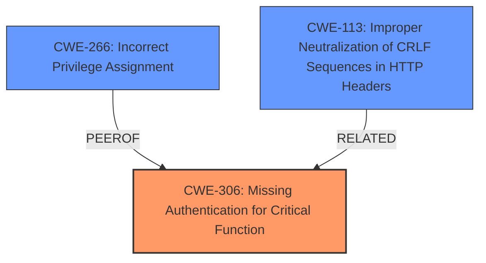

# Analysis for CVE-2024-27713

# Summary
| CWE ID | CWE Name | Confidence | CWE Abstraction Level | CWE Vulnerability Mapping Label | CWE-Vulnerability Mapping Notes |
|---|---|---|---|---|---|
| CWE-306 | Missing Authentication for Critical Function | 0.8 | Base | Primary | Allowed |
| CWE-266 | Incorrect Privilege Assignment | 0.7 | Base | Secondary | Allowed |
| CWE-113 | Improper Neutralization of CRLF Sequences in HTTP Headers ('HTTP Request/Response Splitting') | 0.6 | Variant | Secondary | Allowed |

## Evidence and Confidence

*   **Confidence Score:** 0.7
*   **Evidence Strength:** MEDIUM

## Relationship Analysis
The primary weakness, **CWE-306 Missing Authentication for Critical Function**, is a base-level CWE that directly addresses the lack of authentication in the described vulnerability. **CWE-266 Incorrect Privilege Assignment** is a related weakness, highlighting the incorrect assignment of privileges, potentially due to the missing authentication. **CWE-113 Improper Neutralization of CRLF Sequences in HTTP Headers ('HTTP Request/Response Splitting')** is included due to the missing HTTP security headers.

## Vulnerability Chain
The vulnerability chain starts with **CWE-306 Missing Authentication for Critical Function**, which leads to **CWE-266 Incorrect Privilege Assignment** and potential exploitation due to missing HTTP security headers, addressed by **CWE-113 Improper Neutralization of CRLF Sequences in HTTP Headers**. The initial flaw is the lack of authentication, which is then exploited to escalate privileges, and HTTP header weaknesses amplify the risk.

## Summary of Analysis
The assessment is based on the provided evidence, especially the "CVE Reference Links Content Summary," which explicitly mentions the **missing security headers** and vulnerabilities in the sign-up process that allow manipulation of account settings.

The primary classification is **CWE-306 Missing Authentication for Critical Function**, as the vulnerability description clearly states that the Eskooly software does not perform authentication for critical functions. This lack of authentication is the root cause that allows attackers to escalate privileges. "The product does not perform any authentication for functionality that requires a provable user identity or consumes a significant amount of resources."

**CWE-266 Incorrect Privilege Assignment** is selected because the vulnerability allows attackers to manipulate account settings during registration, leading to unauthorized privilege escalation. "Attackers can register accounts with higher privileges than intended by manipulating settings during the signup process".

**CWE-113 Improper Neutralization of CRLF Sequences in HTTP Headers ('HTTP Request/Response Splitting')** is selected because of the **missing security headers** (`X-Frame-Options`, `X-Content-Type-Options`, `Strict-Transport-Security` (HSTS), Permissions-Policy, Cross-Origin-Resource-Policy).

The selected CWEs are at the optimal level of specificity as they accurately represent the **root cause** (missing authentication) and the immediate consequences (incorrect privilege assignment, HTTP header vulnerabilities) of the vulnerability. Other CWEs were considered, but they were either too general or did not directly address the specific weaknesses described in the vulnerability description.