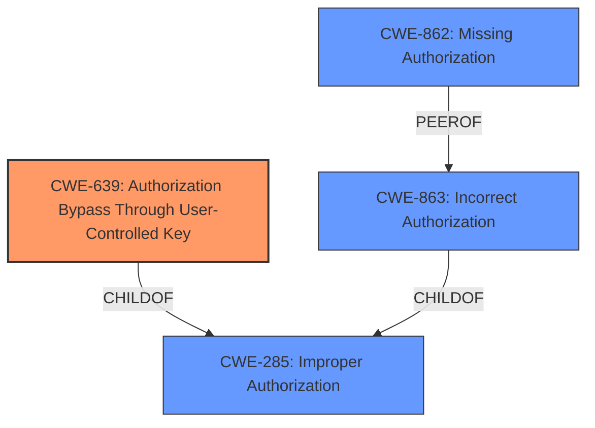

# Analysis for CVE-2024-27730

# Summary
| CWE ID | CWE Name | Confidence | CWE Abstraction Level | CWE Vulnerability Mapping Label | CWE-Vulnerability Mapping Notes |
|---|---|---|---|---|---|
| CWE-639 | Authorization Bypass Through User-Controlled Key | 0.9 | Base | Primary | Allowed |
| CWE-285 | Improper Authorization | 0.7 | Class | Secondary | Discouraged |
| CWE-862 | Missing Authorization | 0.6 | Class | Secondary | Allowed-with-Review |

## Evidence and Confidence

*   **Confidence Score:** 0.9
*   **Evidence Strength:** HIGH

## Relationship Analysis
The primary CWE, CWE-639, is a Base level CWE which is preferred. It is related to the higher level CWE-285 Improper Authorization. CWE-862 Missing Authorization is a peer of CWE-863 Incorrect Authorization which is a child of CWE-285. The selection of CWE-639 reflects the specific mechanism of bypassing authorization through a user-controlled key, a more precise identification than the more general authorization issues.

## Vulnerability Chain
The vulnerability chain starts with the **insecure permissions** and **insufficient access control** on the `cid` parameter, leading to the ability to manipulate the parameter. This allows an attacker to create and modify calendar events as other users, potentially combined with XSS for further impact.

**Chain:**
1.  **CWE-639: Authorization Bypass Through User-Controlled Key** (**Root Cause**) - Attacker manipulates the `cid` parameter.
2.  **CWE-200: Information Exposure** (Potential Intermediate, not explicitly identified) - Access to other user's calendar events.
3.  **CWE-79: Improper Neutralization of Input During Web Page Generation ('Cross-site Scripting')** (Secondary impact, mentioned in CVE details) - Exploitation of stored XSS.

## Summary of Analysis
The initial assessment, based on the vulnerability description and CVE details, pointed to an authorization issue related to **insecure permissions**. The selection of CWE-639 is driven by the specific exploitation mechanism of manipulating the `cid` parameter.

The evidence from the CVE Reference Links Content Summary explicitly states: "The vulnerability stems from a lack of proper access control checks when creating and editing calendar events. Specifically, the `cid` (contact ID) parameter, which determines the user associated with the event, can be manipulated by an attacker."

This aligns perfectly with CWE-639: "The system's authorization functionality does not prevent one user from gaining access to another user's data or record by modifying the key value identifying the data."

Other CWEs considered but not selected:

*   CWE-732: Incorrect Permission Assignment for Critical Resource - While the initial description mentioned **insecure permissions**, the CVE details clarify that the issue is related to authorization bypass through manipulating the `cid` parameter, not just incorrect permission assignments.
*   CWE-285: Improper Authorization and CWE-862: Missing Authorization - These are higher-level Class CWEs, and CWE-639 provides a more specific description of the vulnerability.

Relevant CWE Information:
* CWE-639: Authorization Bypass Through User-Controlled Key: "The system's authorization functionality does not prevent one user from gaining access to another user's data or record by modifying the key value identifying the data."