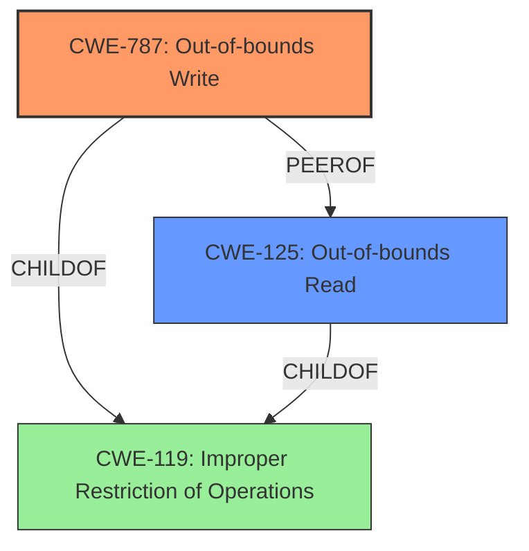

# Analysis Report for CVE-2024-27857

# Vulnerability Analysis Report: CVE-2024-27857

## Description

An ****out-of-bounds access** issue** was addressed with improved bounds checking. This issue is fixed in visionOS 1.2, macOS Sonoma 14.5, tvOS 17.5, iOS 17.5 and iPadOS 17.5. A remote attacker may be able to cause unexpected app termination or arbitrary code execution.

## Vulnerability Description Key Phrases

- **Rootcause:** out-of-bounds access issue
- **Weakness:** out-of-bounds access
- **Impact:** ["['unexpected app termination'", "'arbitrary code execution']"]
- **Attacker:** remote attacker
- **Product:** ['visionOS', 'macOS Sonoma', 'tvOS', 'iOS', 'iPadOS']
- **Version:** ["['1.2'", "'14.5'", "'17.5'", "'17.5'", "'17.5']"]

## Analysis (with Relationship Data)

# Summary
| CWE ID | CWE Name | Confidence | CWE Abstraction Level | CWE Vulnerability Mapping Label | CWE-Vulnerability Mapping Notes |
|---|---|---|---|---|---|
| CWE-787 | Out-of-bounds Write | 0.9 | Base | Primary CWE | Allowed |
| CWE-125 | Out-of-bounds Read | 0.7 | Base | Secondary Candidate | Allowed |

## Evidence and Confidence

*   **Confidence Score:** 0.8
*   **Evidence Strength:** HIGH

## Relationship Analysis
The primary CWE is CWE-787 (**Out-of-bounds Write**), which is a base-level CWE. CWE-125 (**Out-of-bounds Read**) is a potential secondary CWE and peer. Both CWE-787 and CWE-125 are children of the more general CWE-119 (**Improper Restriction of Operations within the Bounds of a Memory Buffer**), which is a Class-level CWE. The analysis favors the more specific Base CWEs (787 and 125) over the more general Class CWE (119).



## Vulnerability Chain
The vulnerability chain starts with an **out-of-bounds access issue**, which leads to either **unexpected app termination** or **arbitrary code execution**. The **out-of-bounds access** can manifest as either writing past the end of a buffer (CWE-787) or reading past the end of a buffer (CWE-125).

## Summary of Analysis
The vulnerability description clearly states an "**out-of-bounds access issue** was addressed with improved bounds checking." The CVE Reference Links Content Summary reinforces this by stating, "An out-of-bounds access issue was addressed with improved bounds checking" and identifies the **root_cause** as "**Out-of-bounds access**". This directly points to either CWE-787 (**Out-of-bounds Write**) or CWE-125 (**Out-of-bounds Read**).

Given the high similarity scores in the Retriever Results, both CWE-787 and CWE-125 are strong candidates. CWE-787 has a slightly higher score and is often the more critical issue, as writing out of bounds can directly lead to code execution. However, without more context, it is possible that the out-of-bounds access was a read. Therefore, CWE-125 is included as a secondary candidate.

CWE-119 (**Improper Restriction of Operations within the Bounds of a Memory Buffer**) was considered but not chosen as the primary CWE because it is a more general Class-level CWE. The more specific Base-level CWEs, 787 and 125, provide a more accurate and detailed representation of the vulnerability.

CWE-843 (**Access of Resource Using Incompatible Type ('Type Confusion')**) was also considered, but the description doesn't give any indication of type confusion.

CWE-190 (**Integer Overflow or Wraparound**) and CWE-131 (**Incorrect Calculation of Buffer Size**) were also considered as they can lead to out-of-bounds access, but there is no direct evidence of either integer overflow or incorrect buffer size calculation.

The final decision favors CWE-787 as the primary CWE, representing the **root cause**, with CWE-125 as a secondary candidate. This decision is based on the vulnerability description, the CVE reference, retriever results, and the CWE specifications, all pointing to an out-of-bounds access issue.


## CWE Relationship Analysis

Current CWEs represent these abstraction levels: .


### Vulnerability Chain Analysis

**Chain starting from CWE-125:**
- 125 (Out-of-bounds Read) - ROOT


**Chain starting from CWE-131:**
- 131 (Incorrect Calculation of Buffer Size) - ROOT


### CWE Relationship Diagram

```mermaid
graph TD
    classDef primary fill:#f96,stroke:#333,stroke-width:2px
    classDef secondary fill:#69f,stroke:#333
    classDef tertiary fill:#9e9,stroke:#333
```


*Report generated on 2025-07-13 06:45:42*
