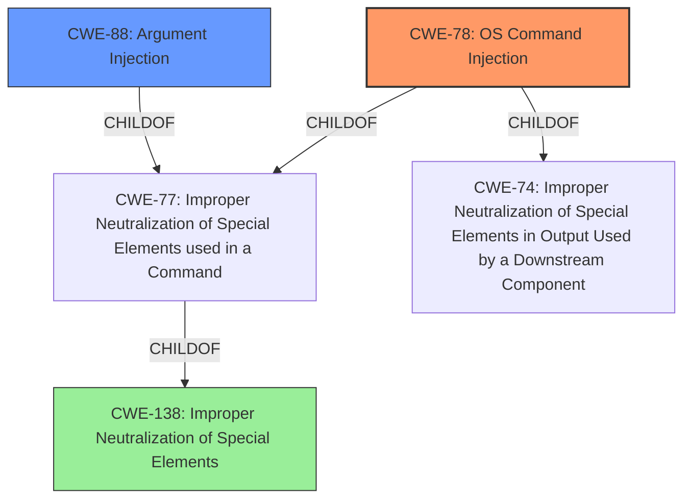

# Raw Analyzer Response for CVE-2024-27980

# Summary
| CWE ID | CWE Name | Confidence | CWE Abstraction Level | CWE Vulnerability Mapping Label | CWE-Vulnerability Mapping Notes |
|---|---|---|---|---|---|
| CWE-78 | Improper Neutralization of Special Elements used in an OS Command ('OS Command Injection') | 1.0 | Base | Allowed | Primary CWE: The vulnerability allows arbitrary command execution due to **improper handling of batch files**, indicating a failure to neutralize special elements in OS commands. |
| CWE-88 | Improper Neutralization of Argument Delimiters in a Command ('Argument Injection') | 0.7 | Base | Allowed | Secondary Candidate: This CWE is relevant as the vulnerability involves malicious command line arguments, which are not properly delimited, leading to command injection. |
| CWE-138 | Improper Neutralization of Special Elements | 0.5 | Class | Discouraged | Secondary Candidate: Although less specific, this CWE broadly describes the **improper neutralization** issue. It is not the best fit but captures a general aspect of the vulnerability. |

## Evidence and Confidence

*   **Confidence Score:** 0.9
*   **Evidence Strength:** HIGH

## Relationship Analysis
The primary CWE is CWE-78, which is a base-level CWE describing **OS Command Injection**. It's a child of CWE-77 (Improper Neutralization of Special Elements used in a Command) and CWE-74 (Improper Neutralization of Special Elements in Output Used by a Downstream Component ('Injection')). CWE-88 (Improper Neutralization of Argument Delimiters in a Command ('Argument Injection')) is a peer of CWE-78 and also a child of CWE-77. CWE-138 (Improper Neutralization of Special Elements) is a higher-level class that encompasses multiple types of injection vulnerabilities but is less specific. The hierarchical relationships helped narrow down the selection to the most precise CWE.

## Vulnerability Chain
The vulnerability chain starts with the **improper handling of batch files** by `child_process.spawn` and `child_process.spawnSync`. This leads to the injection of arbitrary commands due to the **lack of proper neutralization** of special elements. The final impact is arbitrary code execution.
- Root Cause: **Improper handling of batch files** (CWE-78).
- Weakness: Command injection (CWE-78, CWE-88).
- Impact: Arbitrary code execution.

## Summary of Analysis
The primary assessment is strongly supported by the vulnerability description and the CVE reference links content summary. The root cause is identified as the **improper handling of batch files**, which directly leads to command injection and arbitrary code execution. The selection of CWE-78 is based on the evidence of **improper neutralization** of special elements in OS commands, which aligns perfectly with the CWE description. The retriever results also support this, with CWE-78 being a strong candidate. The hierarchical relationships further solidified this choice, as CWE-78 is a base-level CWE that accurately represents the vulnerability.

The justification for selecting CWE-78 is based on the following evidence:
- Vulnerability Description: "Due to the **improper handling of batch files** in child_process.spawn / child_process.spawnSync, a malicious command line argument can inject arbitrary commands and achieve code execution even if the shell option is not enabled."
- CVE Reference Links Content Summary: "Root cause of vulnerability: Command injection via the `args` parameter of `child_process.spawn` without the shell option enabled on Windows."

CWE-88 was considered as a secondary candidate because the vulnerability involves malicious command-line arguments, which are not properly delimited. However, CWE-78 is a better fit as the core issue is the **improper handling of batch files** that allows for OS command injection.

CWE-138 was also considered but deemed too general, as it is a class-level CWE that encompasses various types of **improper neutralization**. While it captures a general aspect of the vulnerability, it is not as specific as CWE-78.

The selected CWEs are at the optimal level of specificity because they accurately represent the root cause and the immediate weakness that leads to the vulnerability.