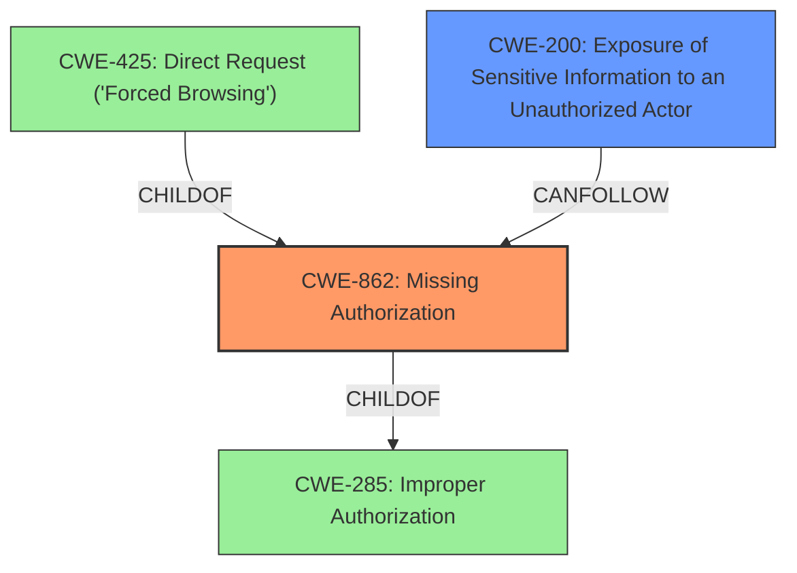

# Analysis Report for CVE-2024-28164

# Vulnerability Analysis Report: CVE-2024-28164

## Description

SAP NetWeaver AS Java (CAF - Guided Procedures) allows an unauthenticated user to access non-sensitive information about the server which would otherwise be restricted causing low impact on confidentiality of the application.

## Vulnerability Description Key Phrases

- **Impact:** access non-sensitive information about the server
- **Attacker:** unauthenticated user
- **Product:** SAP NetWeaver AS Java
- **Component:** CAF - Guided Procedures

## Analysis (with Relationship Data)

# Summary
| CWE ID | CWE Name | Confidence | CWE Abstraction Level | CWE Vulnerability Mapping Label | CWE-Vulnerability Mapping Notes |
|---|---|---|---|---|---|
| CWE-862 | Missing Authorization | 0.8 | Class | Primary | Allowed-with-Review |
| CWE-200 | Exposure of Sensitive Information to an Unauthorized Actor | 0.6 | Class | Secondary | Discouraged |

## Evidence and Confidence

*   **Confidence Score:** 0.7
*   **Evidence Strength:** MEDIUM

## Relationship Analysis
The primary CWE selected is CWE-862, which is a Class-level CWE. While more specific Base or Variant CWEs are generally preferred, the provided information does not offer enough detail to pinpoint a more specific cause. CWE-862's parent is CWE-285 (Improper Authorization), and it has children like CWE-425 (Direct Request). CWE-200 (Exposure of Sensitive Information) is often a consequence of missing authorization and represents the impact of the vulnerability.



## Vulnerability Chain
The vulnerability chain starts with **missing authorization** (CWE-862), which allows an unauthenticated user to **access non-sensitive information** (CWE-200). The root cause is the lack of proper authorization checks, leading to the information exposure.

## Summary of Analysis
The vulnerability description indicates that an unauthenticated user can access non-sensitive information due to **missing authorization**. This directly aligns with CWE-862 (Missing Authorization). While the information is non-sensitive, the fact that it should have been restricted suggests an authorization issue. CWE-200 (Exposure of Sensitive Information to an Unauthorized Actor) is considered a secondary CWE, representing the impact of the missing authorization. Though the description says the information isn't sensitive, the summary also says the information "would otherwise be restricted" implying that an exposure has occurred. The retriever results also support CWE-862 and CWE-200.

CWE-285 (Improper Authorization) was considered but not chosen as it's a more general class. CWE-862 is a more specific child and therefore a better fit.

Relevant evidence includes:
*   "allows an unauthenticated user to **access non-sensitive information** about the server which **would otherwise be restricted**"

# Enhanced Context (25 CWEs)
The following CWEs were identified as potentially relevant to this vulnerability:

## CWE-497: Exposure of Sensitive System Information to an Unauthorized Control Sphere
**Abstraction Level**: Base
**Similarity Score**: 0.76
**Source**: dense

**Description**:
The product does not properly prevent sensitive system-level information from being accessed by unauthorized actors who do not have the same level of access to the underlying system as the product does.

**Mapping Guidance**:
- Usage: Allowed
- Rationale: This CWE entry is at the Base level of abstraction, which is a preferred level of abstraction for mapping to the root causes of vulnerabilities.
**NOT USED:** While this could be relevant, the vulnerability description states the information is non-sensitive.

## CWE-807: Reliance on Untrusted Inputs in a Security Decision
**Abstraction Level**: Base
**Similarity Score**: 0.75
**Source**: dense

**Description**:
The product uses a protection mechanism that relies on the existence or values of an input, but the input can be modified by an untrusted actor in a way that bypasses the protection mechanism.

**Mapping Guidance**:
- Usage: Allowed
- Rationale: This CWE entry is at the Base level of abstraction, which is a preferred level of abstraction for mapping to the root causes of vulnerabilities.
**NOT USED:** This is not relevant since the vulnerability is about missing authorization, not about relying on untrusted inputs.

## CWE-200: Exposure of Sensitive Information to an Unauthorized Actor
**Abstraction Level**: Class
**Similarity Score**: 0.74
**Source**: dense

**Description**:
The product exposes sensitive information to an actor that is not explicitly authorized to have access to that information.

**Mapping Guidance**:
- Usage: Discouraged
- Rationale: CWE-200 is commonly misused to represent the loss of confidentiality in a vulnerability, but confidentiality loss is a technical impact - not a root cause error. As of CWE 4.9, over 400 CWE entries can lead to a loss of confidentiality. Other options are often available. [REF-1287].
**USED:** While the description says the information isn't sensitive, the summary also says the information "would otherwise be restricted" implying that an exposure has occurred.

## CWE-303: Incorrect Implementation of Authentication Algorithm
**Abstraction Level**: Base
**Similarity Score**: 0.73
**Source**: dense

**Description**:
The requirements for the product dictate the use of an established authentication algorithm, but the implementation of the algorithm is incorrect.

**Mapping Guidance**:
- Usage: Allowed
- Rationale: This CWE entry is at the Base level of abstraction, which is a preferred level of abstraction for mapping to the root causes of vulnerabilities.
**NOT USED:** There's no mention of an incorrect authentication algorithm.

## CWE-668: Exposure of Resource to Wrong Sphere
**Abstraction Level**: Class
**Similarity Score**: 0.73
**Source**: dense

**Description**:
The product exposes a resource to the wrong control sphere, providing unintended actors with inappropriate access to the resource.

**Mapping Guidance**:
- Usage: Discouraged
- Rationale: CWE-668 is high-level and is often misused as a catch-all when lower-level CWE IDs might be applicable. It is sometimes used for low-information vulnerability reports [REF-1287]. It is a level-1 Class (i.e., a child of a Pillar). It is not useful for trend analysis.
**NOT USED:** This is too general.

## CWE-209: Generation of Error Message Containing Sensitive Information
**Abstraction Level**: Base
**Similarity Score**: 0.73
**Source**: dense

**Description**:
The product generates an error message that includes sensitive information about its environment, users, or associated data.

**Mapping Guidance**:
- Usage: Allowed
- Rationale: This CWE entry is at the Base level of abstraction, which is a preferred level of abstraction for mapping to the root causes of vulnerabilities.
**NOT USED:** This is not relevant since the vulnerability is about accessing information directly, not through error messages.

## CWE-213: Exposure of Sensitive Information Due to Incompatible Policies
**Abstraction Level**: Base
**Similarity Score**: 0.73
**Source**: dense

**Description**:
The product's intended functionality exposes information to certain actors in accordance with the developer's security policy, but this information is regarded as sensitive according to the intended security policies of other stakeholders such as the product's administrator, users, or others whose information is being processed.

**Mapping Guidance**:
- Usage: Allowed
- Rationale: This CWE entry is at the Base level of abstraction, which is a preferred level of abstraction for mapping to the root causes of vulnerabilities.
**NOT USED:** This is not relevant since the vulnerability is about missing authorization, not about incompatible policies.

## CWE-311: Missing Encryption of Sensitive Data
**Abstraction Level**: Class
**Similarity Score**: 0.72
**Source**: dense

**Description**:
The product does not encrypt sensitive or critical information before storage or transmission.

**Mapping Guidance**:
- Usage: Discouraged
- Rationale: CWE-311 is high-level with more precise children available. It is a level-1 Class (i.e., a child of a Pillar).
**NOT USED:** This is not relevant since the vulnerability is about missing authorization, not about missing encryption.

## CWE-280: Improper Handling of Insufficient Permissions or Privileges 
**Abstraction Level**: Base
**Similarity Score**: 0.72
**Source**: dense

**Description**:
The product does not handle or incorrectly handles when it has insufficient privileges to access resources or functionality as specified by their permissions. This may cause it to follow unexpected code paths that may leave the product in an invalid state.

**Mapping Guidance**:
- Usage: Allowed
- Rationale: This CWE entry is at the Base level of abstraction, which is a preferred level of abstraction for


## CWE Relationship Analysis

Current CWEs represent these abstraction levels: .


### Vulnerability Chain Analysis

**Chain starting from CWE-280:**
- 280 (Improper Handling of Insufficient Permissions or Privileges ) - ROOT


**Chain starting from CWE-862:**
- 862 (Missing Authorization) - ROOT


### CWE Relationship Diagram

```mermaid
graph TD
    classDef primary fill:#f96,stroke:#333,stroke-width:2px
    classDef secondary fill:#69f,stroke:#333
    classDef tertiary fill:#9e9,stroke:#333
```


*Report generated on 2025-07-13 06:51:13*
