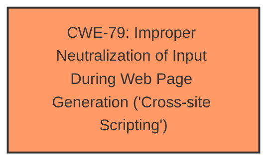

# Raw Analyzer Response for CVE-2024-2872

# Summary

| CWE ID | CWE Name | Confidence | CWE Abstraction Level | CWE Vulnerability Mapping Label | CWE-Vulnerability Mapping Notes |
|---|---|---|---|---|---|
| CWE-79 | Improper Neutralization of Input During Web Page Generation ('Cross-site Scripting') | 1.0 | Base | Allowed | Primary CWE: The **root cause** is the **lack of sanitization and escaping of settings**, leading to a Stored Cross-Site Scripting vulnerability. |

## Evidence and Confidence

*   **Confidence Score:** 1.0
*   **Evidence Strength:** HIGH

## Relationship Analysis

The primary relationship influencing the CWE selection is the direct match between the vulnerability description and the characteristics of CWE-79. The description explicitly states a **failure to sanitize and escape settings**, resulting in a stored Cross-Site Scripting vulnerability. CWE-79's description of **improper neutralization of input during web page generation** aligns perfectly with this scenario.

## Vulnerability Chain

The vulnerability chain is straightforward:

1.  **Root Cause:** **Improper neutralization of input (settings)**.
2.  **Weakness:** Cross-Site Scripting (XSS).
3.  **Impact:** Stored XSS attacks, potentially leading to privilege escalation if an administrator is targeted.

## Summary of Analysis

The analysis is based on the provided evidence, which explicitly mentions the **lack of sanitization and escaping of settings**, resulting in a stored Cross-Site Scripting vulnerability.

*   The vulnerability description states that the plugin **does not sanitise and escape some of its settings**, allowing for Stored Cross-Site Scripting attacks.
*   The CVE Reference Links Content Summary confirms that the **root cause** is the plugin's **failure to properly sanitize and escape certain settings**.
*   The attacker injects malicious JavaScript code into the "Caption Title" field, which is then executed in the context of an administrator's browser.

CWE-79 is selected as the optimal level of specificity because it directly addresses the **improper neutralization of input during web page generation**, which is the core issue in this vulnerability. The evidence strongly supports this classification, and the relationship analysis further reinforces its appropriateness.

Several other CWEs were considered but ultimately not chosen:

*   **CWE-862 (Missing Authorization)** and **CWE-863 (Incorrect Authorization)**: While privilege escalation is a potential impact, the **root cause** is not related to missing or incorrect authorization checks. The vulnerability stems from the **lack of input sanitization**, not from authorization flaws.
*   **CWE-89 (Improper Neutralization of Special Elements used in an SQL Command ('SQL Injection'))**: This is not an SQL Injection vulnerability.
*   **CWE-352 (Cross-Site Request Forgery (CSRF))**: This is not a CSRF vulnerability.
*   **CWE-434 (Unrestricted Upload of File with Dangerous Type)**: This is not a file upload vulnerability.

The decision to map to CWE-79 is based on the direct evidence of **improper input neutralization**, which aligns perfectly with the CWE's description. The high confidence score reflects the strong match between the vulnerability and the chosen CWE.