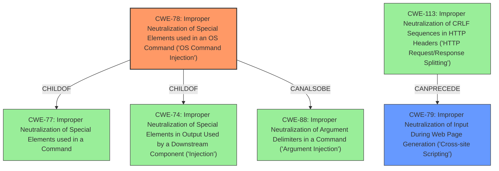

# Enhanced Analysis for CVE-2024-28739

# Summary
| CWE ID | CWE Name | Confidence | CWE Abstraction Level | CWE Vulnerability Mapping Label | CWE-Vulnerability Mapping Notes |
|---|---|---|---|---|---|
| CWE-78 | Improper Neutralization of Special Elements used in an OS Command ('OS Command Injection') | 1.0 | Base | Primary | Allowed |
| CWE-79 | Improper Neutralization of Input During Web Page Generation ('Cross-site Scripting') | 1.0 | Base | Secondary | Allowed |

## Evidence and Confidence

*   **Confidence Score:** 1.0
*   **Evidence Strength:** HIGH

## Relationship Analysis
The primary CWE is CWE-78, which falls under the broader category of injection vulnerabilities. It has hierarchical relationships, such as being a child of CWE-77 (Improper Neutralization of Special Elements used in a Command) and CWE-74 (Improper Neutralization of Special Elements in Output Used by a Downstream Component ('Injection')). There is also a CANALSOBE relationship with CWE-88 (Improper Neutralization of Argument Delimiters in a Command ('Argument Injection')). The secondary CWE is CWE-79 which can lead to other vulnerabilities if CRLF sequences are not neutralized as indicated by the CANPRECEDE relationship to CWE-113.



## Vulnerability Chain
The vulnerability chain starts with **improper neutralization** of input in the Task Scheduler, leading to **OS Command Injection** (CWE-78). The same or similar **improper neutralization** can also lead to **Cross-Site Scripting** (CWE-79). Successful command injection allows an attacker to execute arbitrary code. XSS allows attackers to take over the Admin Staff account by stealing CSRF tokens.

## Summary of Analysis
The primary vulnerability is **OS Command Injection** (CWE-78) due to **improper neutralization** of special elements in an OS command. The `format` parameter in the Task Scheduler allows arbitrary input from the user, which is then appended to a system command. This is confirmed by the CVE Reference Links Content Summary: "The vulnerability is present in the Task Scheduler feature, which allows arbitrary input from the user and appends it to a system command." The impact is that "An attacker can execute arbitrary commands on the system at the scheduled time."

The secondary vulnerability is **Cross-Site Scripting** (CWE-79). The CVE Reference Links Content Summary lists "Cross-Site Scripting (XSS)" as one of the weaknesses present. The summary also describes how the XSS vulnerability can be used to "bypass CSRF protections in Koha, steal the CSRF token, change username and password to completely takeover the Admin Staff account."

The retriever results also list CWE-78 and CWE-79 as possible matches, further supporting these classifications.

The selected CWEs are at the optimal level of specificity because they accurately represent the **root cause** of the vulnerability (CWE-78) and another related contributing factor (CWE-79).

Other CWEs considered but not used:

*   CWE-22 (Improper Limitation of a Pathname to a Restricted Directory ('Path Traversal')), CWE-23 (Relative Path Traversal), CWE-36 (Absolute Path Traversal): These are not appropriate because the vulnerability does not involve path manipulation.
*   CWE-94 (Improper Control of Generation of Code ('Code Injection')): While code execution is the impact, the **root cause** is command injection, making CWE-78 more appropriate.
*   CWE-434 (Unrestricted Upload of File with Dangerous Type): This is mentioned in the "Impact of exploitation" in the CVE reference summary, but it is not a **direct** cause of the vulnerability, rather a potential avenue for exploitation if the plugin upload feature is enabled.
*   CWE-787 (Out-of-bounds Write): There is no specific evidence to suggest this.
*   CWE-88 (Improper Neutralization of Argument Delimiters in a Command ('Argument Injection')): Although related, CWE-78 is a better fit as it describes the general issue of injecting OS commands.
*   CWE-425 (Direct Request ('Forced Browsing')): This is not applicable, as the vulnerability does not involve bypassing authorization checks on restricted URLs.


## CWE Relationship Analysis

Current CWEs represent these abstraction levels: .


### Vulnerability Chain Analysis

**Chain starting from CWE-94:**
- 94 (Improper Control of Generation of Code ('Code Injection')) - ROOT


**Chain starting from CWE-88:**
- 88 (Improper Neutralization of Argument Delimiters in a Command ('Argument Injection')) - ROOT


### CWE Relationship Diagram

```mermaid
graph TD
    classDef primary fill:#f96,stroke:#333,stroke-width:2px
    classDef secondary fill:#69f,stroke:#333
    classDef tertiary fill:#9e9,stroke:#333
```